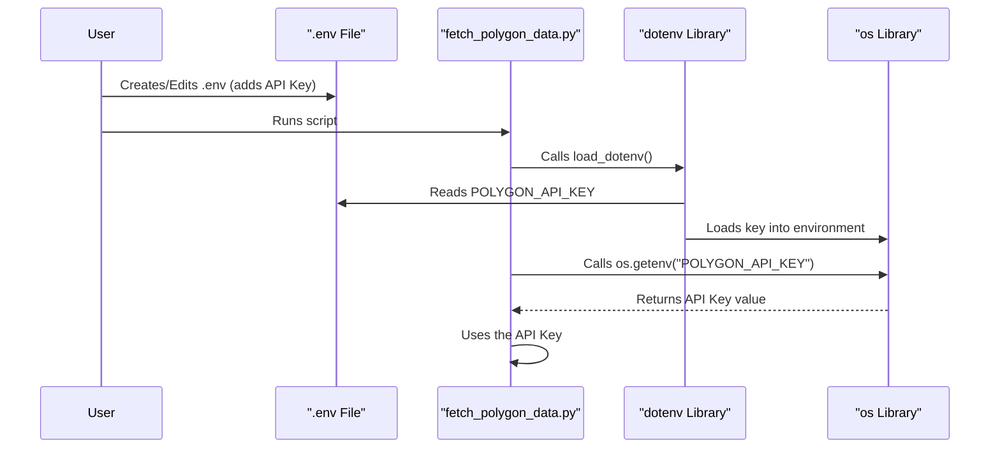
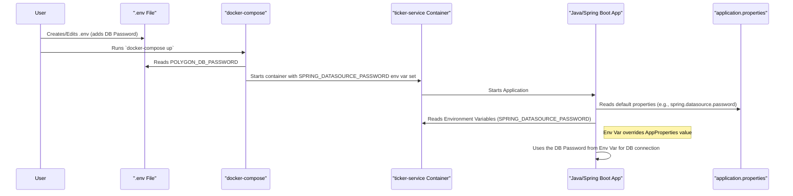

# Chapter 1: Configuration Management

Welcome to the `polygon-lgbm-service` tutorial! Before we dive into the fancy machine learning and real-time data, we need to understand how our project handles its settings and secrets. Think of it like the control panel and key storage for our application. This is **Configuration Management**.

## What's the Big Deal with Settings?

Imagine you have a super-secret key, like your Polygon API key, which gives access to your paid data subscription. You wouldn't want to accidentally share this key with the world by putting it directly into your code and uploading it to a place like GitHub!

Also, applications often need settings that might change depending on where they run (your laptop vs. a server) or what they connect to (like a database). We need a way to manage these settings and secrets safely and flexibly.

Our main goal here is: **Keep secrets secure and make settings easy to change without modifying the core code.**

Let's see how `polygon-lgbm-service` handles this.

## Where Do Settings Live? The Key Files

Our project uses a few different files to manage configuration:

1.  **`.env` File (The Secret Keeper):**
    *   This file lives in the main project folder but is **intentionally ignored by Git** (thanks to the `.gitignore` file).
    *   It's primarily used by our Python scripts.
    *   It holds sensitive information like your `POLYGON_API_KEY` and the password for the database (`POLYGON_DB_PASSWORD`).
    *   Think of it as a local notepad containing secrets that *only your computer* should know.

    ```dotenv
    # .env (This file should NOT be committed to Git!)
    POLYGON_API_KEY=YOUR_SECRET_POLYGON_KEY_HERE
    POLYGON_DB_PASSWORD=your_database_password
    ```
    *Explanation:* This simple text file defines key-value pairs. `POLYGON_API_KEY` is the key, and `YOUR_SECRET_POLYGON_KEY_HERE` is its value.

2.  **`application.properties` (Java's Control Panel):**
    *   Located in `src/main/resources/`, this is the standard configuration file for our Java service (built with Spring Boot).
    *   It contains settings like database connection details (URL, username, default password), the Polygon API key (though often overridden), and server settings.
    *   Think of this as the default settings menu for the Java application.

    ```properties
    # src/main/resources/application.properties (snippet)
    # Default Database settings (might be overridden!)
    spring.datasource.url=jdbc:postgresql://timescaledb:5432/polygondata
    spring.datasource.username=polygonuser
    spring.datasource.password=default_password_if_any

    # Default Polygon API Key (likely overridden!)
    polygon.api.key=default_key_if_any
    ```
    *Explanation:* This file also uses key-value pairs. Spring Boot automatically reads this file when the Java service starts.

3.  **`docker-compose.yml` (The Orchestrator's Instructions):**
    *   This file defines how our different services (Java app, database) run together using Docker. We'll cover Docker Compose in detail in the [Infrastructure Orchestration (Docker Compose)
        ](02_infrastructure_orchestration__docker_compose__.md) chapter.
    *   Crucially, it can define **environment variables** that are passed directly into the running containers (the isolated environments where our services run).
    *   These environment variables often **override** the settings found in `application.properties` for the Java service. This is super useful for providing specific secrets or settings when deploying the application. It can also read variables from the `.env` file to avoid hardcoding secrets here.

    ```yaml
    # docker-compose.yml (snippet for the Java service)
    services:
      ticker-service:
        image: polygon-ticker-service:0.0.1-SNAPSHOT
        environment:
          # Override Java app settings using environment variables
          - POLYGON_API_KEY=${POLYGON_API_KEY} # Reads from .env or host env
          - SPRING_DATASOURCE_PASSWORD=${POLYGON_DB_PASSWORD} # Reads from .env
          - SPRING_DATASOURCE_URL=jdbc:postgresql://timescaledb:5432/polygondata
          # ... other environment variables
    ```
    *Explanation:* The `environment:` section defines variables *inside* the `ticker-service` container. Docker Compose can substitute `${VARIABLE_NAME}` with values from a `.env` file in the same directory or from the host machine's environment variables. This is how we inject the *actual* secrets from `.env` into the running service.

## How It Works: Getting the Settings

Let's trace how a piece of configuration, like the Polygon API key, is accessed.

**Scenario 1: Python Script (`fetch_polygon_data.py`) Needs the API Key**

1.  You create the `.env` file with `POLYGON_API_KEY=YOUR_SECRET_POLYGON_KEY_HERE`.
2.  You run the Python script: `python fetch_polygon_data.py`.
3.  Inside the script, this line runs early on:

    ```python
    # fetch_polygon_data.py (snippet)
    from dotenv import load_dotenv
    import os

    load_dotenv() # Read the .env file
    API_KEY = os.getenv("POLYGON_API_KEY") # Get the key from the environment
    ```
    *Explanation:* `load_dotenv()` reads your `.env` file and makes the variables available to the script as if they were system environment variables. `os.getenv("POLYGON_API_KEY")` then retrieves the value.

Here's a simple diagram of that flow:



**Scenario 2: Java Service (`ticker-service`) Needs the Database Password**

1.  You have `POLYGON_DB_PASSWORD=your_database_password` in your `.env` file.
2.  Your `docker-compose.yml` has a line like `SPRING_DATASOURCE_PASSWORD=${POLYGON_DB_PASSWORD}` in the `environment` section for the `ticker-service`.
3.  You run `docker-compose up`.
4.  Docker Compose reads the `.env` file (if present), substitutes the value for `${POLYGON_DB_PASSWORD}`, and starts the `ticker-service` container, injecting `SPRING_DATASOURCE_PASSWORD=your_database_password` into the container's environment.
5.  The Java Spring Boot application starts inside the container.
6.  Spring Boot looks for configuration properties. It checks multiple places, including `application.properties` and environment variables.
7.  It finds `spring.datasource.password` in `application.properties` (maybe with a default value).
8.  It *also* finds the `SPRING_DATASOURCE_PASSWORD` environment variable (Spring Boot cleverly maps this naming convention).
9.  **Crucially:** Environment variables have higher priority! Spring Boot uses the value `your_database_password` provided by Docker Compose via the environment variable, ignoring the default value in `application.properties`.
10. The Java service uses this password to connect to the database.

Here's a diagram for the Java service flow:



## Why This Matters

This multi-layered approach gives us:

*   **Security:** Secrets like API keys and passwords stay out of our version-controlled code (Git). The `.env` file is local.
*   **Flexibility:** We can easily change settings (like database location or tickers to watch) by modifying `.env` or `docker-compose.yml` without rebuilding the Java application or changing Python code.
*   **Consistency:** Both Python and Java components can access necessary configuration in a structured way.
*   **Overrides:** Docker Compose provides a powerful way to tailor settings for specific runtime environments, overriding defaults when needed.

## Conclusion

You've now learned the basics of Configuration Management in `polygon-lgbm-service`. We saw how `.env`, `application.properties`, and `docker-compose.yml` work together to manage settings and secrets securely and flexibly. This keeps our application organized and adaptable.

Understanding configuration is crucial because almost every other part of the system relies on accessing these settings correctly – from connecting to the database to authenticating with the Polygon API.

Next, we'll explore how `docker-compose.yml` actually brings our database and Java service to life.

Ready to orchestrate? Let's move on to [Chapter 2: Infrastructure Orchestration (Docker Compose)](02_infrastructure_orchestration__docker_compose__.md).

---

Generated by [AI Codebase Knowledge Builder](https://github.com/The-Pocket/Tutorial-Codebase-Knowledge)