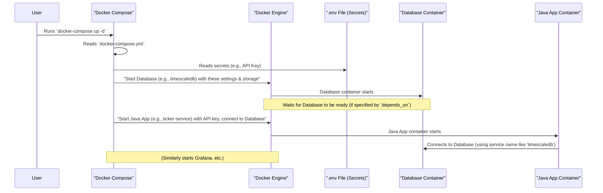

# Chapter 1: Dockerized Service Orchestration

Welcome to the `nvda-daily-prediction` project! This project aims to help you understand how to build a system that collects stock market data, trains a model, and makes predictions. Before we can dive into the exciting world of market data and predictions, we need to set up our stage. This chapter is all about how we get all the different software pieces working together smoothly.

Imagine you're trying to put on a big show with many performers. You'd need a conductor for an orchestra, right? Someone to make sure every instrument starts on time, plays the right notes, and works in harmony. In our project, "Dockerized Service Orchestration" is that conductor!

Our project involves several software "instruments":
*   A **database** to store all the stock data.
*   A **Java data collector** to fetch live data.
*   A **visualization tool** to see charts and graphs.
*   And later, **Python scripts** for machine learning and predictions.

Getting all these to start correctly, talk to each other, and be properly configured can be tricky. That's where our "conductor" comes in, using tools called Docker and Docker Compose.

## What's the Problem We're Solving?

If you tried to install a database, then set up the Java application, then configure a visualization tool, all on your computer, you might run into many problems:
*   One software might need a specific version of another tool that conflicts with something else.
*   Configuring them to find each other (e.g., the Java app finding the database) can be a headache.
*   If you move to a new computer, you have to do it all over again, and it might not work the same way!

Dockerized Service Orchestration solves these problems by making the whole system easy to run consistently, anywhere.

## Meet the Tools: Docker and Docker Compose

Think of these two tools working together:

1.  **Docker: The Magical Lunchbox** 🍱
    Imagine you pack a lunchbox. Inside, you have your sandwich, your apple, your juice – everything you need for lunch, all neatly contained.
    **Docker** does something similar for software. It packages an application (like our database) along with *everything* it needs to run (its code, special tools, settings) into a neat, isolated package called a **container**.
    This container is like that magical lunchbox: it has everything the software needs, and it keeps it separate from other software on your computer. This means the database software runs the same way on your laptop as it would on any other computer.

2.  **Docker Compose: The Recipe for a Feast** 📜
    Now, imagine you're preparing a feast with many dishes (many lunchboxes!). You need a recipe that lists all the dishes, what goes into them, and maybe even the order to prepare them.
    **Docker Compose** is like that recipe for our software feast. It uses a special instruction file, usually called `docker-compose.yml`, to define and manage multiple Docker containers at once. It tells Docker:
    *   Which "lunchboxes" (containers) to prepare (e.g., one for the database, one for the Java app).
    *   How to set them up (e.g., what settings the database needs).
    *   How they should connect and talk to each other.
    *   If one service needs another to be ready first (e.g., the Java app needs the database to be running).

The `docker-compose.yml` file is the main script for our conductor.

## Our `docker-compose.yml`: The Conductor's Score

The `docker-compose.yml` file is written in a format called YAML, which is designed to be easy for humans to read. Let's look at a simplified overview of what it might contain for our `nvda-daily-prediction` project.

```yaml
# docker-compose.yml (Simplified Overview)

services: # This keyword means we're listing our software services
  
  timescaledb: # This is a name we give to our database service
    image: timescale/timescaledb-ha:pg16-ts2.14 # Tells Docker to use a pre-made TimescaleDB "lunchbox"
    ports:
      - "5433:5432" # Makes the database accessible from our computer
    # ... other settings like passwords, storage ...

  ticker-service: # Our Java data collector
    image: polygon-ticker-service:0.0.1-SNAPSHOT # Use the "lunchbox" we build for our Java app
    ports:
      - "8080:8080"
    depends_on: # Tells this service to wait for the database
      - timescaledb 
    # ... other settings like API keys ...

  grafana: # Our visualization tool
    image: grafana/grafana-oss:latest # Use a pre-made Grafana "lunchbox"
    ports:
      - "3000:3000"
    # ... other settings ...

# ... definitions for shared networks and storage ...
```

Let's break down some key parts you'll see in the actual file:

*   **`services:`**: This is the main section where we list each independent software component.
*   **`timescaledb:`, `ticker-service:`, `grafana:`**: These are custom names we give to our services. Docker Compose uses these names so services can find each other on their private network. For example, our `ticker-service` can connect to the database by simply referring to it as `timescaledb`.
*   **`image:`**: This tells Docker which "lunchbox" template (called an image) to use. It can be an official one from the internet (like `timescale/timescaledb-ha` or `grafana/grafana-oss`) or one we build ourselves for our custom code (like `polygon-ticker-service:0.0.1-SNAPSHOT` for our Java app).
*   **`ports:`**: This maps a "door" (port number) on your computer to a "door" inside the container. For example, `5433:5432` for `timescaledb` means that if you connect to port `5433` on your computer, Docker will route that connection to port `5432` inside the `timescaledb` container, where the database is listening.
*   **`environment:`**: (Not shown in full above, but very important!) This section allows us to pass settings into our containers, like database passwords or API keys. Often, these sensitive details are stored in a separate `.env` file, and Docker Compose reads them from there. We'll learn more about this in [Chapter 2: Secure Configuration & Secrets Management](02_secure_configuration___secrets_management_.md).
*   **`volumes:`**: (Not shown in full above) This is like giving our containers a permanent storage locker outside the "lunchbox." For our database, this is crucial! It ensures that if the database container stops and restarts, all the data it stored is still there.
*   **`depends_on:`**: This tells Docker Compose the startup order. For instance, our `ticker-service` needs the `timescaledb` database to be running before it can start. `depends_on: - timescaledb` ensures this.
*   **`networks:`**: (Usually defined at the bottom of the file) This sets up a private network for our containers so they can communicate with each other securely and easily, using their service names.

## Running the Show: It's Easy!

Once you have Docker and Docker Compose installed (see the "Prerequisites" in the main `README.md`), and the `docker-compose.yml` file is in your project directory, starting all these background services is incredibly simple.

You open your computer's terminal (or command prompt), navigate to the project's main folder (where `docker-compose.yml` lives), and type this command:

```bash
docker-compose up -d
```

Let's break that down:
*   `docker-compose`: Tells your computer to use the Docker Compose tool.
*   `up`: This is the command to start the services defined in your `docker-compose.yml` file.
*   `-d`: This stands for "detached" mode. It means the services will run in the background, and your terminal will be free for you to type other commands. Without `-d`, you'd see all the log messages from all the services filling up your terminal.

**What happens when you run this?**
Docker Compose reads your `docker-compose.yml` "recipe" and:
1.  Checks if it needs to download any "lunchbox" templates (images).
2.  Creates any necessary private networks or storage volumes.
3.  Starts the containers for each service (like `timescaledb`, `ticker-service`, `grafana`), respecting any `depends_on` orders.
4.  Sets up the port mappings and injects any environment configurations.

And just like that, your entire backend infrastructure – database, data collector, visualizer – is up and running!

**To stop all the services** defined in the file, you can go back to the same terminal and project folder, and run:

```bash
docker-compose down
```

This will gracefully stop and remove the containers. Don't worry, data stored in volumes (like your database data) will usually be safe and will be there the next time you run `docker-compose up -d`.

## Under the Hood: How the Conductor Directs

When you run `docker-compose up -d`, a lot happens behind the scenes, orchestrated by Docker Compose:



In essence, Docker Compose acts as the overall manager, telling the Docker Engine (the core Docker program) precisely what to build (networks, storage) and run (containers), in what order, and how they should be configured and connected. It handles the complexity of managing these multiple, related pieces of software.

## Why This is Great for Beginners (and Everyone!)

*   **Simplicity:** You only need to learn one main command (`docker-compose up -d`) to get a complex system running.
*   **Consistency:** The setup described in `docker-compose.yml` will run the same way on your computer, your friend's computer, or even a server in the cloud. "It works on my machine!" is no longer an excuse (or a problem!).
*   **Isolation:** Each service runs in its own "container," so they don't interfere with each other or with other software on your system.
*   **Easy Cleanup:** `docker-compose down` removes everything cleanly.

## Conclusion

You've now had your first look at **Dockerized Service Orchestration**! You've learned that it's like having a conductor for our project's software "orchestra," using Docker to package services into containers ("lunchboxes") and Docker Compose with its `docker-compose.yml` file ("recipe" or "score") to manage them all.

This orchestration is foundational for the `nvda-daily-prediction` project. It ensures that our database, data collector, and other tools are all running correctly and can communicate, setting the stage for all the data processing and machine learning that will follow. With this, starting the entire backend infrastructure becomes as simple as typing `docker-compose up -d`.

In the next chapter, we'll zoom in on an important aspect we briefly mentioned: how we handle sensitive information like API keys and passwords securely.

Ready to learn about keeping secrets safe? Let's move on to [Chapter 2: Secure Configuration & Secrets Management](02_secure_configuration___secrets_management_.md).

---

Generated by [AI Codebase Knowledge Builder](https://github.com/The-Pocket/Tutorial-Codebase-Knowledge)