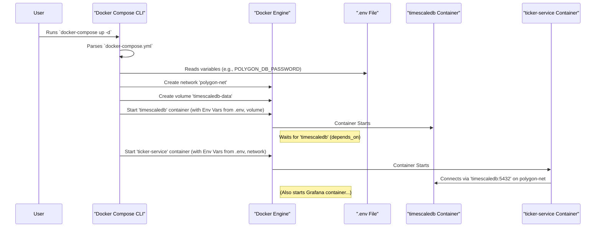

# Chapter 2: Infrastructure Orchestration (Docker Compose)

In [Chapter 1: Configuration Management](01_configuration_management_.md), we learned how our project handles settings and keeps secrets safe using files like `.env` and `docker-compose.yml`. Now, we'll focus on that last file, `docker-compose.yml`, and understand how it acts like the "stage crew" for our project, setting up all the necessary background services. This process is called **Infrastructure Orchestration**.

## Why Do We Need a Stage Crew?

Imagine putting on a play. You need a stage, lighting, sound systems, maybe some projectors. You can't just have actors show up and expect everything to work! Someone needs to set up all this "infrastructure" beforehand.

In our project, the "performance" is the machine learning model training and prediction. But before that can happen, we need several background services running:

1.  **The Database:** A place to store all the stock data (we use TimescaleDB, which is built on PostgreSQL). This is like the stage itself.
2.  **The Data Collector:** Our Java `ticker-service` that fetches real-time data from Polygon.io and saves it to the database. This is like the sound system capturing the performance.
3.  **The Visualizer:** Grafana, a tool to create dashboards and graphs to see our data and results. This is like the display screens showing information to the audience (us!).

Setting these up manually one by one, making sure they can talk to each other, and managing their configuration would be tedious and error-prone. That's where Docker and Docker Compose come in!

## Meet the Tools: Docker and Docker Compose

Think of these two tools working together:

1.  **Docker:** Imagine standardized shipping containers. Instead of shipping goods, Docker containers package up a piece of software (like our Java service or the database) along with *everything* it needs to run (code, libraries, system tools, settings). This means it runs the same way on your laptop as it does anywhere else. Each service gets its own container.

2.  **Docker Compose:** This is the instruction manual or the script for the stage crew. It's a tool that reads a special configuration file (our `docker-compose.yml`) and tells Docker exactly *how* to set up and run *multiple* containers together. It defines which containers to start, how they should be connected (networked), what settings they need, and if one service depends on another (e.g., the Java service needs the database to be ready first).

## Our `docker-compose.yml`: The Blueprint

Let's look at a simplified version of the `docker-compose.yml` file used in `polygon-lgbm-service`. This file is written in a format called YAML, which is designed to be easy for humans to read.

```yaml
# docker-compose.yml (Simplified Overview)

services: # Defines all the services (containers) we need

  timescaledb: # Our database service
    image: timescale/timescaledb-ha:pg16-ts2.14 # Use the official TimescaleDB image
    container_name: polygon_timescaledb
    environment: # Settings passed INTO the container
      - POSTGRES_USER=polygonuser
      - POSTGRES_PASSWORD=${POLYGON_DB_PASSWORD} # Read from .env!
      - POSTGRES_DB=polygondata
    ports: # Connect computer's port 5433 to container's port 5432
      - "5433:5432"
    volumes: # Persist database data even if container stops
      - timescaledb-data:/var/lib/postgresql/data
    networks: # Connect this service to our private network
      - polygon-net

  ticker-service: # Our Java data ingestion service
    image: polygon-ticker-service:0.0.1-SNAPSHOT # Use the image we built
    container_name: polygon_ticker_service
    environment: # Pass settings like API key and DB location
      - POLYGON_API_KEY=${POLYGON_API_KEY} # Read from .env!
      - SPRING_DATASOURCE_URL=jdbc:postgresql://timescaledb:5432/polygondata
      - SPRING_DATASOURCE_USERNAME=polygonuser
      - SPRING_DATASOURCE_PASSWORD=${POLYGON_DB_PASSWORD} # Read from .env!
    ports: # Connect computer's port 8080 to container's port 8080
      - "8080:8080"
    depends_on: # Don't start this until timescaledb is ready
      - timescaledb
    networks:
      - polygon-net

  grafana: # Our visualization tool
    image: grafana/grafana-oss:latest # Use the official Grafana image
    container_name: polygon_grafana
    ports: # Connect computer's port 3000 to container's port 3000
      - "3000:3000"
    depends_on:
      - timescaledb # Grafana needs the DB to store its own settings
    volumes: # Persist Grafana dashboards and settings
      - grafana-data:/var/lib/grafana
    networks:
      - polygon-net

# Define the shared network these services will use
networks:
  polygon-net:
    driver: bridge

# Define the persistent storage areas (volumes)
volumes:
  timescaledb-data:
  grafana-data:
```

**Explanation of Key Parts:**

*   **`services:`**: This is the main section listing each independent part of our application infrastructure.
*   **`timescaledb:`, `ticker-service:`, `grafana:`**: These are the names we give to our services. Docker Compose uses these names so services can find each other (e.g., `ticker-service` connects to the database using the hostname `timescaledb`).
*   **`image:`**: Specifies which Docker image to use for the service. This could be an official image (like `timescale/timescaledb-ha`) or one we built ourselves (`polygon-ticker-service`).
*   **`container_name:`**: A specific name for the running container instance.
*   **`environment:`**: This is crucial! It injects settings (environment variables) directly into the container. Notice how `${POLYGON_API_KEY}` and `${POLYGON_DB_PASSWORD}` tell Docker Compose to grab these values from the `.env` file we discussed in [Chapter 1: Configuration Management](01_configuration_management_.md). This keeps secrets out of this file! It also overrides settings in the Java service's `application.properties`.
*   **`ports:`**: Maps a port on your host computer (`HOST:CONTAINER`) to a port inside the container. `5433:5432` means you can connect to the database from your computer using port 5433, which forwards to port 5432 inside the `timescaledb` container.
*   **`volumes:`**: Links a directory on your host machine (or a named Docker volume like `timescaledb-data`) to a directory inside the container. This is essential for the database (`timescaledb-data`) and Grafana (`grafana-data`) so their data isn't lost when the container stops and restarts.
*   **`depends_on:`**: Tells Docker Compose the startup order. `ticker-service` won't start until `timescaledb` is running.
*   **`networks:`**: Defines which virtual network the services should connect to. Here, all services join `polygon-net`, allowing them to communicate with each other using their service names.
*   **`volumes:` (Top Level):** Declares the named volumes used by the services. Docker manages these storage areas.
*   **`networks:` (Top Level):** Declares the custom network.

## How to Use It: Running the Show

With Docker and Docker Compose installed, and the `docker-compose.yml` file ready in your project directory, starting all these background services is incredibly simple.

Open your terminal, navigate to the project's root directory (where `docker-compose.yml` lives), and run:

```bash
docker-compose up -d
```

**What happens:**

*   `docker-compose`: Tells your computer to use the Docker Compose tool.
*   `up`: The command to start the services defined in the `docker-compose.yml` file.
*   `-d`: Stands for "detached" mode. This runs the containers in the background, so your terminal is free to use. Without `-d`, you'd see all the logs from all services printed directly in your terminal.

Docker Compose will now:
1.  Read the `docker-compose.yml` file.
2.  Create the `polygon-net` network if it doesn't exist.
3.  Create the `timescaledb-data` and `grafana-data` volumes if they don't exist.
4.  Pull the necessary Docker images if you don't have them locally.
5.  Start the `timescaledb` container.
6.  Wait for `timescaledb` to be ready (because of `depends_on`).
7.  Start the `ticker-service` container, injecting the environment variables (reading secrets from `.env`).
8.  Start the `grafana` container.

All your background services are now running!

To stop all the services defined in the file, you can run:

```bash
docker-compose down
```

This stops and removes the containers, but the data stored in the volumes (`timescaledb-data`, `grafana-data`) will remain safe for the next time you run `docker-compose up -d`.

## Under the Hood: How Docker Compose Orchestrates

Let's visualize the process when you run `docker-compose up -d`:



The key takeaway is that Docker Compose acts as the director, telling the Docker Engine exactly what needs to be built (networks, volumes) and run (containers), in what order, and how they should be configured and connected. It handles the complexity of managing multiple related services.

## Conclusion

You've now seen how **Infrastructure Orchestration** using Docker Compose acts as the essential "stage crew" for the `polygon-lgbm-service` project. It reads the `docker-compose.yml` blueprint to automatically set up, configure, and connect our vital background services: the TimescaleDB database, the Java `ticker-service`, and Grafana. This makes starting the entire backend infrastructure as simple as running a single command (`docker-compose up -d`).

We rely on this orchestrated infrastructure for everything that follows. The database needs to be running to store data, the ticker service needs it to save data, and our Python scripts will connect to it for training and prediction.

With the stage set, let's take a closer look at the structure of that database in the next chapter.

Ready to see where the data lives? Let's move on to [Chapter 3: Database Schema & Persistence](03_database_schema___persistence_.md).

---

Generated by [AI Codebase Knowledge Builder](https://github.com/The-Pocket/Tutorial-Codebase-Knowledge)