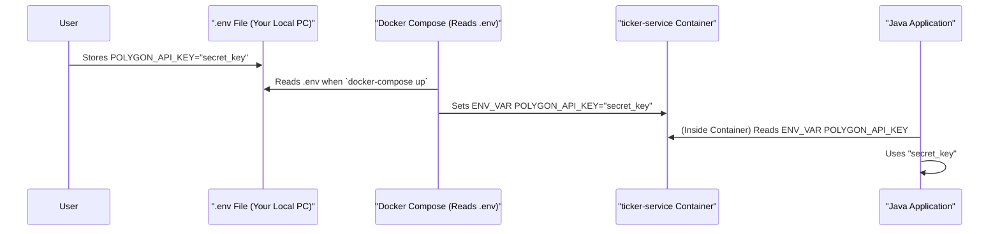

# Chapter 2: Secure Configuration & Secrets Management

Welcome back! In [Chapter 1: Dockerized Service Orchestration](01_dockerized_service_orchestration_.md), we saw how our project uses Docker and Docker Compose to get all its different software parts (like the database and the Java data collector) running together smoothly, like a well-conducted orchestra. We briefly mentioned that these services need settings and sometimes sensitive information like API keys.

This chapter is all about how we handle that: **Secure Configuration & Secrets Management**. Think of this as our project's secure vault combined with its main settings panel. It's super important for keeping things safe and making our project easy to set up.

## What's the Big Secret (and Why Keep It)?

Imagine you have a special key to a very valuable service – for example, your `POLYGON_API_KEY` for Polygon.io. This key gives access to real-time market data, which you might be paying for. If this key fell into the wrong hands, someone else could use your subscription, potentially costing you money or getting your account blocked!

Similarly, our project uses a database, and that database has a password. We don't want to just write these passwords and API keys directly into our code where everyone can see them, especially if we share our code on platforms like GitHub.

So, the main problem we're solving is:
*   **How do we give our applications the secret keys and passwords they need without exposing them?**
*   **How do we manage other settings (like which stock tickers to watch) easily without changing the main code?**

Our project uses a few key tools and files to manage this safely and effectively.

## Our Toolkit for Secrets and Settings

Let's look at the main components involved in managing configuration and secrets in `nvda-daily-prediction`.

### 1. The `.env` File: Your Personal Secret Safe 🗝️

*   **What it is:** A simple text file named `.env` (the dot at the beginning is important!) that you create in the main project folder.
*   **Purpose:** This file is where you store your personal secrets, like your Polygon.io API key and the database password.
*   **Super Important Rule:** The `.env` file should **NEVER** be committed to version control (like Git). It's listed in a special file called `.gitignore`, which tells Git to ignore it. This way, your secrets stay on your computer and don't get shared.
*   **Format:** It uses simple `KEY=VALUE` pairs.

Here's an example of what your `.env` file might look like (as mentioned in the `README.md` setup):

```dotenv
# .env (This file is NOT committed to Git!)
# It should be in the root directory of the project.

POLYGON_API_KEY=YOUR_VERY_SECRET_POLYGON_API_KEY_HERE
POLYGON_DB_PASSWORD=your_chosen_super_secret_db_password
```
*Explanation:* You replace `YOUR_VERY_SECRET_POLYGON_API_KEY_HERE` with your actual API key from Polygon.io, and `your_chosen_super_secret_db_password` with a strong password you choose for the database.

### 2. `docker-compose.yml`: The Conductor's Secret Instructions 📜

In Chapter 1, we learned that `docker-compose.yml` is like the recipe for running our services. It also plays a crucial role in passing configurations and secrets to them.

*   **Environment Variables:** Docker Compose can set "environment variables" for each service it starts. Think of these as settings passed to the service when it boots up inside its Docker container.
*   **Reading from `.env`:** Docker Compose is smart! It can automatically read values from your `.env` file and use them to set these environment variables. This is done using the `${VARIABLE_NAME}` syntax.

Here’s a snippet from our project's `docker-compose.yml` showing how it might provide the API key and database password to our `ticker-service` (the Java data collector) and the `timescaledb` service:

```yaml
# docker-compose.yml (simplified snippet)
services:
  ticker-service:
    image: polygon-ticker-service:0.0.1-SNAPSHOT
    # ... other configurations ...
    environment:
      # Reads POLYGON_API_KEY from your .env file
      - POLYGON_API_KEY=${POLYGON_API_KEY} 
      # Reads POLYGON_DB_PASSWORD from your .env file for the app
      - SPRING_DATASOURCE_PASSWORD=${POLYGON_DB_PASSWORD} 
      # Other settings like database host and user
      - SPRING_DATASOURCE_URL=jdbc:postgresql://timescaledb:5432/polygondata
      - SPRING_DATASOURCE_USERNAME=polygonuser

  timescaledb:
    image: timescale/timescaledb-ha:pg16-ts2.14
    # ... other configurations ...
    environment:
      # Sets the database password using the value from .env
      - POSTGRES_PASSWORD=${POLYGON_DB_PASSWORD} 
      - POSTGRES_USER=polygonuser
      - POSTGRES_DB=polygondata
```
*Explanation:*
*   When you run `docker-compose up -d`, Docker Compose looks for a `.env` file in the same directory.
*   For `ticker-service`, it takes the value of `POLYGON_API_KEY` from your `.env` file and makes it available inside the `ticker-service` container as an environment variable also named `POLYGON_API_KEY`.
*   Similarly, `SPRING_DATASOURCE_PASSWORD` for the Java application and `POSTGRES_PASSWORD` for the database service are set using the `POLYGON_DB_PASSWORD` value from your `.env` file.

This is how your personal secrets securely make their way into the running services without being written directly in `docker-compose.yml`.

### 3. `application.properties`: The Java App's Default Settings Panel ⚙️

Our Java data collector (`ticker-service`) is a Spring Boot application. Spring Boot applications often use a file named `application.properties` for their settings.

*   **Location:** You'll find this file inside the Java service's code, typically at `src/main/resources/application.properties`.
*   **Purpose:** It can define default values for various settings, like the database connection URL, default username, or even a placeholder for the API key.
*   **Override Power:** A key thing to remember is that **environment variables usually override values in `application.properties`**. This is very powerful! It means we can set defaults in `application.properties` but then provide the *actual* (and secret) values through environment variables set by Docker Compose (which reads from `.env`).

Here's a small example of what you might see in `src/main/resources/application.properties` for the Java service:

```properties
# src/main/resources/application.properties (snippet)

# Default Polygon API key (can be overridden by environment variable)
# It's good practice to use a placeholder or non-functional key here.
polygon.api.key=YOUR_API_KEY_PLEASE_SET_VIA_ENV

# Database connection (username might be overridden by env var if needed)
spring.datasource.url=jdbc:postgresql://timescaledb:5432/polygondata
spring.datasource.username=polygonuser
# Password here would be a default, but we override it with SPRING_DATASOURCE_PASSWORD env var
spring.datasource.password=default_weak_password 
```
*Explanation:*
The Java application, when it starts, will first look at `application.properties`. Then, it checks for environment variables. If it finds an environment variable like `POLYGON_API_KEY` (which Spring Boot cleverly maps to `polygon.api.key`) or `SPRING_DATASOURCE_PASSWORD` (maps to `spring.datasource.password`), it will use the value from the environment variable instead of the one in the file.

## How Your Secrets and Settings Flow

Let's trace how a secret, like your `POLYGON_API_KEY`, gets from your private `.env` file to the Java application (`ticker-service`) that needs it.

1.  **You:** Create the `.env` file in the project root and put your `POLYGON_API_KEY=your_actual_key` in it.
2.  **Docker Compose:** When you run `docker-compose up -d`, it reads your `.env` file.
3.  **Environment Variable Injection:** Docker Compose starts the `ticker-service` container. Because `docker-compose.yml` has `POLYGON_API_KEY=${POLYGON_API_KEY}` in the `environment` section for this service, it sets an environment variable *inside the container* called `POLYGON_API_KEY` with the value from your `.env` file.
4.  **Java (Spring Boot) Application:** The `ticker-service` starts up.
    *   It might have a line in its Java code like `@Value("${polygon.api.key}") private String apiKey;` (you can see a hardcoded version in `PolygonWebSocketService.java`, but using `"${polygon.api.key}"` is the flexible way).
    *   Spring Boot intelligently looks for a property named `polygon.api.key`. It checks environment variables first (and automatically converts `POLYGON_API_KEY` to `polygon.api.key`).
    *   It finds the `POLYGON_API_KEY` environment variable you injected and uses its value! This value overrides any default that might have been in `application.properties`.
5.  **Secure Usage:** The Java service now has your API key and can use it to connect to Polygon.io, all without the key ever being written into the main code or `docker-compose.yml` directly.

Here's a simplified diagram showing this flow:



**What about Python scripts?**
Python scripts (like those for training models or running predictions, which we'll see in later chapters) also need access to things like the database password or API key.
1.  They also rely on the `.env` file you create.
2.  Python scripts often use a library like `python-dotenv`. When the script starts, this library can be told to load variables from the `.env` file into the script's environment.
3.  The script then uses standard Python methods (like `os.getenv("POLYGON_DB_PASSWORD")`) to read these values.
This process is outlined in the main `README.md` file under the "Setup" section for Python.

## Why This System is Great

*   **Security:** Your most sensitive information (API keys, passwords) stays in your local `.env` file and is never shared on Git.
*   **Flexibility:** You can easily change settings (like the database password or the list of tickers) by editing your `.env` file or `docker-compose.yml` without needing to rebuild your Java application's Docker image or change the core Python code.
*   **Clarity:** It's clear where settings come from. Defaults can be in `application.properties`, but environment-specific overrides (especially secrets) are managed externally.
*   **Consistency:** Docker ensures that if the application runs, it runs with the configuration provided through these mechanisms, making behavior predictable.

## Conclusion

You've now learned about the "secure vault and settings panel" of the `nvda-daily-prediction` project! We've seen how `.env` files keep your secrets safe and local, how `docker-compose.yml` securely passes these secrets and other configurations to our running services using environment variables, and how `application.properties` can provide defaults for our Java service.

This careful management of configuration and secrets is vital. It protects sensitive information and makes the project adaptable. The database credentials we've configured here will be crucial for our next step.

Speaking of databases, are you ready to see how our project stores all the valuable market data it collects? Let's dive into [Chapter 3: Time-Series Data Persistence (TimescaleDB & JPA/psycopg2)](03_time_series_data_persistence__timescaledb___jpa_psycopg2__.md).

---

Generated by [AI Codebase Knowledge Builder](https://github.com/The-Pocket/Tutorial-Codebase-Knowledge)