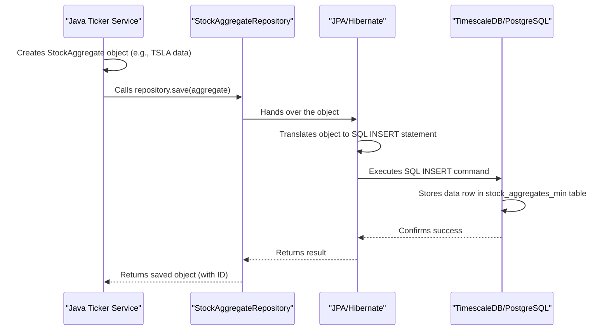

# Chapter 3: Database Schema & Persistence

In the previous chapter, [Infrastructure Orchestration (Docker Compose)](02_infrastructure_orchestration__docker_compose__.md), we saw how Docker Compose acts like a stage crew, setting up our database (TimescaleDB/PostgreSQL) and other services. Now that the stage is set, let's look at *how* we actually organize the information we store in that database. Think of this chapter as designing the filing cabinets and labels for all our financial data. This is **Database Schema & Persistence**.

## Why Care About Organizing Data?

Imagine you're collecting thousands of LEGO bricks. If you just throw them all into one giant box, finding a specific small red brick later will be a nightmare! It's much better to sort them by color, size, or type into different containers.

Similarly, our project collects a lot of financial data: minute-by-minute price changes, individual stock trades, model predictions, and even simulated trade results. If we just dumped this raw data somewhere without structure, it would be incredibly difficult and slow to find the specific information needed for training our machine learning models or analyzing performance.

We need a clear plan – a **schema** – to organize this data, and a reliable way to store it – **persistence** – so it doesn't disappear when we turn off our computer or restart our services.

Our main goal: **Store data in a structured way so we can easily find, retrieve, and use it later.**

## The Blueprint: Database Schema

A **database schema** is like the blueprint for our data storage. It defines:

1.  **Tables:** Where data is stored (like different filing cabinets).
2.  **Columns:** The specific pieces of information stored in each table (like labeled folders within a cabinet drawer).
3.  **Data Types:** What kind of information each column holds (e.g., text, numbers, dates/times).
4.  **Relationships:** How different tables might be linked (though we keep this simple initially).

In our project, we use TimescaleDB, which is an extension built on top of PostgreSQL (a popular and powerful database). TimescaleDB is especially good at handling **time-series data** – data that is recorded over time, like stock prices!

## Making Data Last: Persistence

**Persistence** simply means that the data we store *persists* or lasts, even if the application that wrote it stops running. When our Java service saves a stock price, it writes it to the database on disk. Thanks to Docker volumes we set up in [Chapter 2: Infrastructure Orchestration (Docker Compose)](02_infrastructure_orchestration__docker_compose__.md), this data remains safe even if we stop and restart the database container.

Without persistence, all the data collected would be lost every time the service restarted, making it useless for training models on historical data.

## Our Key Data Tables

Our schema defines a few important tables:

1.  **`stock_aggregates_min`**:
    *   **Purpose:** Stores summarized stock data for each minute. This is often called OHLCV data (Open, High, Low, Close prices, and Volume).
    *   **Key Columns:** `symbol` (like 'TSLA'), `start_time`, `agg_open`, `agg_high`, `agg_low`, `agg_close`, `volume`, `vwap` (Volume-Weighted Average Price), `num_trades`.
    *   **Used By:** Java service saves data here; Python scripts read it for feature engineering and training.

2.  **`stock_ticks`**:
    *   **Purpose:** Stores *individual* trade events as they happen (very granular).
    *   **Key Columns:** `symbol`, `timestamp`, `price`, `size`.
    *   **Used By:** Java service saves data here (optional, depending on configuration). Can be used for more detailed analysis later.

3.  **`stock_predictions`**:
    *   **Purpose:** Stores the predictions made by our machine learning model.
    *   **Key Columns:** `timestamp`, `ticker`, `current_price`, `predicted_probability`, `trade_signal` (Buy/Hold).
    *   **Used By:** The Python [Prediction Service (Python)](07_prediction_service__python__.md) writes predictions here; the [Paper Trading Simulation (Python)](08_paper_trading_simulation__python__.md) reads them.

4.  **`paper_trades`**:
    *   **Purpose:** Records the details of simulated trades made based on the model's predictions.
    *   **Key Columns:** `entry_time`, `exit_time`, `ticker`, `entry_price`, `exit_price`, `shares`, `profit_loss`.
    *   **Used By:** The Python [Paper Trading Simulation (Python)](08_paper_trading_simulation__python__.md) reads predictions and writes trade results here.

Think of these tables as well-organized sections in our financial data library.

## How Java Interacts: JPA Entities and Repositories

Our [Real-time Data Ingestion Service (Java)](04_real_time_data_ingestion_service__java__.md) needs to save the incoming stock data into the `stock_aggregates_min` and `stock_ticks` tables. It uses a technology called **JPA (Jakarta Persistence API)**, which makes interacting with the database from Java much easier.

Here's the idea:

1.  **Entities:** These are special Java classes that mirror the structure of a database table. We have classes like `StockAggregate` and `StockTick`. Each variable in the class corresponds to a column in the table.

    ```java
    // Simplified snippet from src/main/java/.../entity/StockAggregate.java
    @Entity // Tells JPA this class maps to a table
    @Table(name = "stock_aggregates_min") // Specifies the table name
    public class StockAggregate {
        @Id // Marks the primary key
        private Long id;
        private String symbol;
        @Column(name = "agg_close") // Maps to specific column name
        private double close;
        private long volume;
        private Instant startTime;
        // ... other fields, constructors, getters, setters ...
    }
    ```
    *Explanation:* The `@Entity` and `@Table` annotations tell JPA how to link this Java class to the `stock_aggregates_min` database table. `@Id` marks the unique identifier, and `@Column` can specify exact column names.

2.  **Repositories:** These are Java interfaces that define methods for database operations (like saving, finding, deleting). We don't have to write the actual database code (SQL)! Spring Data JPA magically implements these methods for us.

    ```java
    // Simplified snippet from src/main/java/.../repository/StockAggregateRepository.java
    @Repository // Marks this as a data access component
    public interface StockAggregateRepository
           extends JpaRepository<StockAggregate, Long> {
        // Provides methods like save(), findById(), findAll() automatically!
    }
    ```
    *Explanation:* By extending `JpaRepository`, this interface instantly gets methods like `save(StockAggregate aggregate)` which takes a Java object and saves it as a row in the database.

So, the Java service creates `StockAggregate` objects with the data received from Polygon and then simply calls `repository.save(myAggregateObject)` to persist it. JPA handles the translation to SQL `INSERT` commands behind the scenes.

## How Python Interacts: Direct Connection with `psycopg2`

Our Python scripts, used for [Feature Engineering (Python)](05_feature_engineering__python__.md), [Model Training & Walk-Forward Validation (Python)](06_model_training___walk_forward_validation__python__.md), [Prediction Service (Python)](07_prediction_service__python__.md), and [Paper Trading Simulation (Python)](08_paper_trading_simulation__python__.md), need to read data from and write data (predictions, trades) to the database.

Python typically connects more directly using libraries like `psycopg2`.

1.  **Connection:** The script uses connection details (host, port, user, password – often from the `.env` file via [Chapter 1: Configuration Management](01_configuration_management_.md)) to establish a connection to the PostgreSQL database.

    ```python
    # Simplified snippet from sonnet/lgbm_prediction_service.py
    import psycopg2
    import os
    # ... load DB_PASS from .env ...
    conn = psycopg2.connect(
        host="localhost", # Connect to the host port mapped in Docker
        port="5433",
        database="polygondata",
        user="polygonuser",
        password=DB_PASS
    )
    cursor = conn.cursor() # Create a cursor to execute commands
    ```
    *Explanation:* This code uses the `psycopg2` library to connect to the database running on `localhost:5433` (as mapped by Docker Compose). A `cursor` object is created to send SQL commands.

2.  **Executing SQL:** The Python script then writes standard SQL queries to fetch or insert data.

    ```python
    # Simplified snippet from sonnet/lgbm_prediction_service.py (fetching data)
    ticker = 'TSLA'
    limit = 100
    query = """
    SELECT start_time, agg_close, volume FROM stock_aggregates_min
    WHERE symbol = %s ORDER BY start_time DESC LIMIT %s;
    """
    cursor.execute(query, (ticker, limit)) # Execute the SQL query
    results = cursor.fetchall() # Get all the rows returned
    # Now 'results' contains the data read from the database
    ```
    *Explanation:* A standard SQL `SELECT` query is defined as a string. The `cursor.execute()` method runs this query against the database, safely substituting parameters like the ticker symbol and limit. `fetchall()` retrieves the results. Similarly, SQL `INSERT` statements are used to save predictions or paper trades.

## Under the Hood: Saving Data with Java/JPA

Let's quickly trace how the Java service saves a minute aggregate using JPA:

1.  The Java service receives data for TSLA for a specific minute from Polygon.io.
2.  It creates a new `StockAggregate` Java object and fills its fields (symbol="TSLA", close=180.5, volume=50000, etc.).
3.  It calls the `save()` method on the `StockAggregateRepository`.
4.  Spring Data JPA intercepts this call.
5.  JPA generates the appropriate SQL `INSERT INTO stock_aggregates_min (...) VALUES (...)` command based on the `StockAggregate` object's data and the annotations (`@Entity`, `@Table`, `@Column`).
6.  JPA sends this SQL command to the TimescaleDB/PostgreSQL database via the database connection (configured in `application.properties` / `docker-compose.yml`).
7.  The database executes the SQL command, storing the new row in the `stock_aggregates_min` table.

Here's a simplified diagram:



This abstraction saves Java developers from writing raw SQL code for common operations. Python scripts, however, often benefit from the direct control offered by writing SQL explicitly with `psycopg2`.

## Conclusion

You now understand the concept of a **Database Schema** – the blueprint defining our tables (`stock_aggregates_min`, `stock_ticks`, `stock_predictions`, `paper_trades`) and columns for storing financial data in TimescaleDB/PostgreSQL. You also grasp **Persistence** – ensuring this data is saved reliably.

We saw how the Java service uses **JPA Entities and Repositories** for an object-oriented way to interact with the database, while Python scripts use the **`psycopg2`** library to execute direct SQL commands. Both methods rely on the connection details provided via [Configuration Management](01_configuration_management_.md) and the database instance set up by [Infrastructure Orchestration (Docker Compose)](02_infrastructure_orchestration__docker_compose__.md).

With our data storage structure defined, we can now look at how the first piece of our system, the Java service, actually collects data in real-time and uses this schema to save it.

Ready to see the data flow in? Let's move on to [Chapter 4: Real-time Data Ingestion Service (Java)](04_real_time_data_ingestion_service__java__.md).

---

Generated by [AI Codebase Knowledge Builder](https://github.com/The-Pocket/Tutorial-Codebase-Knowledge)