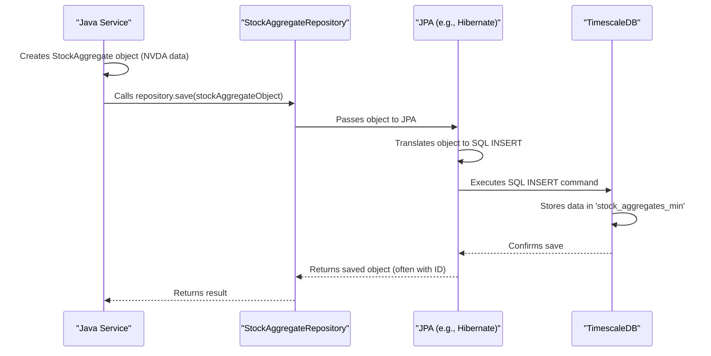

# Chapter 3: Time-Series Data Persistence (TimescaleDB & JPA/psycopg2)

Welcome back! In [Chapter 2: Secure Configuration & Secrets Management](02_secure_configuration___secrets_management_.md), we learned how our project keeps important settings and secret keys (like database passwords) safe and sound. Now that we know *how* to securely tell our services where the database is and how to access it, let's dive into what that database *is* and *how* we store and retrieve our precious financial data.

This chapter is all about **Time-Series Data Persistence**. Think of it as building and using a specialized, super-organized library for all the stock market information our project will collect and generate.

## What's the Big Deal with Storing Financial Data?

Imagine you want to predict tomorrow's weather. You'd probably look at weather patterns from the past, right? What was the temperature yesterday? The day before? Last week? This type of data, where each piece of information is tied to a specific time, is called **time-series data**.

Our `nvda-daily-prediction` project aims to predict stock price movements. To do this, we need to:
1.  Collect historical stock prices (e.g., NVDA's price every minute).
2.  Store this data efficiently.
3.  Retrieve it easily to "train" our prediction models.
4.  Store the predictions our model makes.

If we didn't have a good way to store and manage this data, it would be like trying to remember every stock price in your head – impossible! We need a robust system.

## Our Toolkit for Financial Data

Our project uses a few key tools to handle this:

### 1. TimescaleDB: The Time-Traveling Database 🕰️

*   **What it is:** We use a database called **TimescaleDB**. You can think of it as a standard PostgreSQL database (which is already very powerful) that has been given superpowers for handling time-series data.
*   **Why it's special:** Stock prices, trades, and our predictions are all tied to specific timestamps. TimescaleDB is optimized to store and query this kind of data very quickly. For example, asking "What were all of NVDA's minute prices last Tuesday between 10:00 AM and 10:30 AM?" is a breeze for TimescaleDB.
*   **Setup:** Remember in [Chapter 1: Dockerized Service Orchestration](01_dockerized_service_orchestration_.md), our `docker-compose.yml` file set up a `timescaledb` service? That's this database!

### 2. Data Blueprints: JPA Entities (for Java) 📝

Our Java service (which collects live market data, as we'll see in [Chapter 4: Live Market Data Ingestion (Java/WebSocket)](04_live_market_data_ingestion__java_websocket__.md)) needs a way to understand the structure of the data it's saving. It uses something called **JPA (Jakarta Persistence API)**.

*   **Entities:** Within JPA, we define "Entities." An Entity is like a Java blueprint that perfectly matches a table in our database. For example, we have `StockAggregate.java` which is a blueprint for storing summarized stock data (like the open, high, low, and close price for a minute).

```java
// Simplified from src/main/java/com/example/restfulpolygon/entity/StockAggregate.java
@Entity // Tells JPA this is a blueprint for a database table
@Table(name = "stock_aggregates_min") // The actual table name in TimescaleDB
public class StockAggregate {
    @Id // Marks this as a unique identifier for each record
    private Long id;
    private String symbol; // e.g., "NVDA"
    private Instant startTime; // The timestamp for this data point
    @Column(name = "agg_close") // Maps to the 'agg_close' column
    private double close; // The closing price for that minute
    // ... other fields like open, high, low, volume ...
}
```
*Explanation:* This Java class, with its annotations (`@Entity`, `@Table`, `@Id`, `@Column`), tells JPA exactly how a `StockAggregate` object in Java corresponds to a row in the `stock_aggregates_min` table in our TimescaleDB.

We also have `StockTick.java` for individual trade events, and later, Python scripts will write to tables like `stock_predictions`.

### 3. Data Helpers: JPA Repositories (for Java) 🧑‍💼

Once we have the blueprint (Entity), we need a helper to do the actual saving and fetching from the database. That's where **JPA Repositories** come in.

*   **Repositories:** These are simple Java interfaces that, with a little Spring Data JPA magic, give us powerful methods to interact with the database without writing complex SQL queries.

```java
// Simplified from src/main/java/com/example/restfulpolygon/repository/StockAggregateRepository.java
@Repository // Marks this as a data access helper
public interface StockAggregateRepository
       extends JpaRepository<StockAggregate, Long> {
    // Spring Data JPA automatically provides methods like:
    // save(StockAggregate data)
    // findById(Long id)
    // findAll()
    // ...and many more!
}
```
*Explanation:* Just by defining this interface, our Java code gets methods like `save()`. When the Java service has a `StockAggregate` object filled with data, it can just call `stockAggregateRepository.save(myStockData)` and JPA handles the rest!

### 4. Direct Line: `psycopg2` (for Python) 📞

Our Python scripts (for feature engineering, model training, and prediction, covered in later chapters) also need to talk to the TimescaleDB database. They often use a more direct approach.

*   **`psycopg2`:** This is a popular Python library that allows Python code to connect to and interact with PostgreSQL (and thus TimescaleDB) databases directly by sending SQL commands.

Here's how a Python script might connect:
```python
# Simplified from load_aggregates.py or sonnet/lgbm_prediction_service.py
import psycopg2
import os # To get password from environment

# DB_PASS is loaded from .env (see Chapter 2)
DB_PASS = os.getenv("POLYGON_DB_PASSWORD")
conn = psycopg2.connect(
    host="localhost", port="5433", # As mapped in docker-compose.yml
    database="polygondata", user="polygonuser",
    password=DB_PASS
)
cursor = conn.cursor() # Creates a 'cursor' to execute commands
print("Python connected to TimescaleDB!")
```
*Explanation:* This code uses the connection details (host, port, username, password from the `.env` file we learned about in [Chapter 2: Secure Configuration & Secrets Management](02_secure_configuration___secrets_management_.md)) to establish a link with our TimescaleDB. The `cursor` is then used to send SQL queries.

And here's how it might fetch data:
```python
# Simplified from sonnet/lgbm_prediction_service.py
ticker_symbol = "NVDA"
cursor.execute(
    "SELECT start_time, agg_close FROM stock_aggregates_min WHERE symbol = %s ORDER BY start_time DESC LIMIT 5",
    (ticker_symbol,) # Parameters are passed safely
)
for row in cursor.fetchall():
    print(f"Time: {row[0]}, Close Price: {row[1]}")

# Don't forget to close cursor and connection when done
# cursor.close()
# conn.close()
```
*Explanation:* Python constructs an SQL query string and uses `cursor.execute()` to run it. The `%s` is a placeholder, and `(ticker_symbol,)` provides the actual value safely, preventing issues like SQL injection. `fetchall()` retrieves all matching rows.

## How Data Gets Saved: Java & JPA Example

Let's imagine our Java data collector receives new minute-by-minute data for NVDA. How does it get into TimescaleDB using JPA?

1.  **Data Arrives:** The Java service gets information: symbol="NVDA", startTime=2023-10-26T10:00:00Z, close=405.50, etc.
2.  **Create Object:** It creates a `StockAggregate` Java object and fills its fields with this data.
    ```java
    StockAggregate newData = new StockAggregate();
    newData.setSymbol("NVDA");
    newData.setStartTime(Instant.parse("2023-10-26T10:00:00Z"));
    newData.setClose(405.50);
    // ... set other fields ...
    ```
3.  **Save It!:** It calls the `save()` method on our `StockAggregateRepository`.
    ```java
    // 'repository' is an instance of StockAggregateRepository
    repository.save(newData); 
    ```
    *What happens:* JPA takes the `newData` object. Because `StockAggregate` is an `@Entity` mapped to the `stock_aggregates_min` table, JPA knows exactly how to translate this Java object into an SQL `INSERT` command. It sends this command to TimescaleDB, and the data is stored!

Here's a simplified view of that process:



This "magic" of JPA allows our Java developers to work with familiar Java objects without writing a lot of direct SQL for common database tasks. The annotations in `StockAggregate.java` (like `@Table(name = "stock_aggregates_min")` and `@Column(name = "agg_close")`) are the critical instructions that guide JPA in this translation.

## Persistence: Making Sure Data Sticks Around

The "Persistence" part of our chapter title is crucial. When we save data to TimescaleDB:
*   It's written to disk.
*   Thanks to the Docker `volumes` we configured in [Chapter 1: Dockerized Service Orchestration](01_dockerized_service_orchestration_.md), this data remains safe even if we stop and restart the `timescaledb` Docker container.

This means the historical data we collect today will be there tomorrow, next week, or next year, ready for us to use for analysis and model training. Without persistence, all our hard-collected data would vanish when the application stops!

## Conclusion

You've now peeked into our project's "financial data library"! We've learned that:
*   We use **TimescaleDB**, a database supercharged for **time-series data** like stock prices.
*   Our Java service uses **JPA Entities** (like `StockAggregate.java`) as blueprints for how data is structured and **JPA Repositories** as convenient helpers to save and retrieve this data.
*   Our Python scripts often use the **`psycopg2`** library to communicate directly with TimescaleDB using SQL queries.
*   **Persistence** ensures our valuable data is safely stored and doesn't disappear.

Understanding how we store and access data is fundamental. This data is the fuel for our entire prediction engine. With our database ready and our methods for interacting with it clear, we can now look at how we actually get live market data into this system.

Ready to see the data flow in? Let's move on to [Chapter 4: Live Market Data Ingestion (Java/WebSocket)](04_live_market_data_ingestion__java_websocket__.md).

---

Generated by [AI Codebase Knowledge Builder](https://github.com/The-Pocket/Tutorial-Codebase-Knowledge)