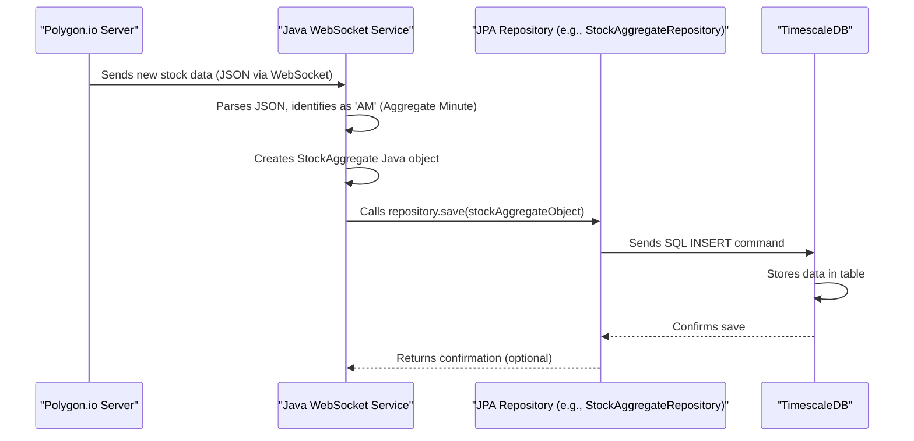

# Chapter 4: Live Market Data Ingestion (Java/WebSocket)

Welcome back! In [Chapter 3: Time-Series Data Persistence (TimescaleDB & JPA/psycopg2)](03_time_series_data_persistence__timescaledb___jpa_psycopg2__.md), we set up our special "library" (TimescaleDB) and learned how our Java and Python applications can store and retrieve financial data using tools like JPA and `psycopg2`. We have the shelves ready, but how do we get the latest "books" (market data) onto them as they are "published"?

This chapter introduces our project's **Live Market Data Ingestion** component. Think of this as a dedicated radio receiver, constantly tuned to the stock market's broadcast. Specifically, it listens to a real-time feed from **Polygon.io**. This "receiver" is a Java application, primarily driven by the `PolygonWebSocketService.java` class. Its job is to catch live stock trades (called "ticks") and summarized data (like price information for each minute, known as "minute bars"), process them, and quickly save them into our TimescaleDB database.

## Why Do We Need a Live "Radio Receiver"?

Imagine you're trying to follow your favorite sports game, but instead of watching it live, you have to call the stadium every 30 seconds and ask, "What's the score now?" It would be tedious, you might miss quick plays, and the stadium staff would get annoyed!

Similarly, for our `nvda-daily-prediction` project, we want to know about stock price changes *as they happen*. Asking a server "What's the price of NVDA now?" repeatedly is inefficient and doesn't give us a truly live picture.

This is the problem our Live Market Data Ingestion service solves:
*   It establishes a **continuous, live connection** to the market data source (Polygon.io).
*   It **receives updates automatically** the moment they occur.
*   It processes these updates and **stores them reliably** in our TimescaleDB database, which we learned about in [Chapter 3: Time-Series Data Persistence (TimescaleDB & JPA/psycopg2)](03_time_series_data_persistence__timescaledb___jpa_psycopg2__.md).

This way, our database always has the freshest information available for analysis and prediction.

## Meet Our Digital "Radio Receiver": `PolygonWebSocketService.java`

The heart of this live data capture is a Java class named `PolygonWebSocketService.java`. This service is designed to be a robust, always-on component. It's like a high-tech radio that not only tunes into the right frequency but also understands the language of the broadcast and records everything important.

Let's explore the key parts of how this "receiver" works:

### 1. The Magic Channel: WebSockets 📡

Instead of making repeated requests (like our stadium phone calls), our Java service uses something called a **WebSocket**.
*   **What it is:** A WebSocket creates a persistent, two-way communication channel between our application and Polygon.io's servers. Think of it like keeping an open phone line.
*   **Why it's great:** Once the line is open, Polygon.io can send us data (like a new NVDA trade) instantly, without us having to ask each time. This is perfect for real-time updates!

### 2. Tuning In: Subscribing to Data Feeds 📻

Just having an open phone line isn't enough; we need to tell Polygon.io what we're interested in. This is called "subscribing."
*   **What we subscribe to:** We can specify:
    *   Which stock tickers we care about (e.g., "NVDA", "AAPL").
    *   What kind of data we want:
        *   **Trades ("Ticks"):** Individual buy/sell transactions as they happen.
        *   **Aggregates ("Minute Bars"):** Summarized data for each minute (e.g., open, high, low, close price, and volume for NVDA from 10:00 AM to 10:01 AM).
*   **How it's done:** Our Java service sends a message over the WebSocket telling Polygon.io our "listening preferences."

### 3. Hearing the Broadcast: The Data Listener 🎧

Our Java service has a "listener" component that's constantly paying attention to the WebSocket connection.
*   **What it does:** When Polygon.io sends a new piece of data (a trade or a minute bar), this listener "hears" it.
*   **Data Format:** The data usually arrives as text in a format called JSON (JavaScript Object Notation), which is easy for computers to read.

### 4. Understanding and Recording: Processing and Saving 📝➡️💾

Once a message is received, our service needs to:
1.  **Parse the JSON:** Convert the text-based JSON message into a more structured format that Java can easily work with.
2.  **Create Java Objects:** Transform this structured data into the Java "blueprints" (Entities) we defined in [Chapter 3: Time-Series Data Persistence (TimescaleDB & JPA/psycopg2)](03_time_series_data_persistence__timescaledb___jpa_psycopg2__.md), like `StockTick.java` for trades or `StockAggregate.java` for minute bars.
3.  **Save to Database:** Use the JPA Repositories (e.g., `StockTickRepository`, `StockAggregateRepository`) from Chapter 3 to save these Java objects into our TimescaleDB. Each object becomes a new row in the appropriate table.

## A Peek Inside `PolygonWebSocketService.java` (Simplified View)

Let's look at some simplified code snippets from `PolygonWebSocketService.java` to understand these steps. (Remember, the actual code might be more complex with error handling and other features.)

**1. Opening the Channel (Connecting & Authenticating)**

First, our service needs to establish the WebSocket connection and tell Polygon.io who we are using our API key (which we manage securely as described in [Chapter 2: Secure Configuration & Secrets Management](02_secure_configuration___secrets_management_.md)).

```java
// Simplified from PolygonWebSocketService.java

// Get the API key from configuration
@Value("${polygon.api.key}")
private String apiKey;

private WebSocket ws; // Represents the WebSocket connection

// This method is called when the application starts
@EventListener(ApplicationReadyEvent.class)
public void connectOnStartup() {
    log.info("Starting WebSocket connection...");
    try {
        // Create a WebSocket connection to Polygon.io's stock feed
        ws = new WebSocketFactory().createSocket("wss://socket.polygon.io/stocks");
        // Add a listener to handle incoming messages (more on this soon)
        ws.addListener(new PolygonWebSocketListener());
        ws.connectAsynchronously(); // Connect without blocking
    } catch (IOException e) {
        log.error("Oops! Couldn't create WebSocket: " + e.getMessage());
    }
}

// This is called after the connection is successfully made
private void sendAuthentication(WebSocket websocket) {
    // Format an authentication message with our API key
    String authMessage = String.format("{\"action\":\"auth\",\"params\":\"%s\"}", apiKey);
    log.info("Sending our secret handshake (authentication)...");
    websocket.sendText(authMessage); // Send it to Polygon.io
}
```
*Explanation:* When our Java application starts, `connectOnStartup()` tries to open a WebSocket "phone line" to Polygon.io. If successful, the `PolygonWebSocketListener` (an inner part of our service) will eventually call `sendAuthentication()` to send our API key, proving we're allowed to get data.

**2. Tuning In (Subscribing to Tickers)**

Once authenticated, we tell Polygon.io what data we want.

```java
// Simplified from PolygonWebSocketService.java

// Get the list of stock tickers from configuration (e.g., "NVDA,MSFT")
@Value("${polygon.tickers}")
private String tickersToSubscribe;

// This is called after we've successfully authenticated
private void sendSubscription(WebSocket websocket) {
    // Example: Subscribe to Trades (T.) and Minute Aggregates (AM.)
    // for tickers like "NVDA". So it becomes "T.NVDA,AM.NVDA".
    String params = buildSubscriptionParameters(tickersToSubscribe); // Helper method

    String subMessage = String.format("{\"action\":\"subscribe\",\"params\":\"%s\"}", params);
    log.info("Telling Polygon.io we want data for: " + params);
    websocket.sendText(subMessage);
}
```
*Explanation:* The `sendSubscription()` method takes the list of tickers (like "NVDA") from our configuration. It then crafts a message asking Polygon.io to send us both individual trades (`T.NVDA`) and minute-by-minute aggregate data (`AM.NVDA`) for these stocks.

**3. Hearing the Broadcast (Listening for Messages)**

The `PolygonWebSocketListener` (an inner class within `PolygonWebSocketService.java`) is where incoming messages are handled.

```java
// Simplified from the inner PolygonWebSocketListener class

// This method is called automatically whenever Polygon.io sends us text
@Override
public void onTextMessage(WebSocket websocket, String text) {
    try {
        // Polygon often sends a list of updates in one go
        List<Map<String, Object>> messages = parseJsonToList(text); // Helper
        for (Map<String, Object> oneMessage : messages) {
            processOneMessage(oneMessage); // Handle each update
        }
    } catch (JsonProcessingException e) {
        log.error("Hmm, couldn't understand this message: " + text);
    }
}
```
*Explanation:* Whenever Polygon.io sends data, `onTextMessage()` receives it as a `text` string (which is in JSON format). We parse this text into a list of individual messages, and then `processOneMessage()` (shown next) handles each one.

**4. Recording the Show (Processing and Saving Data)**

This is where we convert the received data into our database-friendly Java objects and save them. Let's focus on saving minute aggregates (`StockAggregate`).

```java
// Simplified from PolygonWebSocketService.java

// Our helper for saving StockAggregate data (from Chapter 3)
@Autowired
private StockAggregateRepository stockAggregateRepository;
// (We'd also have one for StockTickRepository for trades)

private void processOneMessage(Map<String, Object> message) {
    String eventType = (String) message.get("ev"); // Check: Is it a trade or aggregate?

    if ("AM".equals(eventType)) { // "AM" means Aggregate Minute
        handleAggregateMessage(message);
    } else if ("T".equals(eventType)) { // "T" means Trade (Tick)
        // handleTradeMessage(message); // Similar logic for StockTick
    }
    // ... other event types ...
}

@Transactional // Makes sure the save is all-or-nothing
public void handleAggregateMessage(Map<String, Object> data) {
    StockAggregate agg = new StockAggregate(); // Create a new "record card"
    // Fill the card with data from the message
    agg.setSymbol((String) data.get("sym"));    // Stock symbol (e.g., "NVDA")
    agg.setClose(((Number) data.get("c")).doubleValue()); // Closing price
    agg.setVolume(((Number) data.get("v")).longValue());  // Volume traded
    agg.setStartTime(Instant.ofEpochMilli(((Number) data.get("s")).longValue())); // Timestamp
    // ... set open, high, low, etc. ...

    stockAggregateRepository.save(agg); // Save it to the database!
    log.trace("Saved minute data for: " + agg.getSymbol());
}
```
*Explanation:* `processOneMessage()` checks the `ev` (event type) field. If it's `AM` (a minute aggregate), `handleAggregateMessage()` takes over. This method:
1.  Creates a new `StockAggregate` object (our Java blueprint from `StockAggregate.java`, discussed in [Chapter 3: Time-Series Data Persistence (TimescaleDB & JPA/psycopg2)](03_time_series_data_persistence__timescaledb___jpa_psycopg2__.md)).
2.  Populates it with details like the stock symbol, closing price, volume, and timestamp, all extracted from the `data` map.
3.  Uses `stockAggregateRepository.save(agg)` to store this `StockAggregate` object in our `stock_aggregates_min` table in TimescaleDB. The `@Transactional` annotation ensures this save operation is robust.
A similar process happens for `T` (trade/tick) events, using `StockTick.java` and `StockTickRepository.java`.

## The Journey of a Stock Update: Under the Hood

Let's quickly trace how a single NVDA minute-summary update travels from Polygon.io to our database:

1.  **Polygon.io Broadcasts:** Polygon.io's servers generate a new minute bar for NVDA (e.g., data for 10:01 AM). It sends this as a JSON message over our open WebSocket connection.
2.  **Java Service Hears:** The `onTextMessage()` method in our `PolygonWebSocketListener` receives this JSON string.
3.  **Java Service Understands:** The JSON is parsed. `processOneMessage()` sees it's an "AM" event.
4.  **Data Prepared:** `handleAggregateMessage()` creates a `StockAggregate` object and fills it with NVDA's 10:01 AM data (open, high, low, close, volume, time).
5.  **Data Saved:** `stockAggregateRepository.save()` is called. JPA (Hibernate, under the hood) converts this Java object into an SQL `INSERT` command.
6.  **TimescaleDB Records:** The SQL command is sent to our TimescaleDB. A new row representing NVDA's 10:01 AM minute bar is added to the `stock_aggregates_min` table, safely persisted!

Here's a simple diagram of that flow:



This whole process happens continuously, for every stock we're subscribed to, for every trade and every minute bar, ensuring our database is always filling up with fresh market data.

## Running the Receiver (A Quick Reminder)

You typically don't run `PolygonWebSocketService.java` by hand. As we saw in [Chapter 1: Dockerized Service Orchestration](01_dockerized_service_orchestration_.md), it's one of the services defined in our `docker-compose.yml` file. When you run `docker-compose up -d`, Docker starts this Java service in its own container, and it automatically begins its job of listening for and saving market data.

## Conclusion

You've now met our project's "dedicated radio receiver" – the **Live Market Data Ingestion** service! We've seen how the `PolygonWebSocketService.java` class uses WebSockets to establish a persistent connection to Polygon.io, subscribes to real-time stock trades (ticks) and minute aggregates, processes the incoming JSON data, and saves it into our TimescaleDB database using JPA Entities and Repositories from [Chapter 3: Time-Series Data Persistence (TimescaleDB & JPA/psycopg2)](03_time_series_data_persistence__timescaledb___jpa_psycopg2__.md).

This constant flow of fresh data is the lifeblood of our prediction system. But raw prices and volumes, while useful, might not be the best "food" for a machine learning model. We often need to transform this raw data into more meaningful "features" or indicators.

Ready to learn how we can process this collected data to prepare it for our predictive model? Let's move on to [Chapter 5: Market Feature Engineering (Python/Pandas)](05_market_feature_engineering__python_pandas__.md).

---

Generated by [AI Codebase Knowledge Builder](https://github.com/The-Pocket/Tutorial-Codebase-Knowledge)