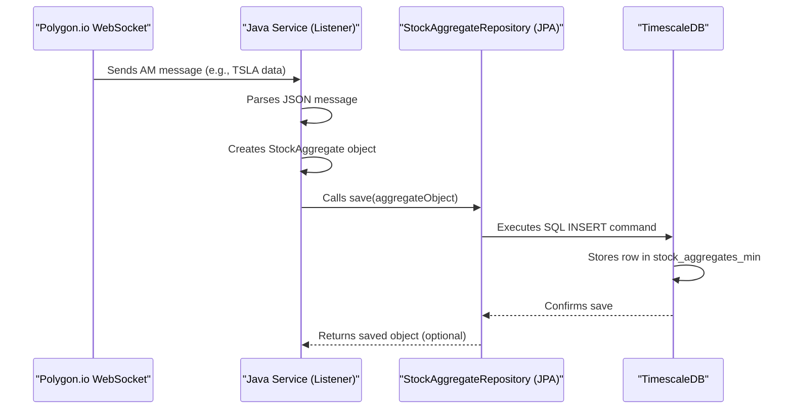

# Chapter 4: Real-time Data Ingestion Service (Java)

In [Chapter 3: Database Schema & Persistence](03_database_schema___persistence_.md), we designed the "filing cabinets" (database tables) for our stock data. Now, let's meet the tireless librarian who actually *collects* the information in real-time and puts it into those cabinets: our **Real-time Data Ingestion Service**.

This is a core Java application that acts like a dedicated radio receiver constantly tuned into the stock market's frequency, specifically listening for broadcasts from Polygon.io.

## Why Do We Need a Dedicated Listener?

Imagine you want to track the price of a specific stock, say Tesla (TSLA), *as it changes* throughout the day. You can't just ask "What's the price?" every few seconds – that's inefficient and might miss important movements. We need a way to get updates *pushed* to us the moment they happen.

This service solves that problem. Its main job is: **Continuously listen for real-time stock market updates from Polygon.io and reliably save them into our database.**

## Key Concepts: How the Listener Works

Let's break down the main parts of this Java service:

1.  **WebSocket Connection:** Think of this like establishing a persistent, open phone line directly to Polygon.io's servers. Unlike a regular website request where you ask and get one answer, a WebSocket stays open, allowing Polygon.io to send us data *whenever it has updates*, without us needing to ask repeatedly. We use our API key (managed via [Chapter 1: Configuration Management](01_configuration_management_.md)) to authenticate this connection.

2.  **Subscription:** Once the phone line is open, we tell Polygon.io what we're interested in. We "subscribe" to specific data types (like minute-by-minute summaries or individual trades) for particular stock tickers (e.g., "TSLA", "AAPL").

3.  **Data Listener:** This is the part of our Java code that actively "listens" to the open phone line. When Polygon.io sends a message (like a new price update for TSLA), the listener picks it up.

4.  **Data Processing:** The messages from Polygon.io arrive in a specific format (usually JSON text). Our service needs to understand this format, extract the useful information (like ticker symbol, price, volume, timestamp), and translate it into a structured format that our database understands – specifically, the Java `StockAggregate` or `StockTick` objects we defined based on our [Chapter 3: Database Schema & Persistence](03_database_schema___persistence_.md).

5.  **Database Saving:** Once the data is processed into a Java object (like `StockAggregate`), the service uses the JPA Repositories (e.g., `StockAggregateRepository`) we learned about in Chapter 3 to save this object as a new row in the corresponding database table (e.g., `stock_aggregates_min`).

## Running the Service

You don't usually run this Java service directly. It's managed by **Docker Compose** as part of our infrastructure stack, which we set up in [Chapter 2: Infrastructure Orchestration (Docker Compose)](02_infrastructure_orchestration__docker_compose__.md). When you run `docker-compose up -d`, Docker starts this service in a container, and it immediately tries to connect to Polygon.io based on the settings provided (like the API key and tickers from the `docker-compose.yml` environment variables).

## A Look Inside the Code

Let's peek at simplified snippets from the core file: `PolygonWebSocketService.java`.

**1. Connecting and Authenticating:**

```java
// Inside PolygonWebSocketService.java

// Read API key from environment/config
@Value("${polygon.api.key}") // Simplified from actual code
private String apiKey;

private WebSocket ws; // Represents the connection

// Method called automatically on startup
@EventListener(ApplicationReadyEvent.class)
public void connectOnStartup() {
    log.info("Initiating WebSocket connection...");
    try {
        ws = new WebSocketFactory().createSocket("wss://socket.polygon.io/stocks");
        // Add listener to handle messages (more on this later)
        ws.addListener(new PolygonWebSocketListener());
        ws.connectAsynchronously(); // Connect without blocking
    } catch (IOException e) {
        log.error("Failed to create WebSocket", e);
    }
}

// Called after connection is established
private void sendAuthentication(WebSocket websocket) {
    String authMsg = String.format("{\"action\":\"auth\",\"params\":\"%s\"}", apiKey);
    log.info("Sending authentication...");
    websocket.sendText(authMsg); // Tell Polygon.io who we are
}
```

*Explanation:* When the service starts (`ApplicationReadyEvent`), it creates a WebSocket connection (`ws`) to Polygon's address. It then connects asynchronously. Once connected, the `sendAuthentication` method sends our API key to prove we have access.

**2. Subscribing to Tickers:**

```java
// Inside PolygonWebSocketService.java

// Read tickers from environment/config
@Value("${polygon.tickers}") // Simplified
private String tickersToSubscribe; // e.g., "TSLA,AAPL"

// Called after successful authentication
private void sendSubscription(WebSocket websocket) {
    // Creates a comma-separated list like "AM.TSLA,AM.AAPL,T.TSLA,T.AAPL"
    // AM = Aggregates per Minute, T = Trades
    String params = buildSubscriptionParams(tickersToSubscribe);

    String subMsg = String.format("{\"action\":\"subscribe\",\"params\":\"%s\"}", params);
    log.info("Sending subscription for: {}", params);
    websocket.sendText(subMsg); // Tell Polygon.io what data we want
}
```

*Explanation:* After authentication succeeds, this code reads the list of tickers from the configuration (e.g., "TSLA"). It then tells Polygon.io, "Please send me minute aggregates (AM) and trades (T) for these tickers."

**3. Listening for Messages:**

```java
// Inside the inner PolygonWebSocketListener class within PolygonWebSocketService.java

// This method is automatically called when a text message arrives
@Override
public void onTextMessage(WebSocket websocket, String text) {
    try {
        // Parse the JSON text into a list of message maps
        List<Map<String, Object>> messages = objectMapper.readValue(text, ...);
        for (Map<String, Object> message : messages) {
            processMessage(message); // Handle each message individually
        }
    } catch (JsonProcessingException e) {
        log.error("Failed to parse message: {}", text, e);
    }
}
```

*Explanation:* This is the core listening part. Whenever Polygon.io sends data over the WebSocket, the `onTextMessage` method receives it as a string (`text`). It parses this text (which is usually JSON) and calls `processMessage` for each update received.

**4. Processing and Saving Data (Example: Minute Aggregates):**

```java
// Inside PolygonWebSocketService.java

// Inject the repository to interact with the database
@Autowired
private StockAggregateRepository stockAggregateRepository;

private void processMessage(Map<String, Object> message) {
    String eventType = (String) message.get("ev"); // Check message type (e.g., "AM")
    if ("AM".equals(eventType)) { // If it's an Aggregate Minute message
        handleAggregateMessage(message);
    } // else handle other types like "T" (Trades), "status", etc.
}

@Transactional // Make the database save operation reliable
public void handleAggregateMessage(Map<String, Object> message) {
    try {
        StockAggregate agg = new StockAggregate(); // Create our Java object
        // Extract data from the message map and set fields
        agg.setSymbol((String) message.get("sym"));
        agg.setClose(((Number) message.get("c")).doubleValue());
        agg.setVolume(((Number) message.get("v")).longValue());
        // ... set open, high, low, startTime, etc. ...

        // SAVE TO DATABASE using the repository
        stockAggregateRepository.save(agg);
        log.trace("Saved aggregate: {}", agg);

    } catch (Exception e) {
        log.error("Error processing aggregate: {}", message, e);
    }
}
```

*Explanation:* The `processMessage` method checks the type of event (`ev`). If it's a minute aggregate (`AM`), it calls `handleAggregateMessage`. This method creates a `StockAggregate` object (our Java representation from Chapter 3), fills it with data parsed from the message, and then crucially calls `stockAggregateRepository.save(agg)`. This JPA command saves the data into the `stock_aggregates_min` table in our TimescaleDB database.

## Under the Hood: The Data Flow

Let's trace the journey of a single minute-summary update for TSLA:

1.  **Polygon Sends:** Polygon.io's server detects the end of a minute and has summarized TSLA's activity. It sends a JSON message over the established WebSocket connection.
2.  **Service Receives:** The `onTextMessage` method in our Java service receives this JSON string.
3.  **Service Parses:** The JSON string is parsed into a Java `Map` structure.
4.  **Service Processes:** `processMessage` identifies it as an "AM" event and calls `handleAggregateMessage`.
5.  **Object Creation:** `handleAggregateMessage` creates a `StockAggregate` Java object and populates its fields (symbol, open, high, low, close, volume, time) from the map.
6.  **Repository Called:** The service calls `stockAggregateRepository.save(theNewAggregateObject)`.
7.  **JPA Magic:** Spring Data JPA translates this `save` call into an SQL `INSERT INTO stock_aggregates_min (...) VALUES (...)` command.
8.  **Database Stores:** The SQL command is sent to the TimescaleDB database, which executes it, adding a new row to the `stock_aggregates_min` table. The data is now persistently stored!

Here's a diagram of that flow:



This process repeats continuously for every message received from Polygon.io, steadily building up our historical dataset in the database.

## Conclusion

You've now learned about the **Real-time Data Ingestion Service**, the Java component that acts as our dedicated receiver for live stock market data from Polygon.io. We saw how it uses WebSockets to maintain a connection, subscribes to specific data feeds, listens for incoming messages, processes them into structured Java objects, and uses JPA repositories (from [Chapter 3: Database Schema & Persistence](03_database_schema___persistence_.md)) to save this valuable information into our TimescaleDB database.

This service runs in the background, managed by [Chapter 2: Infrastructure Orchestration (Docker Compose)](02_infrastructure_orchestration__docker_compose__.md), ensuring a continuous flow of data.

Now that we have a way to collect and store raw market data, the next step is to start making sense of it. How can we transform this raw data into meaningful signals that a machine learning model can understand? That's where feature engineering comes in.

Ready to start preparing the data for our model? Let's move on to [Chapter 5: Feature Engineering (Python)](05_feature_engineering__python__.md).

---

Generated by [AI Codebase Knowledge Builder](https://github.com/The-Pocket/Tutorial-Codebase-Knowledge)