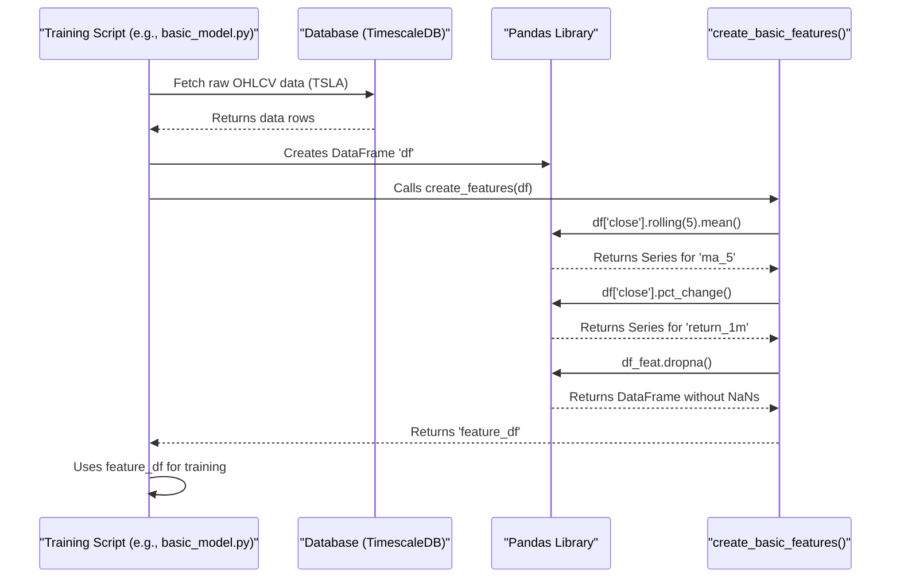

# Chapter 5: Feature Engineering (Python)

In [Chapter 4: Real-time Data Ingestion Service (Java)](04_real_time_data_ingestion_service__java__.md), we learned how our Java service collects live stock market data and stores it neatly in our database, thanks to the structure we defined in [Chapter 3: Database Schema & Persistence](03_database_schema___persistence_.md). We now have the raw ingredients: minute-by-minute stock prices (Open, High, Low, Close) and Volume (OHLCV).

But just like a chef wouldn't just throw raw potatoes and onions into a pot and expect a gourmet meal, our machine learning model needs these raw ingredients prepared. It needs more flavourful, informative signals to make good predictions. This preparation process is called **Feature Engineering**.

## Why Prepare the Ingredients?

Imagine trying to predict if a stock price will go up based *only* on the closing price from the last minute. That's not very helpful, right? The model needs more context.

*   Is the price going up or down compared to an hour ago? (Trend)
*   How much has the price bounced around recently? (Volatility)
*   Is the trading volume unusually high or low? (Activity/Interest)

Raw OHLCV data doesn't directly answer these questions. **Feature Engineering** is the process of transforming this raw data into new, calculated values – called **features** – that capture these kinds of insights.

Think of it like this:
*   **Raw Data:** Raw potatoes, onions, carrots.
*   **Feature Engineering:** Chopping, dicing, maybe pre-roasting the vegetables.
*   **Features:** Prepared, ready-to-cook ingredients.
*   **Machine Learning Model:** The final recipe/cooking process.

Our goal is: **Transform raw market data into informative features that help the machine learning model understand market patterns.**

## Key Concepts: Creating Features

1.  **What are Features?** Features are the input signals we feed into our machine learning model. They are numerical representations derived from the raw data.

2.  **What is Feature Engineering?** It's the art and science of creating these features. We use our understanding of markets (or just mathematical transformations) to create values that might hold predictive power.

3.  **Examples of Features:**
    *   **Moving Averages (MA):** The average closing price over the last N minutes (e.g., 5 minutes, 20 minutes). Helps understand the recent trend.
    *   **Percentage Return:** How much the price changed from one minute to the next (or over several minutes). Shows momentum.
    *   **Volatility:** How much the price fluctuates. Often measured by the standard deviation of returns.
    *   **Technical Indicators:** Pre-defined calculations used by traders, like RSI (Relative Strength Index), MACD, or Bollinger Bands. These often combine price and volume in specific ways. (We use some of these in our more advanced scripts).

4.  **Why Python?** Python has amazing libraries like **Pandas** that make manipulating time-series data (like our stock prices) very easy. Calculating rolling averages or percentage changes can be done in just one line of code!

5.  **Reusability:** Since we need these features for training different models or running different analyses, the code for creating features is often put into functions that can be reused across multiple Python scripts in our project (like in `sonnet/basic_model.py` and the more complex `sonnet/lightgbm_*.py` scripts).

## How To Use It: Creating Features in Code

Let's look at a simplified example from the `sonnet/basic_model.py` script. This script first fetches raw data from the database (using connection details from [Chapter 1: Configuration Management](01_configuration_management_.md) and the schema from [Chapter 3: Database Schema & Persistence](03_database_schema___persistence_.md)) into a Pandas DataFrame.

**1. Fetching Data:**

```python
# Simplified from sonnet/basic_model.py
import psycopg2
import pandas as pd
import os
# ... load DB connection details ...

conn = psycopg2.connect(...) # Connect to database
TICKER = "TSLA"
query = """
SELECT start_time AS time, agg_close AS close, volume
FROM stock_aggregates_min WHERE symbol = %(ticker)s
ORDER BY start_time ASC;
"""
df = pd.read_sql(query, conn, params={'ticker': TICKER})
df['time'] = pd.to_datetime(df['time'])
df.set_index('time', inplace=True)
conn.close()
# Now 'df' looks like:
#                      close    volume
# time
# 2023-10-26 10:00:00  210.50   150000
# 2023-10-26 10:01:00  210.75   120000
# ...
```

*Explanation:* We connect to the database, run a SQL query to get the closing price and volume for TSLA, and load it into a Pandas DataFrame called `df`. We set the `time` column as the index, which is standard practice for time-series data in Pandas.

**2. Creating Features with a Function:**

Now, we define a function to add new feature columns to this DataFrame.

```python
# Simplified from sonnet/basic_model.py
def create_basic_features(df):
    df_feat = df.copy() # Work on a copy

    # Feature 1: 5-minute Moving Average of Close Price
    df_feat['ma_5'] = df_feat['close'].rolling(window=5).mean()

    # Feature 2: 1-minute Percentage Return
    df_feat['return_1m'] = df_feat['close'].pct_change()

    # ... potentially add more features ...

    df_feat.dropna(inplace=True) # Remove rows with NaNs
    return df_feat

# Apply the function
feature_df = create_basic_features(df)
# Now 'feature_df' looks like:
#                      close    volume    ma_5  return_1m
# time
# 2023-10-26 10:04:00  211.20   110000  210.90   0.001186 # First row with valid MA_5
# 2023-10-26 10:05:00  211.00   130000  211.00  -0.000947
# ...
```

*Explanation:*
*   The `create_basic_features` function takes the raw DataFrame `df` as input.
*   `df_feat['close'].rolling(window=5).mean()`: This is the magic of Pandas! It calculates the rolling average of the `close` price over a 5-minute window.
*   `df_feat['close'].pct_change()`: This calculates the percentage change in the `close` price from the previous row (1-minute return).
*   `df_feat.dropna(inplace=True)`: The first few rows won't have enough data for a 5-minute average, resulting in `NaN` (Not a Number). We drop these rows.
*   The function returns `feature_df`, which now contains the original data *plus* the new `ma_5` and `return_1m` columns. This enhanced DataFrame is what we'll use to train the model.

Our more advanced scripts like `sonnet/lightgbm_walk_forward.py` have a much more complex `create_features` function that calculates dozens of features, including technical indicators using libraries like `pandas_ta`. The core idea remains the same: take raw data, apply transformations, get an enriched feature set.

## Under the Hood: How Pandas Helps

Let's quickly trace what happens when we call `create_basic_features`.

**Step-by-Step:**

1.  **Data Retrieval:** The main script connects to the database (as set up by [Chapter 2: Infrastructure Orchestration (Docker Compose)](02_infrastructure_orchestration__docker_compose__.md)) and fetches raw OHLCV data into a Pandas DataFrame.
2.  **Function Call:** The script passes this DataFrame to the `create_basic_features` function.
3.  **Pandas Rolling:** Inside the function, `df['close'].rolling(window=5)` tells Pandas to create "sliding windows" of 5 consecutive rows for the 'close' column.
4.  **Pandas Mean:** `.mean()` calculates the average value within each of those windows. Pandas automatically aligns the result back to the original DataFrame index, creating the `ma_5` column.
5.  **Pandas Pct_Change:** `.pct_change()` calculates the percentage difference between each 'close' value and the previous one, creating the `return_1m` column.
6.  **NaN Handling:** Pandas automatically inserts `NaN` where calculations aren't possible (e.g., the first 4 rows for a 5-period rolling mean, or the very first row for `pct_change`). `dropna()` removes these incomplete rows.
7.  **Return DataFrame:** The function returns the modified DataFrame containing the new feature columns.

**Sequence Diagram:**



This process leverages the power of Pandas to perform complex time-series calculations efficiently with very readable code. The exact features created can vary greatly depending on the strategy, as seen in the different `create_features` functions within the `sonnet/` directory.

## Conclusion

You've now learned about **Feature Engineering**, the crucial step of transforming raw market data (like OHLCV) into meaningful input signals (features) for our machine learning models. We saw how simple features like Moving Averages and Returns can be calculated easily using Python's Pandas library. We also understand that this process is like a chef preparing ingredients – essential for getting a good final result (prediction).

This feature engineering logic, often encapsulated in reusable functions, provides the enriched data needed for the next stage: actually training the model to recognize patterns in these features.

Ready to see how the model learns from these prepared ingredients? Let's move on to [Chapter 6: Model Training & Walk-Forward Validation (Python)](06_model_training___walk_forward_validation__python__.md).

---

Generated by [AI Codebase Knowledge Builder](https://github.com/The-Pocket/Tutorial-Codebase-Knowledge)