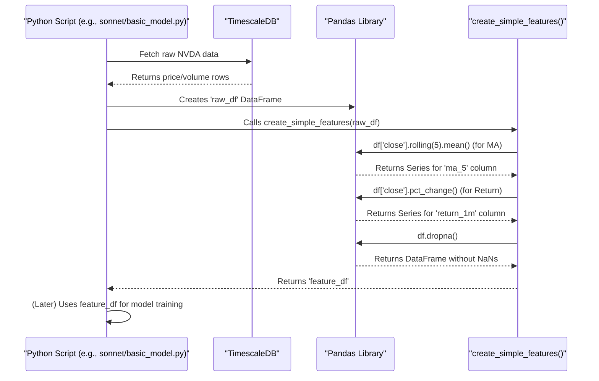

# Chapter 5: Market Feature Engineering (Python/Pandas)

Welcome back! In [Chapter 4: Live Market Data Ingestion (Java/WebSocket)](04_live_market_data_ingestion__java_websocket__.md), we saw how our Java service acts like a live radio, capturing real-time stock market data (like prices and trades for NVDA) and storing it in our TimescaleDB database. We now have a growing collection of raw data.

But is this raw data, like plain Open, High, Low, Close prices, and Volume (OHLCV), the best food for our prediction model? Often, it's like having basic ingredients like potatoes and onions. A chef wouldn't just throw them into a pot and expect a gourmet meal! They would first prepare and season them. This chapter is about that preparation step: **Market Feature Engineering**.

## What's the Problem? Why Can't We Use Raw Prices Directly?

Imagine you're trying to predict if NVDA's stock price will go up in the next hour. Just knowing the *current* price isn't very informative. You'd probably want to know:
*   Has the price been generally increasing or decreasing lately? (Trend)
*   How much has the price been jumping around? (Volatility)
*   Is the current trading volume higher or lower than usual? (Market Activity)

Raw OHLCV data doesn't directly answer these questions. A machine learning model, much like a person, needs more context and more "flavorful" signals to make good predictions.

**Feature Engineering** is the art and science of transforming this raw data into new, calculated values – called **features** – that capture these kinds. It's like our chef meticulously dicing vegetables, grinding spices, or creating a special sauce before actually cooking. The goal is to provide our machine learning model with richer, more insightful inputs.

## Meet Our Chef's Tools: Python and Pandas 🐍🐼

For this "ingredient preparation," our project relies heavily on **Python** and a powerful Python library called **Pandas**.

*   **Python:** A versatile programming language that's very popular in data science and machine learning.
*   **Pandas:** A library specifically designed for working with structured data, especially time-series data like our stock prices. It provides tools (called DataFrames) that are like super-powered spreadsheets, making it easy to load, manipulate, and analyze data.

Why these tools?
*   **Ease of Use:** Pandas allows us to perform complex calculations like "average price over the last 10 minutes" with just a single line of code.
*   **Power:** It can handle large datasets efficiently.
*   **Community:** Being widely used means lots of examples and help are available if you get stuck.

You'll find Python scripts that perform feature engineering in the `sonnet/` directory of our project (e.g., `sonnet/basic_model.py`, `sonnet/lightgbm_walk_forward.py`).

## Feature Engineering in Action: A Simple Recipe

Let's walk through a simplified example of how we might create some new features from raw stock data.

### Step 1: Getting the Raw Ingredients (Fetching Data)

First, our Python script needs to get the raw OHLCV data from our TimescaleDB database, which was populated by the Java service in [Chapter 4: Live Market Data Ingestion (Java/WebSocket)](04_live_market_data_ingestion__java_websocket__.md).

We use a Python library called `psycopg2` to connect to the database. The connection details (like password, host) are securely managed, as discussed in [Chapter 2: Secure Configuration & Secrets Management](02_secure_configuration___secrets_management_.md), often read from an `.env` file.

```python
# Simplified from sonnet/basic_model.py
import psycopg2
import pandas as pd
import os
from dotenv import load_dotenv

load_dotenv() # Load credentials from .env file
DB_PASS = os.getenv("POLYGON_DB_PASSWORD")
# ... other DB connection details ...

conn_string = f"host='localhost' port='5433' dbname='polygondata' user='polygonuser' password='{DB_PASS}'"
conn = psycopg2.connect(conn_string)
print("Connected to TimescaleDB!")

TICKER_SYMBOL = "NVDA" # Let's use NVDA as an example
query = f"""
SELECT start_time AS time, agg_close AS close, volume
FROM stock_aggregates_min 
WHERE symbol = '{TICKER_SYMBOL}'
ORDER BY start_time ASC;
"""
# Pandas can read SQL query results directly into a DataFrame
raw_df = pd.read_sql(query, conn)
conn.close() # Always close the connection

# Convert 'time' column to datetime objects and set as index
raw_df['time'] = pd.to_datetime(raw_df['time'])
raw_df.set_index('time', inplace=True)

print("Raw NVDA data loaded:")
print(raw_df.head()) # Display first 5 rows
```

*Explanation:*
1.  We load database credentials securely.
2.  We connect to our `polygondata` database.
3.  We define an SQL query to select the closing price (`agg_close`) and `volume` for NVDA from the `stock_aggregates_min` table (where our minute-by-minute data is stored).
4.  `pd.read_sql()` executes the query and loads the results directly into a Pandas DataFrame called `raw_df`.
5.  We convert the `time` column to a special datetime format and make it the "index" of our DataFrame. This is like labeling the rows with timestamps, which is very useful for time-series data.

The `raw_df` might look something like this:

```
                     close    volume
time
2023-10-26 10:00:00  405.50   150000
2023-10-26 10:01:00  405.75   120000
2023-10-26 10:02:00  405.60   115000
2023-10-26 10:03:00  406.00   130000
2023-10-26 10:04:00  406.20   110000
...
```

### Step 2: Preparing the Ingredients (Creating Features)

Now that we have our raw data in a Pandas DataFrame, we can start creating new features. This is often done within a Python function. Let's create two simple features:

1.  **5-Minute Moving Average (MA) of Closing Price:** The average closing price over the last 5 minutes. This helps smooth out short-term noise and see the recent trend.
2.  **1-Minute Price Return:** The percentage change in price from the previous minute to the current minute. This shows short-term momentum.

```python
# Simplified from sonnet/basic_model.py
def create_simple_features(input_df):
    # Work on a copy to avoid changing the original DataFrame
    df = input_df.copy()

    # Feature 1: 5-minute Moving Average of 'close' price
    df['ma_5'] = df['close'].rolling(window=5).mean()

    # Feature 2: 1-minute Percentage Return of 'close' price
    df['return_1m'] = df['close'].pct_change()

    # Remove rows with NaN (Not a Number) values
    # These NaNs appear because MA and return can't be calculated for the first few rows
    df.dropna(inplace=True)
    return df

# Apply the function to our raw data
feature_df = create_simple_features(raw_df)

print("\nData with new features:")
print(feature_df.head())
```

*Explanation:*
*   The `create_simple_features` function takes our `raw_df` as input.
*   `df['close'].rolling(window=5).mean()`: This is the Pandas magic!
    *   `df['close']` selects the 'close' price column.
    *   `.rolling(window=5)` creates a "sliding window" of 5 data points.
    *   `.mean()` calculates the average of the 'close' prices within each 5-minute window.
    *   The result is stored in a new column called `ma_5`.
*   `df['close'].pct_change()`: This calculates the percentage change between the current 'close' price and the previous one. The result is stored in a new column `return_1m`.
*   `df.dropna(inplace=True)`: The first few rows won't have enough data to calculate a 5-minute average (e.g., the first row doesn't have 4 previous rows). Similarly, the very first row has no previous price to calculate a return. These calculations result in `NaN` (Not a Number) values. `dropna()` removes rows that contain any `NaN`s.

After these operations, our `feature_df` will have the original `close` and `volume` columns, plus the new `ma_5` and `return_1m` columns:

```
                     close    volume    ma_5  return_1m
time
2023-10-26 10:04:00  406.20   110000  405.81   0.000492  # First row with valid ma_5
2023-10-26 10:05:00  406.10   130000  405.93  -0.000246
...
```
Notice that the first few rows from our `raw_df` are gone because they couldn't have a `ma_5` calculated. This `feature_df` is now "richer" and ready to be fed into a machine learning model (which we'll cover in [Chapter 6: Predictive Model Training & Walk-Forward Validation](06_predictive_model_training___walk_forward_validation_.md)).

More complex scripts in the `sonnet/` directory, like `sonnet/lightgbm_walk_forward.py` (used for training a LightGBM model), have much more sophisticated `create_features` functions that might calculate dozens of features, including technical indicators like RSI, MACD, or Bollinger Bands using libraries like `pandas_ta`. But the core idea is the same: transform raw data into more meaningful features.

## Under the Hood: How Pandas Does Its Magic

Let's quickly trace what Pandas is doing internally when we ask it to calculate something like a 5-minute moving average.

1.  **Data Loaded:** Your Python script has loaded the raw stock data into a Pandas DataFrame.
2.  **`rolling(window=5)` Called:** When you call `.rolling(window=5)` on the 'close' price column, Pandas prepares to look at the data in chunks of 5 consecutive rows.
3.  **Window Slides:** Imagine a "window" of 5 rows sliding down your data:
    *   For the 5th row in your original data, the window covers rows 1 through 5.
    *   For the 6th row, the window covers rows 2 through 6.
    *   And so on...
4.  **`mean()` Called:** For each position of this sliding window, `.mean()` calculates the average of the 'close' prices within that window.
5.  **Result Stored:** Pandas neatly aligns these calculated averages with the correct timestamp (the end of each window) and stores them in the new `ma_5` column. If a window doesn't have enough data (like at the very beginning), Pandas puts a `NaN`.

Here's a simplified sequence diagram:



This process, powered by Pandas, allows us to create many complex features efficiently and with surprisingly little code.

## Why is This "Seasoning" So Important?

*   **Better Model Performance:** Well-engineered features provide clearer signals to the machine learning model, often leading to more accurate predictions.
*   **Capturing Domain Knowledge:** Features like Moving Averages or RSI are based on common financial market analysis techniques. By creating them, we're embedding some of this "market wisdom" into our data.
*   **Dimensionality Reduction (Sometimes):** While we often add features, sometimes feature engineering can also involve combining or selecting features to reduce noise and focus on the most important signals.

## Conclusion

You've now learned about **Market Feature Engineering**, our project's "ingredient preparation" stage! We've seen that:
*   Raw stock market data (OHLCV) is like basic ingredients.
*   Feature engineering transforms this raw data into more "flavorful" inputs (features) for machine learning models.
*   We use **Python** and the **Pandas** library, often in scripts found in the `sonnet/` directory, to perform these transformations.
*   Simple features like Moving Averages and Price Returns can be calculated easily using Pandas' powerful functions.
*   This process creates an enriched DataFrame, ready for model training.

This step is crucial because the quality of the features fed into a model directly impacts the model's ability to learn and make good predictions. With our "ingredients" now expertly prepared, we're ready for the main course: training our predictive model.

Ready to see how we "cook" these features into a working prediction model? Let's move on to [Chapter 6: Predictive Model Training & Walk-Forward Validation](06_predictive_model_training___walk_forward_validation_.md).

---

Generated by [AI Codebase Knowledge Builder](https://github.com/The-Pocket/Tutorial-Codebase-Knowledge)