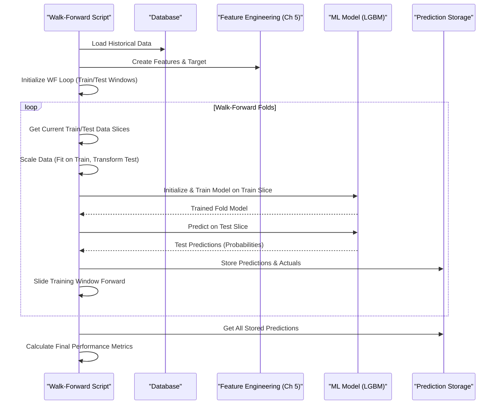

# Chapter 6: Model Training & Walk-Forward Validation (Python)

In [Chapter 5: Feature Engineering (Python)](05_feature_engineering__python__.md), we learned how to prepare our raw stock market data, transforming it into informative "features" like moving averages and returns – the ready-to-cook ingredients for our prediction model. Now, it's time for the main cooking process: **Model Training**. This is where the magic happens, and our chosen machine learning model learns to make predictions based on those features.

But just training a model isn't enough, especially with financial data. We need to test it realistically. Imagine training a weather forecaster using data from 1980-2020 and then testing how well they predict weather in 1995. That doesn't make sense! They had access to "future" data during training relative to the test period. We need a way to test our model as if it were actually running live, day after day. This special testing method is called **Walk-Forward Validation**.

Our main goal here: **Train a model to find patterns in our features and test its performance realistically over time, simulating how it would perform in a live market.**

## Key Concepts: Learning and Testing Over Time

Let's break down the core ideas:

1.  **Model Training (The Learning):**
    *   This is the process where a machine learning algorithm (like LightGBM or XGBoost, which are good at finding complex patterns) analyzes the historical features we created in [Chapter 5: Feature Engineering (Python)](05_feature_engineering__python__.md) and the corresponding outcomes (e.g., did the price go up by a certain amount in the next 15 minutes?).
    *   Think of it like the model studying flashcards. Each card has the features (market conditions) on one side and the actual outcome on the other. The model tries to learn the relationship between them.
    *   The result of training is a "trained model" – a file containing the learned patterns, ready to make predictions on new, unseen data.

2.  **The Problem with Simple Train/Test Split:**
    *   The most basic way to test a model is to split your data randomly: use 80% for training, 20% for testing.
    *   **Why it's bad for time series:** If you randomly pick data points, your training data might include information *from the future* relative to some of your test data points. A model trained on Monday-Friday data might be tested on Wednesday's data – it accidentally "saw" Thursday and Friday already! This gives you overly optimistic results that won't hold up in real trading.

    ```mermaid
    graph LR
        A[Full Historical Data] --> B(Random Split);
        B --> C{Train Data (80%)};
        B --> D{Test Data (20%)};
        subgraph Problem
            direction LR
            E[Train Data includes Future Info relative to Test Data]
        end
        C --> E;
        D --> E;

    ```
    *Diagram: Simple random split mixes past and future, leading to unrealistic testing.*

3.  **Walk-Forward Validation (The Realistic Test):**
    *   This method respects the flow of time. It works like this:
        *   **Step 1: Initial Train:** Train the model on an initial chunk of historical data (e.g., the first 60% of your data).
        *   **Step 2: Predict Next Chunk:** Use the trained model to make predictions on the *immediately following* chunk of data (e.g., the next 10%). Record how well it did (the "out-of-sample" performance).
        *   **Step 3: Slide Forward:** Expand the training window to include the chunk you just predicted on (e.g., now train on the first 70%).
        *   **Step 4: Repeat:** Predict the *next* chunk (e.g., the 10% after the 70%), record performance, and slide the window forward again.
        *   **Continue:** Keep repeating this process until you've predicted on all the remaining data.
    *   **Analogy:** It's exactly like testing our weather forecaster:
        *   Train them on all data up to *today*.
        *   Test them on predicting *tomorrow's* weather.
        *   Tomorrow, add today's actual weather to their training data.
        *   Test them on predicting the *day after tomorrow*. Repeat.
    *   This simulates how a model would perform if deployed live, constantly retraining or adapting as new data arrives. The combined performance across all the "predicted chunks" gives a much more realistic estimate of future performance.

    ```mermaid
    sequenceDiagram
        participant Data as Historical Data
        participant Trainer as Training Process
        participant Predictor as Prediction Process
        participant Results as Performance Log

        Note over Data: Split: Initial Train (60%), Chunk 1 (10%), Chunk 2 (10%), ...

        Trainer->>Data: Gets Initial Train Data (0%-60%)
        Trainer->>Trainer: Trains Model 1
        Predictor->>Trainer: Gets Model 1
        Predictor->>Data: Gets Chunk 1 Data (60%-70%)
        Predictor->>Predictor: Makes Predictions for Chunk 1
        Predictor->>Results: Records Chunk 1 Performance

        Trainer->>Data: Gets Expanded Train Data (0%-70%)
        Trainer->>Trainer: Trains Model 2 (or updates Model 1)
        Predictor->>Trainer: Gets Model 2
        Predictor->>Data: Gets Chunk 2 Data (70%-80%)
        Predictor->>Predictor: Makes Predictions for Chunk 2
        Predictor->>Results: Records Chunk 2 Performance

        Note over Data, Results: Repeat until end of data...

        Results->>Results: Aggregate performance from all chunks

    ```
    *Diagram: Walk-Forward Validation respects time, training on past, predicting the immediate future, and sliding the window.*

## How To Use It: Running a Walk-Forward Training Script

Our project includes Python scripts like `sonnet/lightgbm_walk_forward.py` or `sonnet/xgboost_walk_forward.py` that implement this process. You run them from your terminal after setting up your Python environment (see README).

**1. Setup:**
*   Make sure your database (setup in [Chapter 2: Infrastructure Orchestration (Docker Compose)](02_infrastructure_orchestration__docker_compose__.md)) contains enough historical data (collected by the [Real-time Data Ingestion Service (Java)](04_real_time_data_ingestion_service__java__.md) or loaded manually).
*   Install required Python libraries (`lightgbm`, `pandas`, `sklearn`, etc.).

**2. Run the Script:**
```bash
# Example using the LightGBM script
python3 sonnet/lightgbm_walk_forward.py
```

**3. What Happens (Simplified):**

*   **Load Data:** The script connects to the database (using connection details from [Chapter 1: Configuration Management](01_configuration_management_.md)) and fetches historical data based on the schema from [Chapter 3: Database Schema & Persistence](03_database_schema___persistence__.md).
*   **Create Features:** It calls the feature engineering functions (from [Chapter 5: Feature Engineering (Python)](05_feature_engineering__python__.md)) to prepare the input signals.
*   **Walk-Forward Loop:** It enters the core loop:
    *   Splits data into the current training set and the next test chunk.
    *   Scales the features (important for many models).
    *   Trains a LightGBM model on the scaled training data.
    *   Makes predictions on the scaled test chunk.
    *   Stores the predictions and the actual outcomes.
    *   Slides the window forward for the next iteration.
*   **Evaluate:** After the loop finishes, it combines all the out-of-sample predictions and calculates performance metrics (like accuracy, precision, recall). It often prints a classification report and might save a confusion matrix plot.
*   **(Optional) Final Model:** Some scripts might train one final model on *all* the historical data and save it (e.g., as a `.joblib` file) for later use by the [Prediction Service (Python)](07_prediction_service__python__.md). The walk-forward results tell you how trustworthy that final model might be.

**Example Output (Conceptual):**

```
--- Starting Walk-Forward Validation (LightGBM) ---
Loaded 50000 historical bars for TSLA from DB.
Generating features...
Finished features. Final shape: (49900, 55)
Adding target variable...
Rows after dropping target NaNs: 49885
Total samples: 49885, Initial train: 29931, Predict window: 4988

--- Fold 1 ---
  Training indices: 0-29930 (29931), Test indices: 29931-34918 (4988)
  Scale pos weight for fold: 1.15
  Training LightGBM model for fold 1...
  Predicting on test fold 1...

--- Fold 2 ---
  Training indices: 0-34918 (34919), Test indices: 34919-39906 (4988)
  Scale pos weight for fold: 1.18
  Training LightGBM model for fold 2...
  Predicting on test fold 2...

... (more folds) ...

--- Aggregated Walk-Forward Validation Results (LightGBM) ---
Total out-of-sample predictions made: 19954

Overall Performance across Thresholds:
------------------------------------------------------------
Threshold = 0.60
              precision    recall  f1-score   support
           0       0.55      0.65      0.60     10500
           1       0.52      0.41      0.46      9454
    accuracy                           0.54     19954
   macro avg       0.53      0.53      0.53     19954
weighted avg       0.54      0.54      0.53     19954
------------------------------------------------------------
... (results for other thresholds) ...
Walk-forward confusion matrix (thresh=0.60) saved to lgbm_wf_confusion_matrix_tsla.png
```

This output shows the loop progressing and the final aggregated performance metrics, giving a realistic view of how the model strategy performed over the tested period.

## Under the Hood: The Walk-Forward Machinery

Let's trace the key steps inside a script like `sonnet/lightgbm_walk_forward.py`:

**Step-by-Step:**

1.  **Load & Prepare:** Load raw data (Pandas DataFrame), call `create_features` (from Chapter 5), call `add_target`.
2.  **Define Walk-Forward Parameters:** Set initial training size, rolling window size.
3.  **Initialize Storage:** Create empty lists to store predictions, actuals, and original timestamps for each fold.
4.  **Start Loop:** Begin a `while` loop that continues as long as there's data left to predict.
5.  **Select Data:** Identify the indices for the current training set and the *next* test set (the "chunk").
6.  **Slice Data:** Use Pandas `.iloc` to select the actual data (X_train, y_train, X_test, y_test) for this fold.
7.  **Scale Features:** Use `sklearn.preprocessing.StandardScaler` to scale the training features (`fit_transform`) and apply the *same* scaling to the test features (`transform`). This prevents data leakage from the test set.
8.  **Train Model:** Initialize a LightGBM classifier (`lgb.LGBMClassifier`). Crucially, **set `scale_pos_weight`** to handle imbalanced classes (often, prices don't hit the target gain). Train the model using `model_fold.fit(X_train_fold_scaled, y_train_fold)`. We often use `early_stopping_rounds` with an `eval_set` pointing to the test fold to prevent overfitting within that fold.
9.  **Predict:** Use the trained `model_fold` to predict probabilities on the scaled test data: `model_fold.predict_proba(X_test_fold_scaled)`. We usually care about the probability of the positive class (class 1).
10. **Store Results:** Append the predicted probabilities, the true actual outcomes (`y_test_fold`), and the original timestamps of the test data to the storage lists.
11. **Slide Window:** Update the index marking the end of the training data for the *next* iteration (usually the end of the current test chunk).
12. **Repeat:** Go back to Step 5 until all data is processed.
13. **Aggregate & Evaluate:** After the loop, combine all stored predictions and actuals. Use `sklearn.metrics.classification_report` and `confusion_matrix` to evaluate overall performance across all out-of-sample predictions.

**Simplified Sequence Diagram:**



**Code Snippets (Simplified from `sonnet/lightgbm_walk_forward.py`):**

*Loading Data & Features (Recap)*
```python
# Simplified Data Loading
import pandas as pd
# ... connect to DB (Ch 1) and load data (Ch 3) into df ...
# df = pd.read_sql(...)

# Simplified Feature/Target Creation (Ch 5)
# from my_feature_module import create_features, add_target
feature_df = create_features(df)
feature_df = add_target(feature_df)

# Define features (X) and target (y)
features_to_use = [...] # List of column names
X_full = feature_df[features_to_use]
y_full = feature_df['target']
```
*Explanation:* We load data, then use functions from our feature engineering module to prepare the `feature_df`. We separate the input features (`X_full`) from the target variable (`y_full`).

*The Walk-Forward Loop Structure*
```python
# Simplified Walk-Forward Loop Setup
import numpy as np
from sklearn.preprocessing import StandardScaler
import lightgbm as lgb

n_samples = len(X_full)
initial_train_size = int(n_samples * 0.60)
window_size = int(n_samples * 0.10)
current_idx = initial_train_size
all_preds = []; all_actuals = []
scaler = StandardScaler()

while current_idx < n_samples:
    train_indices = np.arange(0, current_idx)
    test_indices = np.arange(current_idx, min(current_idx + window_size, n_samples))
    if len(test_indices) == 0: break
    print(f"Processing Fold: Train {len(train_indices)}, Test {len(test_indices)}")

    # --- Slice data for this fold ---
    X_train, y_train = X_full.iloc[train_indices], y_full.iloc[train_indices]
    X_test, y_test = X_full.iloc[test_indices], y_full.iloc[test_indices]

    # --- Scale data ---
    X_train_sc = scaler.fit_transform(X_train)
    X_test_sc = scaler.transform(X_test)

    # --- Train Model (Simplified) ---
    model = lgb.LGBMClassifier(random_state=42) # Basic model
    # Add scale_pos_weight for imbalance!
    model.fit(X_train_sc, y_train)

    # --- Predict & Store ---
    preds_proba = model.predict_proba(X_test_sc)[:, 1] # Prob of class 1
    all_preds.extend(preds_proba)
    all_actuals.extend(y_test)

    # --- Slide window ---
    current_idx = test_indices[-1] + 1
```
*Explanation:* This sets up the loop. Inside, it identifies train/test indices, slices the data, scales it, trains a basic LGBM model (real script has more parameters), predicts probabilities, stores them, and updates the index to slide the window for the next fold.

*Evaluating Results*
```python
# Simplified Evaluation
from sklearn.metrics import classification_report

# Apply a threshold to stored probabilities
threshold = 0.60
final_preds_binary = [1 if p >= threshold else 0 for p in all_preds]

# Compare binary predictions to actuals
print(f"\nWalk-Forward Results (Threshold={threshold}):")
print(classification_report(all_actuals, final_preds_binary, zero_division=0))
```
*Explanation:* After the loop, we take all the stored out-of-sample probability predictions (`all_preds`), convert them to binary 0/1 predictions based on a chosen `threshold`, and then compare them to the true outcomes (`all_actuals`) using scikit-learn's reporting tools.

## Conclusion

You've now learned about the core machine learning step: **Model Training**, where algorithms like LightGBM learn patterns from our engineered features. More importantly, you've grasped the concept of **Walk-Forward Validation**, a crucial technique for testing time-series models realistically by simulating their performance over time (Train -> Predict -> Slide). This avoids the pitfalls of simple train/test splits and gives us a more reliable estimate of how our model might perform in the real world.

The output of this process isn't just performance metrics; often, a final trained model is saved. This saved model artifact encapsulates the learned patterns and is ready to be deployed.

How do we use this saved model to make predictions on *new*, incoming data? That's the job of our next component.

Ready to see the model in action? Let's move on to [Chapter 7: Prediction Service (Python)](07_prediction_service__python__.md).

---

Generated by [AI Codebase Knowledge Builder](https://github.com/The-Pocket/Tutorial-Codebase-Knowledge)