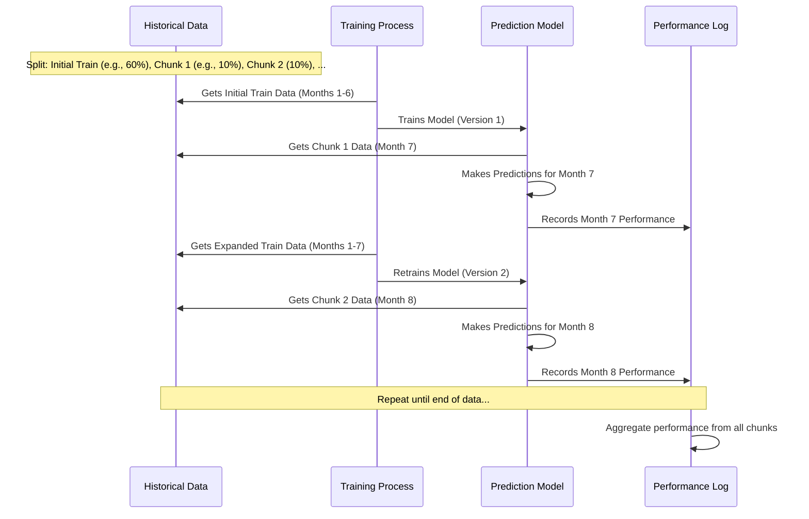
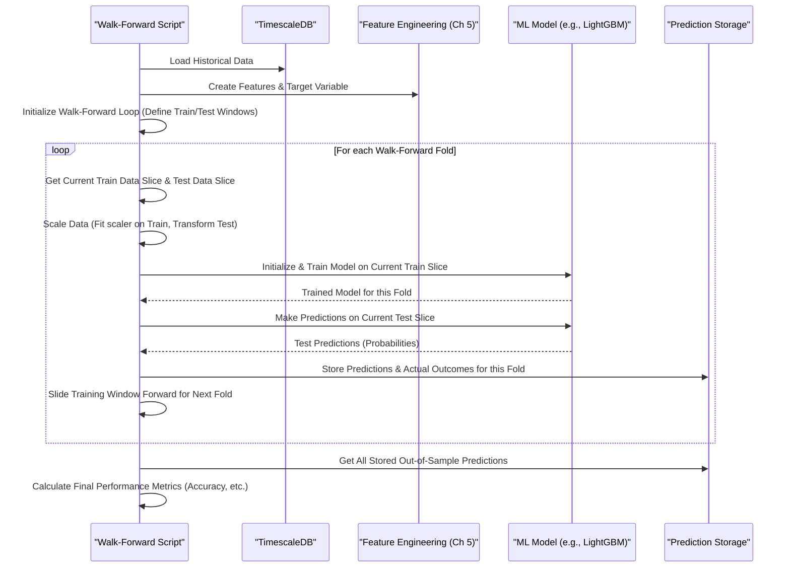

# Chapter 6: Predictive Model Training & Walk-Forward Validation

Welcome back! In [Chapter 5: Market Feature Engineering (Python/Pandas)](05_market_feature_engineering__python_pandas__.md), we learned how to take raw stock market data and transform it into "features" – meaningful signals like moving averages or price momentum. Think of these features as well-prepared ingredients for a recipe. Now, in this chapter, we're going to teach our "chef" – a machine learning model – how to use these ingredients to cook up a prediction!

This is the "learning" phase where our machine learning model (like **LightGBM** or **XGBoost**) studies the historical data and the features we've engineered. Python scripts, such as `sonnet/lightgbm_walk_forward.py`, are responsible for this. A very important part of this chapter is **Walk-Forward Validation**. It's a special way of testing our model that mimics how it would perform in the real world, giving us a realistic idea of its predictive power.

## What's the Goal Here? Learning from the Past to Predict the Future

Imagine you want to predict if NVDA's stock price will go up by at least $1 in the next 15 minutes. How would a computer learn to do this?
1.  It needs to look at past examples: "When the 5-minute moving average was X, and the trading volume was Y, did the price go up by $1 in the next 15 minutes?"
2.  It needs to find patterns in these examples.
3.  It needs to be tested to see if its learned patterns actually work on data it hasn't seen before.

This chapter covers exactly that:
*   **Training a model:** Teaching the computer to find these patterns.
*   **Validating the model:** Testing it robustly to see if it's any good.

Our project uses scripts like `sonnet/lightgbm_walk_forward.py` to train a model that tries to predict, for example, if the price will hit a certain target gain in a set future period.

## Key Concepts: Teaching and Testing Our Model

Let's break down the main ideas.

### 1. Model Training: The Learning Process 🧠

This is where the machine learning algorithm (like LightGBM) "studies" our historical data.
*   **Input:** It takes the features we created in [Chapter 5: Market Feature Engineering (Python/Pandas)](05_market_feature_engineering__python_pandas__.md) (e.g., moving averages, returns) and the actual outcome that happened (e.g., did the price go up by $1, yes or no?).
*   **Process:** The algorithm tries to find mathematical relationships between the input features and the outcome. For example, it might learn that "if the 5-minute moving average is rising AND volume is high, then there's a 70% chance the price will go up."
*   **Output:** A "trained model." This is usually a file that contains all the learned patterns. This model can then be used to make predictions on new, unseen data.

Think of it like a student studying flashcards. Each card has the "market conditions" (features) on one side and the "actual result" (price outcome) on the other. The student (model) tries to learn the connection.

### 2. The Problem with Simple Testing: Don't Cheat! 🙅‍♂️

The simplest way to test a model is to take all your historical data, use 80% to train the model (let it study), and then use the remaining 20% to test it (give it an exam).

**Why this is bad for stock market data (time-series data):**
Stock market data happens in order. If you randomly mix up your data, the model might accidentally get "hints" from the future.
Imagine training a model using data from Monday to Friday, but some of its "test questions" are from Wednesday. During its "study" (training), it might have seen what happened on Thursday and Friday! This is like giving a student the exam answers beforehand. The model will look amazing during testing, but it won't work well in the real world.

```mermaid
graph LR
    A[Full Historical Data] --> B(Random Split);
    B --> C{Train Data (80%)};
    B --> D{Test Data (20%)};
    subgraph Problem [Data Leakage]
        E["Train data might contain info from 'after' some test data points"]
    end
    C --> E;
    D --> E;
```
*Diagram: A simple random split for time-series data can lead to unrealistic test results because the model might have "seen" data from the future relative to its test set.*

### 3. Walk-Forward Validation: Realistic Testing Over Time 🚶➡️

Walk-Forward Validation is a much better way to test models for time-series data like stock prices. It respects the order of time and simulates how a model would actually perform if it were running live.

Here's how it works, step-by-step:

1.  **Initial Training Period:** Take an initial chunk of your historical data (say, the first 6 months) and train your model.
2.  **First Test Period:** Use the trained model to make predictions on the *next* chunk of data (say, the next 1 month). Record how well it did. This is its "out-of-sample" performance because it's data the model hasn't been trained on *yet*.
3.  **Slide and Retrain:** Now, add that 1 month of test data to your training set. So, you retrain the model on the first 7 months of data.
4.  **Next Test Period:** Use this newly retrained model to predict on the *following* 1 month of data. Record its performance.
5.  **Repeat:** Keep "walking forward" through your data – training on all past data available up to a point, testing on the immediate future chunk, then incorporating that chunk into the next training round.

**Analogy: A Weather Forecaster**
*   A forecaster learns from all weather data up to *today*.
*   They predict *tomorrow's* weather.
*   Tomorrow, when the actual weather is known, it's added to their knowledge.
*   They then predict the *day after tomorrow's* weather.
This is exactly what walk-forward validation does for our trading model.


*Diagram: Walk-Forward Validation iteratively trains on past data and tests on the immediate "future" unseen data, then slides the window.*

This method gives a much more realistic estimate of how the model will perform because it's always tested on data it has truly never seen during its training for that specific prediction window.

## How to Use It: Running a Walk-Forward Training Script

Our `nvda-daily-prediction` project uses Python scripts like `sonnet/lightgbm_walk_forward.py` or `sonnet/xgboost_walk_forward.py` to perform this model training and walk-forward validation.

**1. Setup:**
*   Ensure your TimescaleDB (set up in [Chapter 3: Time-Series Data Persistence (TimescaleDB & JPA/psycopg2)](03_time_series_data_persistence__timescaledb___jpa_psycopg2__.md)) has a good amount of historical stock data. This data is collected by the service from [Chapter 4: Live Market Data Ingestion (Java/WebSocket)](04_live_market_data_ingestion__java_websocket__.md) or can be loaded manually.
*   Make sure your Python environment is set up with the necessary libraries (like `pandas`, `scikit-learn`, `lightgbm` or `xgboost`). This is usually detailed in the project's main `README.md`.
*   Your database connection details should be in an `.env` file as discussed in [Chapter 2: Secure Configuration & Secrets Management](02_secure_configuration___secrets_management_.md).

**2. Run the Script:**
You'll typically run the script from your terminal, inside your project directory:
```bash
# Example for LightGBM model
python sonnet/lightgbm_walk_forward.py
```

**3. What Happens Inside (Simplified):**
When you run this script, it performs several steps:

*   **Load Data:** Connects to TimescaleDB and fetches the historical stock data for the specified ticker (e.g., NVDA).
*   **Create Features:** Uses the feature engineering logic (like the `create_features` function from [Chapter 5: Market Feature Engineering (Python/Pandas)](05_market_feature_engineering__python_pandas__.md)) to generate input signals (e.g., moving averages, RSI, etc.) from the raw data.
*   **Define Target:** Creates a "target" variable. This is what the model tries to predict. For example, "did the price go up by at least $1.00 in the next 15 minutes?" (1 for yes, 0 for no).
*   **Walk-Forward Loop:**
    *   Splits data into the current training set and the immediate next test chunk.
    *   Scales the features (a common step to help models learn better).
    *   Trains a model (e.g., LightGBM) on the current training data. Some important settings here are:
        *   `scale_pos_weight`: Helps the model deal with situations where "price goes up" happens less often than "price doesn't go up."
        *   `early_stopping_rounds`: Stops training if the model isn't improving on a validation set (often the test chunk itself), preventing overfitting.
    *   Uses the trained model to make predictions on the test chunk.
    *   Stores these predictions and the actual outcomes.
    *   "Slides" the training window forward to include the data it just tested on, and prepares for the next iteration.
*   **Evaluate Results:** After looping through all the data, it combines all the "out-of-sample" predictions from each test chunk. It then calculates performance metrics like accuracy, precision, and recall to show how well the model did overall. It might print a classification report and save a plot called a "confusion matrix" which visually summarizes correct and incorrect predictions.
*   **(Optional) Save Final Model:** Sometimes, after walk-forward validation, the script might train one last model using *all* the available historical data and save this "final model" (e.g., as a `.joblib` file). The walk-forward results give you an idea of how reliable this final model might be when used for future predictions, which we'll see in [Chapter 7: Real-time Prediction Engine (Python)](07_real_time_prediction_engine__python__.md).

**Example Output (Conceptual):**
You might see output in your terminal like this:
```
--- Starting Walk-Forward Validation (LightGBM) ---
Loaded 50000 historical bars for NVDA from DB.
Generating features... Done.
Adding target variable... Done.
Total samples: 49885, Initial train: 29931, Predict window: 4988

--- Fold 1 ---
  Training on 29931 samples, Testing on 4988 samples
  Scale pos weight for fold: 1.15
  Training LightGBM model for fold 1...
  Predicting on test fold 1...

--- Fold 2 ---
  Training on 34919 samples, Testing on 4988 samples
  Scale pos weight for fold: 1.18
  Training LightGBM model for fold 2...
  Predicting on test fold 2...

... (more folds) ...

--- Aggregated Walk-Forward Validation Results ---
Total out-of-sample predictions: 19954

Overall Performance (Threshold = 0.60):
              precision    recall  f1-score   support
           0       0.55      0.65      0.60     10500  (Predicted 'No', Actual 'No')
           1       0.52      0.41      0.46      9454  (Predicted 'Yes', Actual 'Yes')
    accuracy                           0.54     19954
...
Walk-forward confusion matrix saved to lgbm_wf_confusion_matrix_nvda.png
```
This tells you how the training progressed and gives you the final, realistic performance metrics.

## Under the Hood: The Walk-Forward Machinery

Let's trace the key steps inside a script like `sonnet/lightgbm_walk_forward.py`.

**A High-Level Walkthrough:**
1.  The script starts by loading raw data from the database.
2.  It calls feature engineering functions (like those in [Chapter 5: Market Feature Engineering (Python/Pandas)](05_market_feature_engineering__python_pandas__.md)) to prepare the data with many indicators.
3.  It defines what it's trying to predict (the "target variable").
4.  It then enters the main walk-forward loop:
    *   For each "fold" (iteration) in the loop:
        *   It takes a slice of past data for training (e.g., months 1-6).
        *   It takes the immediately following slice for testing (e.g., month 7).
        *   It trains a new machine learning model (e.g., LightGBM) *only* on that training slice.
        *   It uses this model to make predictions on the test slice.
        *   It stores these predictions and the actual true outcomes for later evaluation.
        *   The training slice for the *next* fold is expanded to include the data just tested on (e.g., months 1-7 for training, month 8 for testing).
5.  After the loop finishes, all the predictions made on the "unseen" test slices are gathered. These are compared against the true outcomes to calculate overall model performance.

Here's a simplified diagram of this flow:


**A Peek at the Code (Highly Simplified):**

Let's look at conceptual snippets from a script like `sonnet/lightgbm_walk_forward.py`.

*Loading Data & Preparing Features (Recap from Chapter 5):*
```python
# Simplified from sonnet/lightgbm_walk_forward.py
import pandas as pd
# df_loaded = ... connect to DB (Ch 3) and load data ...
# feature_df = create_features(df_loaded) # From Ch 5
# final_df = add_target(feature_df)      # Defines 'target' column

# Features we will use as input for the model
features_to_use = ['ma_5', 'return_1m', 'rsi_14', ...]
X_full = final_df[features_to_use]
# What we want the model to predict
y_full = final_df['target']
```
*Explanation:* We load the data, use our `create_features` and `add_target` functions from [Chapter 5: Market Feature Engineering (Python/Pandas)](05_market_feature_engineering__python_pandas__.md). `X_full` holds our input features, and `y_full` holds the outcome (e.g., 1 if price went up, 0 if not).

*Setting up the Walk-Forward Loop:*
```python
# Simplified walk-forward setup
import numpy as np
from sklearn.preprocessing import StandardScaler
import lightgbm as lgb # Our chosen model type

n_samples = len(X_full)
# Example: Initial training on 60% of data
initial_train_size = int(n_samples * 0.60)
# Example: Each test window is 10% of data
predict_window_size = int(n_samples * 0.10)

current_idx = initial_train_size # Start of the first test window
all_out_of_sample_preds = []
all_out_of_sample_actuals = []
```
*Explanation:* We determine how much data to use for the first training round and how large each subsequent test "chunk" will be. `all_out_of_sample_preds` and `all_out_of_sample_actuals` will store results from each test chunk.

*Inside the Walk-Forward Loop - Slicing, Scaling, Training, Predicting:*
```python
# Simplified loop (actual script uses 'while current_idx < n_samples')
# for fold_num in range(num_folds): # Conceptually
    # Define training and testing data for THIS fold
    train_indices = np.arange(0, current_idx)
    test_indices = np.arange(current_idx, min(current_idx + predict_window_size, n_samples))
    if len(test_indices) == 0: break # No more data to test

    X_train, y_train = X_full.iloc[train_indices], y_full.iloc[train_indices]
    X_test, y_test = X_full.iloc[test_indices], y_full.iloc[test_indices]

    # Scale features (helps model learn)
    scaler = StandardScaler()
    X_train_scaled = scaler.fit_transform(X_train)
    X_test_scaled = scaler.transform(X_test) # Use same scaler

    # Train model for this fold
    # (Real script has more params like scale_pos_weight, early_stopping_rounds)
    model_fold = lgb.LGBMClassifier(random_state=42)
    model_fold.fit(X_train_scaled, y_train)

    # Predict probabilities on the test data
    preds_proba_fold = model_fold.predict_proba(X_test_scaled)[:, 1] # Prob of class '1'

    all_out_of_sample_preds.extend(preds_proba_fold)
    all_out_of_sample_actuals.extend(y_test)

    current_idx += len(test_indices) # Slide to next window
```
*Explanation:*
1.  We select the portion of `X_full` and `y_full` for the current training and testing periods.
2.  We use `StandardScaler` to normalize the feature values. It's important to `fit` the scaler *only* on the training data and then `transform` both training and test data with it to avoid data leakage.
3.  We initialize and train a `LGBMClassifier` model *only* on the current `X_train_scaled` and `y_train`.
4.  We use the `model_fold` to predict probabilities on `X_test_scaled`. `[:, 1]` gets the probability for the "positive" class (e.g., price will go up).
5.  We store these predictions and the true actual values.
6.  `current_idx` is updated to move the window for the next iteration.

*Evaluating the Results After the Loop:*
```python
# Simplified from sonnet/lightgbm_walk_forward.py
from sklearn.metrics import classification_report, confusion_matrix
import matplotlib.pyplot as plt

# Convert stored probabilities to binary 0/1 based on a threshold
chosen_threshold = 0.60 # If prob >= 0.60, predict 1 (e.g., "price up")
final_binary_predictions = [1 if p >= chosen_threshold else 0 for p in all_out_of_sample_preds]

print(f"\nWalk-Forward Results (Threshold={chosen_threshold}):")
print(classification_report(all_out_of_sample_actuals, final_binary_predictions))

# Create and save a confusion matrix plot
cm = confusion_matrix(all_out_of_sample_actuals, final_binary_predictions)
# ... (code to plot cm using matplotlib) ...
# plt.savefig('confusion_matrix.png')
```
*Explanation:* Once the loop finishes, we have `all_out_of_sample_preds` (probabilities) and `all_out_of_sample_actuals`. We pick a `chosen_threshold` to convert these probabilities into definite "yes" (1) or "no" (0) predictions. Then, `classification_report` gives us detailed metrics like precision and recall, and `confusion_matrix` helps visualize how many predictions were correct or incorrect for each class.

## Conclusion

You've now journeyed through the heart of our project's learning process: **Predictive Model Training** and the robust **Walk-Forward Validation** technique!
Key takeaways:
*   Machine learning models like LightGBM can learn patterns from historical data and engineered features.
*   Simple train/test splits are misleading for time-series data.
*   Walk-Forward Validation provides a realistic assessment by training on past data and testing on unseen "future" data iteratively.
*   Python scripts (e.g., `sonnet/lightgbm_walk_forward.py`) implement this, involving data loading, feature creation, iterative training/prediction, and performance evaluation.
*   The result is not just a set of performance metrics, but often a final, trained model ready for deployment.

This comprehensive testing gives us confidence (or tells us we need to improve!) in our model's ability to generalize to new, unseen market conditions. With a trained and validated model, we're now ready to use it to make predictions on live, incoming data.

Ready to see how this trained model is put to work in real-time? Let's move on to [Chapter 7: Real-time Prediction Engine (Python)](07_real_time_prediction_engine__python__.md).

---

Generated by [AI Codebase Knowledge Builder](https://github.com/The-Pocket/Tutorial-Codebase-Knowledge)