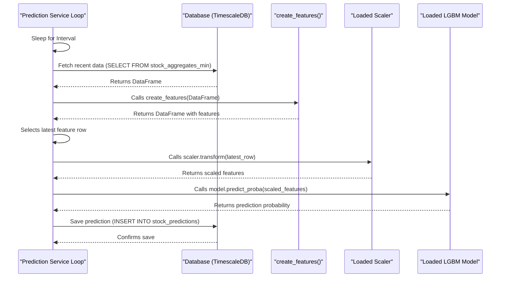

# Chapter 7: Prediction Service (Python)

In the last chapter, [Model Training & Walk-Forward Validation (Python)](06_model_training___walk_forward_validation__python__.md), we trained our machine learning model using historical data and saved the learned patterns into a file. That's great, but a trained model sitting in a file isn't very useful on its own! How do we actually use it to predict what might happen *next* in the market?

That's where the **Prediction Service** comes in. Think of it as putting our trained model to work in real-time.

## What's the Point of a Prediction Service?

Imagine you've trained a super-smart weather forecasting model. Now, you want daily forecasts. You wouldn't just run the training again every day. Instead, you'd take the *already trained* model, feed it the *latest* weather observations (temperature, pressure, humidity right now), and ask it to predict tomorrow's weather.

Our Prediction Service does exactly this for stock prices. Its main job is: **To load the pre-trained model and continuously use it to make predictions based on the latest available market data, saving these predictions for later use.**

## Key Concepts: Putting the Model to Work

Let's break down how this Python script operates:

1.  **Loading the Brain:** The first thing the script does is load the "brain" – the trained model file (e.g., `lgbm_final_model_enhanced_tsla.joblib`) that we saved in [Chapter 6: Model Training & Walk-Forward Validation (Python)](06_model_training___walk_forward_validation__python__.md). It also loads any associated tools needed, like the feature scaler (`StandardScaler`) and the exact list of features the model expects.

2.  **Running Forever (Almost):** The script is designed to run continuously in a loop (`while True`). It only stops when you manually tell it to (e.g., by pressing Ctrl+C in the terminal).

3.  **Checking for New Data:** Inside the loop, the script waits for a set interval (e.g., 60 seconds). Then, it connects to our database (setup in [Chapter 3: Database Schema & Persistence](03_database_schema___persistence__.md)) and fetches the most recent batch of stock data (e.g., the last few hours of minute-by-minute prices for TSLA) that the [Real-time Data Ingestion Service (Java)](04_real_time_data_ingestion_service__java__.md) has been diligently collecting.

4.  **Preparing the Ingredients (Again!):** Just like in training, the raw new data isn't enough. The script applies the *exact same* feature engineering steps we defined in [Chapter 5: Feature Engineering (Python)](05_feature_engineering__python__.md) to this latest data. It's crucial to use the identical process to create features the model understands. It also uses the *same* scaler loaded from the training phase to scale these new features.

5.  **Asking the Model:** With the latest features prepared and scaled, the script feeds them into the loaded model. The model then outputs its prediction – typically a probability (e.g., a 75% chance the price will increase by the target amount in the near future).

6.  **Recording the Forecast:** The script takes this prediction, along with the current timestamp, ticker symbol, current price, and maybe a derived trading signal (e.g., "BUY" if the probability is above a certain threshold), and saves it as a new row in the `stock_predictions` table in our database ([Chapter 3: Database Schema & Persistence](03_database_schema___persistence__.md)).

## How To Use It: Running the Forecaster

Before running the prediction service, make sure:
*   You have successfully run the training script (from [Chapter 6: Model Training & Walk-Forward Validation (Python)](06_model_training___walk_forward_validation__python__.md)) and have the saved model file (e.g., `lgbm_final_model_enhanced_tsla.joblib`).
*   Your database and the Java data ingestion service are running (use `docker-compose up -d` as shown in [Chapter 2: Infrastructure Orchestration (Docker Compose)](02_infrastructure_orchestration__docker_compose__.md)).
*   Your database connection details are correctly set in your `.env` file ([Chapter 1: Configuration Management](01_configuration_management_.md)).
*   You have activated your Python virtual environment (`source venv/bin/activate`).

Now, you can start the prediction service from your terminal (navigate to the `sonnet` directory if needed):

```bash
python3 sonnet/lgbm_prediction_service.py
```

**What you'll see:**

The script will print messages indicating it's starting, loading the model, connecting to the database, and then entering the prediction loop. Every minute (or your configured interval), you'll see logs like:

```
--- Prediction Cycle for TSLA at 2023-10-27 14:35:00+00:00 ---
Fetching data for TSLA (limit 500 rows)...
Returning 300 data points.
Generating features...
Finished feature generation. Shape: (240, 65) # Rows might decrease due to feature lookback
Predicting for time: 2023-10-27 14:35:00+00:00, Price: 215.5000
LGBM Prediction successful (Prob: 0.6850)
Prediction saved to database.
--- Prediction Summary ---
Time: 2023-10-27 14:35:00+00:00
Ticker: TSLA
Current Price: $215.5000
LGBM Probability (Gain>=$1.00): 0.6850
Trade Signal (>0.60): BUY
  Target: $216.50, Stop: $215.00
Loop finished in 0.85s. Sleeping for 59.15s...
```

The script will keep running and making predictions until you press `Ctrl+C`.

## A Peek Inside the Code (Simplified)

Let's look at simplified snippets from `sonnet/lgbm_prediction_service.py` to see the key steps.

**1. Loading the Model and Tools:**

```python
# Simplified from sonnet/lgbm_prediction_service.py
import joblib
import os

# Path to the saved model artifacts from training
MODEL_ARTIFACT_PATH = 'lgbm_final_model_enhanced_tsla.joblib'

# Load the trained model, scaler, and feature list
try:
    model, scaler, features_to_use = joblib.load(MODEL_ARTIFACT_PATH)
    print("Model, scaler, and features loaded.")
except Exception as e:
    print(f"Error loading artifacts: {e}"); exit()
```
*Explanation:* This uses the `joblib` library to load the model, the scaler (needed to prepare data the same way as during training), and the list of feature names the model expects, all saved together during the final training step in [Chapter 6: Model Training & Walk-Forward Validation (Python)](06_model_training___walk_forward_validation__python__.md).

**2. Fetching Latest Data:**

```python
# Simplified from sonnet/lgbm_prediction_service.py
import pandas as pd
import psycopg2
# ... (database connection setup using details from .env - Chapter 1) ...
conn = psycopg2.connect(...)
cursor = conn.cursor()

def get_recent_data(ticker='TSLA', limit=500):
    query = """
    SELECT start_time AS time, agg_close AS close, ... -- other columns
    FROM stock_aggregates_min -- from Chapter 3
    WHERE symbol = %s ORDER BY start_time DESC LIMIT %s;
    """
    df = pd.read_sql(query, conn, params=(ticker, limit), index_col='time')
    df.sort_index(inplace=True) # Sort back to chronological
    return df

# --- Inside the main loop ---
latest_data_raw = get_recent_data(TICKER)
```
*Explanation:* This function connects to the PostgreSQL database (running via [Chapter 2: Infrastructure Orchestration (Docker Compose)](02_infrastructure_orchestration__docker_compose__.md)) and fetches the most recent rows (`LIMIT 500` ordered by time descending) for the specified ticker from the `stock_aggregates_min` table ([Chapter 3: Database Schema & Persistence](03_database_schema___persistence__.md)). It then sorts them back into the correct time order.

**3. Applying Features and Scaling:**

```python
# Simplified from sonnet/lgbm_prediction_service.py
# Assume 'create_features' function is defined or imported (from Chapter 5)
# from my_features import create_features # How it might look

# --- Inside the main loop, after getting latest_data_raw ---
feature_df_full = create_features(latest_data_raw)

# Get the very last row containing all features
latest_feature_row = feature_df_full[features_to_use].iloc[-1:]

# Use the scaler LOADED EARLIER to transform the features
features_scaled = scaler.transform(latest_feature_row.values)
```
*Explanation:* It calls the *same* `create_features` function used during training ([Chapter 5: Feature Engineering (Python)](05_feature_engineering__python__.md)) on the newly fetched data. Then, it takes just the most recent row of features and uses the `scaler` (loaded from the artifact file) to scale them exactly as the model expects.

**4. Making the Prediction:**

```python
# Simplified from sonnet/lgbm_prediction_service.py
# 'model' was loaded earlier

# --- Inside the main loop, after scaling features ---
# Predict probability for the positive class (class 1)
predicted_probability = model.predict_proba(features_scaled)[0, 1]

print(f"Predicted probability: {predicted_probability:.4f}")
```
*Explanation:* This is where the magic happens! The scaled features for the latest data point are fed into the `model.predict_proba` method. It outputs the probability for each class; we typically take the probability of class '1' (price increase).

**5. Saving the Prediction:**

```python
# Simplified from sonnet/lgbm_prediction_service.py
# 'cursor' and 'conn' are the database connection/cursor

# --- Inside the main loop, after getting the prediction ---
current_time = latest_feature_row.index[0] # Get timestamp
current_price = latest_data_raw.loc[current_time, 'close'] # Get price
trade_signal = predicted_probability >= PREDICTION_THRESHOLD # e.g., 0.60

insert_query = """
INSERT INTO stock_predictions (timestamp, ticker, current_price,
                               predicted_probability, trade_signal)
VALUES (%s, %s, %s, %s, %s);
"""
insert_data = (current_time, TICKER, current_price,
               predicted_probability, trade_signal)
cursor.execute(insert_query, insert_data)
# conn.commit() # Usually done with autocommit=True
print("Prediction saved to database.")
```
*Explanation:* It constructs an SQL `INSERT` statement to save the prediction details (timestamp, ticker, price, probability, buy/hold signal) into the `stock_predictions` table ([Chapter 3: Database Schema & Persistence](03_database_schema___persistence__.md)).

## Under the Hood: The Prediction Cycle

Let's trace the main loop of the prediction service:

1.  **Start Loop:** The `while True` loop begins.
2.  **Wait:** The script pauses (`time.sleep`) for the configured interval (e.g., 60 seconds).
3.  **Fetch:** Connects to the database and runs a `SELECT` query to get the latest N rows from `stock_aggregates_min`.
4.  **Engineer Features:** Passes the fetched data (Pandas DataFrame) to the `create_features` function (same one used in training).
5.  **Select Latest:** Takes the last row from the resulting feature DataFrame.
6.  **Scale:** Uses the pre-loaded `scaler` object's `transform` method on this last row.
7.  **Predict:** Calls the pre-loaded `model` object's `predict_proba` method with the scaled features.
8.  **Determine Signal:** Compares the predicted probability to a threshold (e.g., 0.60) to decide if it's a "BUY" signal.
9.  **Save:** Executes an `INSERT` SQL command to store the timestamp, ticker, price, probability, and signal in the `stock_predictions` table.
10. **Repeat:** Goes back to step 2.

Here's a simplified diagram of one prediction cycle:



This cycle ensures that we are constantly generating fresh predictions based on the most up-to-date information available in our database.

## Conclusion

You've now learned about the **Prediction Service (Python)**, the component that brings our trained model to life. It loads the model saved from [Chapter 6: Model Training & Walk-Forward Validation (Python)](06_model_training___walk_forward_validation__python__.md), runs continuously, fetches the latest data collected by the [Real-time Data Ingestion Service (Java)](04_real_time_data_ingestion_service__java__.md), applies the *same* [Feature Engineering (Python)](05_feature_engineering__python__.md) logic, generates a prediction, and saves it to our `stock_predictions` database table ([Chapter 3: Database Schema & Persistence](03_database_schema___persistence__.md)).

This service acts as the bridge between our historical model training and real-time forecasting. The predictions it generates are now available in the database. But how can we simulate actually *acting* on these predictions?

Ready to see how we can simulate trading based on these forecasts? Let's move on to [Chapter 8: Paper Trading Simulation (Python)](08_paper_trading_simulation__python__.md).

---

Generated by [AI Codebase Knowledge Builder](https://github.com/The-Pocket/Tutorial-Codebase-Knowledge)