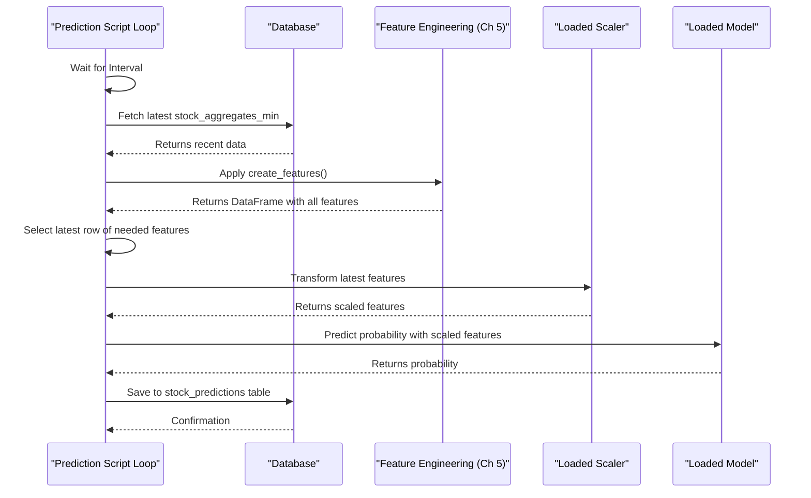

# Chapter 7: Real-time Prediction Engine (Python)

Welcome back! In [Chapter 6: Predictive Model Training & Walk-Forward Validation](06_predictive_model_training___walk_forward_validation_.md), we taught our computer a "recipe" (a machine learning model) using historical stock data. We carefully tested this recipe and saved it to a file. That's fantastic, but a recipe sitting in a cookbook doesn't feed anyone! How do we actually use this learned recipe to predict what might happen *next* in the stock market?

This chapter is all about putting our trained model into action. We'll explore the **Real-time Prediction Engine**, a Python script (like `sonnet/lgbm_prediction_service.py`) that acts like a tireless chef, constantly using our learned recipe to cook up new predictions.

## What's the Goal? From Trained Model to Live Forecasts

Imagine you've trained a very smart dog (our model) to bark once if it thinks a visitor is friendly and twice if it thinks they're a stranger. You've trained it using lots of past examples. Now, when a new visitor approaches your house, you want the dog to use its training to give you a "prediction" (one bark or two).

Our Real-time Prediction Engine does something similar for stock prices:
*   It **loads the "trained dog"** (our saved machine learning model).
*   It **observes the "new visitor"** (the very latest stock market data).
*   It asks the dog to **make a "prediction"** (e.g., "Is the price likely to go up?").
*   It then **records this prediction** so we can see it or use it later.

This engine runs continuously, providing ongoing forecasts.

## Key Steps: How the Prediction Engine Works

Our Python prediction script, like `sonnet/lgbm_prediction_service.py`, follows a regular cycle:

1.  **Wake Up the "Brain":** The first thing it does is load the trained model file (e.g., something like `lgbm_final_model_nvda.joblib`) that we saved in [Chapter 6: Predictive Model Training & Walk-Forward Validation](06_predictive_model_training___walk_forward_validation_.md). It also loads any other tools saved alongside it, like the feature "scaler" (which helps prepare numbers for the model) and the exact list of features the model was trained on.

2.  **Run Continuously:** The script is designed to run in a loop, like a chef who's always on duty during restaurant hours. It only stops if you tell it to (e.g., by pressing Ctrl+C in your terminal).

3.  **Get Fresh Ingredients:** Every few moments (e.g., once a minute), the script checks our TimescaleDB database (which we learned about in [Chapter 3: Time-Series Data Persistence (TimescaleDB & JPA/psycopg2)](03_time_series_data_persistence__timescaledb___jpa_psycopg2__.md)). It fetches the newest stock data (like the latest prices and volumes for NVDA) that our [Live Market Data Ingestion (Java/WebSocket)](04_live_market_data_ingestion__java_websocket__.md) service has been collecting.

4.  **Prepare Ingredients (The Same Way!):** Just like when we trained the model, the raw new data needs to be "chopped and seasoned." The script applies the *exact same* feature engineering steps from [Chapter 5: Market Feature Engineering (Python/Pandas)](05_market_feature_engineering__python_pandas__.md) to this new data. It's super important to use the identical "recipe preparation" so the model understands the input. It also uses the *same* scaler loaded from the training phase.

5.  **Ask the "Brain" for a Prediction:** With the latest features perfectly prepared, the script feeds them to the loaded model. The model then outputs its prediction. This is often a probability, like "There's a 70% chance the price will go up by $1 in the next 15 minutes."

6.  **Write Down the Forecast:** The script takes this prediction, adds details like the current time, stock symbol, and current price, and maybe a simple "BUY" or "HOLD" signal based on the probability. It then saves all this information as a new row in a special table in our database, usually called `stock_predictions`.

## How to Use It: Running Your Own Prediction Chef

Before you can start the prediction engine, make sure of a few things:

*   **You have a trained model:** You must have successfully run the training script from [Chapter 6: Predictive Model Training & Walk-Forward Validation](06_predictive_model_training___walk_forward_validation_.md). This process creates a model file (like `lgbm_final_model_nvda.joblib` or similar, depending on your ticker and script). Note down its exact filename and location.
*   **Your base services are running:** Your TimescaleDB database and the Java data collector service must be up and running. You usually start these with `docker-compose up -d` (as shown in [Chapter 1: Dockerized Service Orchestration](01_dockerized_service_orchestration_.md)).
*   **Database access is configured:** Your Python scripts need to know how to connect to the database. This is usually handled via an `.env` file containing your database password, as discussed in [Chapter 2: Secure Configuration & Secrets Management](02_secure_configuration___secrets_management_.md).
*   **Python environment is ready:** Activate your Python virtual environment (e.g., `source venv/bin/activate` in your project's root directory).

Now, you can start the prediction engine. Open your terminal, navigate to the directory containing the prediction script (e.g., the `sonnet/` folder), and run:

```bash
python sonnet/lgbm_prediction_service.py
```
*(Make sure the script name and path match your project setup. The `README.md` usually specifies the exact script.)*

**What to Expect:**
The script will print messages as it starts up: loading the model, connecting to the database, and then entering its prediction loop. Every minute (or whatever interval is set in the script), you'll see new log messages, something like this:

```
--- Prediction Cycle for NVDA at 2023-11-15 10:30:00+00:00 ---
Fetching data for NVDA...
Generating features...
Finished feature generation. Shape: (250, 70)
Predicting for time: 2023-11-15 10:30:00+00:00, Price: 485.50
LGBM Prediction successful (Prob: 0.7230)
Prediction saved to database.
--- Prediction Summary ---
Time: 2023-11-15 10:30:00+00:00
Ticker: NVDA
Current Price: $485.50
LGBM Probability (Gain>=$1.00): 0.7230
Trade Signal (>0.60): BUY
Loop finished in 0.95s. Sleeping for 59.05s...
```
The script will keep running and making new predictions until you stop it by pressing `Ctrl+C` in the terminal.

## A Peek Inside the Code (Simplified)

Let's look at some very simplified Python code snippets inspired by a script like `sonnet/lgbm_prediction_service.py` to understand the key actions.

**1. Loading the Model and Tools:**
The script first needs to load the model and other items saved during training.

```python
# Simplified from sonnet/lgbm_prediction_service.py
import joblib # For loading saved model files
import os

# Path to your saved model artifact file
MODEL_ARTIFACT_PATH = 'lgbm_final_model_nvda.joblib' # Change if your filename is different!

# Try to load the model, scaler, and the list of feature names
try:
    model, scaler, features_to_use = joblib.load(MODEL_ARTIFACT_PATH)
    print("Model, scaler, and feature list loaded successfully!")
except FileNotFoundError:
    print(f"ERROR: Model file not found at {MODEL_ARTIFACT_PATH}")
    # ... (exit script) ...
```
*Explanation:* `joblib.load()` reads the file created during training. This file conveniently bundles the trained model itself, the `scaler` object (used to normalize numbers), and `features_to_use` (the exact list of feature names the model expects as input).

**2. Fetching the Latest Data from the Database:**
The script needs to get the most recent stock data.

```python
# Simplified from sonnet/lgbm_prediction_service.py
import pandas as pd
import psycopg2 # For talking to PostgreSQL/TimescaleDB

# ... (Code to connect to database using details from .env file - see Ch 2 & 3) ...
# conn = psycopg2.connect(...)

def get_latest_stock_data(ticker_symbol, db_connection, num_rows=500):
    query = """
    SELECT start_time AS time, agg_close AS close, volume, agg_open AS open, agg_high AS high, agg_low AS low, vwap
    FROM stock_aggregates_min 
    WHERE symbol = %s ORDER BY start_time DESC LIMIT %s;
    """
    # Pandas reads data directly from SQL query into a DataFrame
    df = pd.read_sql(query, db_connection, params=(ticker_symbol, num_rows))
    df.sort_values('time', inplace=True) # Sort back to oldest first
    df.set_index('time', inplace=True)   # Use time as the row label
    return df

# --- Inside the main prediction loop ---
# latest_data_df = get_latest_stock_data("NVDA", conn)
```
*Explanation:* The `get_latest_stock_data` function queries the `stock_aggregates_min` table (where our [Live Market Data Ingestion (Java/WebSocket)](04_live_market_data_ingestion__java_websocket__.md) service saves data) for the most recent rows for a given stock. `pd.read_sql` is a handy Pandas function for this. The data is sorted by time and the timestamp is set as the index.

**3. Applying Feature Engineering and Scaling (Crucial Step!):**
This step *must* mirror the feature engineering from training.

```python
# Simplified from sonnet/lgbm_prediction_service.py
# Assume 'create_features' function is defined (it's the same as in Ch 5!)
# from your_feature_script import create_features 

# --- Inside main loop, after getting latest_data_df ---
# feature_df = create_features(latest_data_df) # Create features

# Get just the very latest row of features the model needs
# latest_features_for_model = feature_df[features_to_use].iloc[-1:]

# Scale these features using the loaded 'scaler'
# scaled_latest_features = scaler.transform(latest_features_for_model)
```
*Explanation:*
1.  The `create_features` function (which we explored in [Chapter 5: Market Feature Engineering (Python/Pandas)](05_market_feature_engineering__python_pandas__.md)) is called with the newly fetched data.
2.  We then select only the columns listed in `features_to_use` (which we loaded from our artifact) and take just the very last row (the most recent complete set of features).
3.  Critically, `scaler.transform()` is used. The `scaler` was "fit" (learned its parameters) on the training data in Chapter 6 and loaded here. We *only* `transform` the new data to ensure it's scaled consistently with how the model was trained.

**4. Making the Prediction:**
Now, we ask the model for its forecast.

```python
# Simplified from sonnet/lgbm_prediction_service.py
# 'model' and 'scaled_latest_features' are ready

# --- Inside main loop, after scaling features ---
# Get prediction probabilities (e.g., for [class_0_prob, class_1_prob])
# probability_of_price_increase = model.predict_proba(scaled_latest_features)[0, 1]

# print(f"Predicted probability of price increase: {probability_of_price_increase}")
```
*Explanation:* `model.predict_proba(scaled_latest_features)` feeds the prepared latest features into our trained model. For a binary classification (e.g., will price go up Y/N?), it typically returns two probabilities. `[0, 1]` selects the probability for the "positive" class (e.g., class '1' representing "price will go up").

**5. Saving the Prediction to the Database:**
The forecast is stored for later use or analysis.

```python
# Simplified from sonnet/lgbm_prediction_service.py
# 'conn' is the database connection, 'cursor' is its helper
# current_time = latest_features_for_model.index[0] # Timestamp of prediction
# current_price = latest_data_df['close'].iloc[-1] # Price at prediction time
# ticker_symbol = "NVDA"
# prediction_threshold = 0.60 # Example threshold
# is_buy_signal = probability_of_price_increase >= prediction_threshold

# sql_insert_query = """
# INSERT INTO stock_predictions (timestamp, ticker, current_price, 
#                                predicted_probability, trade_signal)
# VALUES (%s, %s, %s, %s, %s);
# """
# data_to_insert = (current_time, ticker_symbol, current_price,
#                   probability_of_price_increase, is_buy_signal)
# cursor.execute(sql_insert_query, data_to_insert)
# conn.commit() # Save changes to database
# print("Prediction saved to database.")
```
*Explanation:* An SQL `INSERT` command is prepared and executed to store the prediction details (timestamp, ticker, current price at prediction, the model's probability, and a derived buy/hold signal) into the `stock_predictions` table in our database.

## Under the Hood: One Cycle of Prediction

The prediction engine script essentially repeats a cycle:

1.  **Wait:** The script pauses for a defined interval (e.g., 60 seconds).
2.  **Fetch Data:** It connects to TimescaleDB and gets the latest N minute-bars for the target stock (e.g., NVDA) from the `stock_aggregates_min` table.
3.  **Engineer Features:** It passes this new data to the `create_features` function. This function calculates all the same indicators (like moving averages, RSI, etc.) as it did during training.
4.  **Isolate & Scale Latest:** It takes the most recent complete row of engineered features and uses the *loaded* `scaler` (from training) to scale these feature values.
5.  **Predict:** It feeds these scaled features into the *loaded* `model` (from training) and gets back a probability.
6.  **Store:** It writes this probability, along with the timestamp, current price, and a derived signal (e.g., BUY if probability > 0.6) into the `stock_predictions` table.
7.  **Loop:** It goes back to step 1 to wait for the next cycle.

Here’s a simple diagram showing this cycle:



This continuous cycle ensures that our system is always generating fresh predictions based on the very latest market information it has received.

## Conclusion

You've now seen how the **Real-time Prediction Engine (Python)** takes our trained model and puts it to practical use! We've learned that:
*   It loads the model and associated tools (scaler, feature list) saved during training ([Chapter 6: Predictive Model Training & Walk-Forward Validation](06_predictive_model_training___walk_forward_validation_.md)).
*   It runs continuously, fetching the latest market data collected by our [Live Market Data Ingestion (Java/WebSocket)](04_live_market_data_ingestion__java_websocket__.md) service from the database ([Chapter 3: Time-Series Data Persistence (TimescaleDB & JPA/psycopg2)](03_time_series_data_persistence__timescaledb___jpa_psycopg2__.md)).
*   Crucially, it applies the *exact same* [Market Feature Engineering (Python/Pandas)](05_market_feature_engineering__python_pandas__.md) steps and scaling logic as used in training.
*   It uses the model to generate a new prediction (e.g., a probability).
*   This prediction is then saved back to a `stock_predictions` table in the database.

Our system now has a way to learn from the past and make forecasts about the future in near real-time. These forecasts are neatly stored in our database. But what can we *do* with these predictions? How can we simulate acting on them?

Ready to see how we can pretend to trade based on these signals? Let's move on to [Chapter 8: Simulated Trading Execution (Paper Trading)](08_simulated_trading_execution__paper_trading__.md).

---

Generated by [AI Codebase Knowledge Builder](https://github.com/The-Pocket/Tutorial-Codebase-Knowledge)