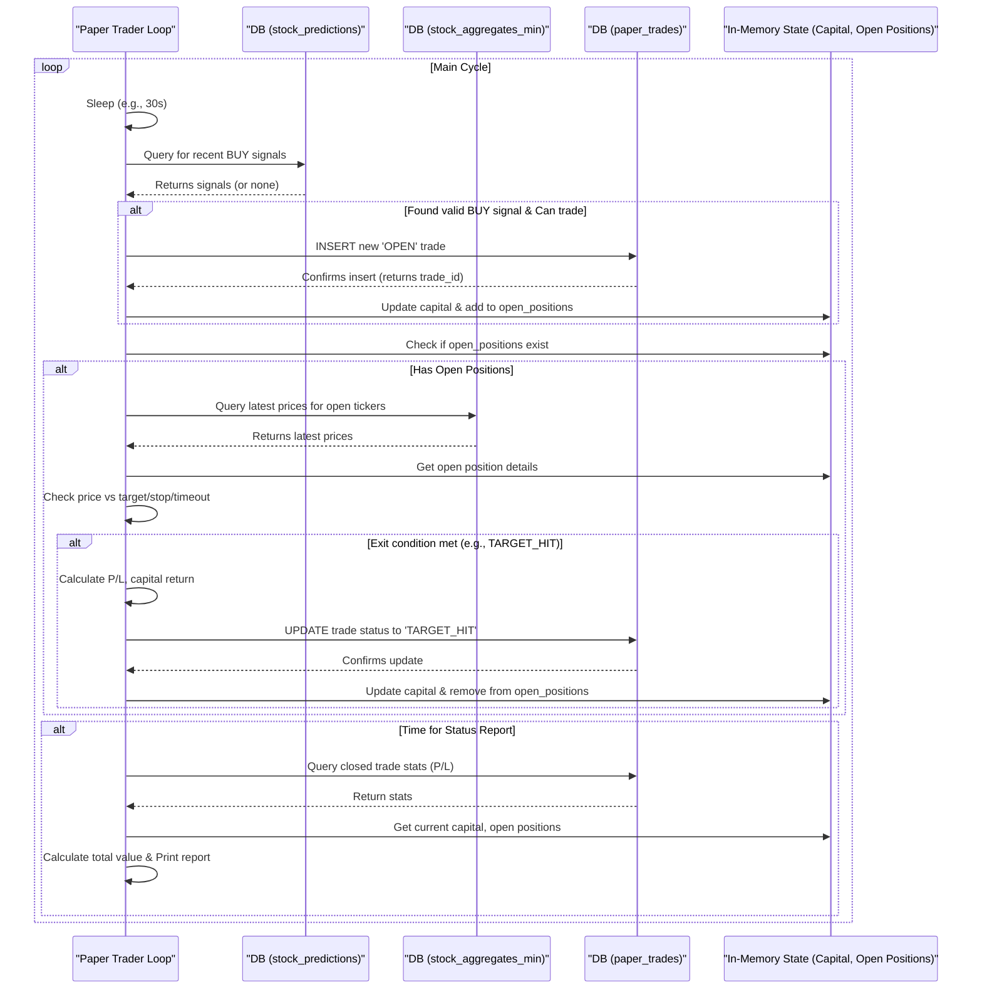

# Chapter 8: Paper Trading Simulation (Python)

Welcome to the final chapter! In [Chapter 7: Prediction Service (Python)](07_prediction_service__python__.md), we saw how our trained model can continuously generate forecasts (predictions) about potential future price movements and save them to the `stock_predictions` table. That's cool, but what if we actually *acted* on those predictions? Would we make or lose money (theoretically)?

That's where our **Paper Trading Simulation** script comes in. Think of it like a flight simulator for trading. It takes the predictions from our model and pretends to buy and sell stocks based on them, using fake money. This lets us test our *entire* strategy – from data collection to prediction to basic trading rules – without risking any real capital.

## Why Simulate Trading?

Imagine you built a fantastic robot chef based on recipes (our model). Before letting it cook for a real restaurant, you'd want to test it in a simulated kitchen. Does it follow the recipes correctly? Does it know when the food is cooked? Does it manage its ingredients (capital)?

Our paper trading script does this for our trading model. Its main job is: **To simulate making trading decisions based on the model's predictions, track these simulated trades, and report the potential profit or loss over time.**

This helps answer: "If I had followed these prediction signals with these simple rules, how might I have performed?"

## Key Concepts: How the Simulator Works

1.  **Paper Trading:** It's simulated trading. We start with a fake amount of cash (e.g., $10,000). When the script "buys," it reduces this fake cash and records the fake shares. When it "sells," it increases the fake cash based on the simulated profit or loss. No real money is ever involved.

2.  **Trading Logic (The Rules):** The script needs simple rules to decide when to act:
    *   **Entry Signal:** It constantly checks the `stock_predictions` table (created by the [Prediction Service (Python)](07_prediction_service__python__.md)). If it sees a recent "BUY" signal with high enough confidence (probability), it considers opening a position.
    *   **Position Sizing:** If it decides to buy, how much? The script uses a very basic rule, like buying a fixed number of shares or risking a small percentage of the fake capital.
    *   **Exit Signals:** Once holding fake shares ("open position"), it needs rules to "sell" (close the position):
        *   **Profit Target:** Sell if the price hits a pre-defined target gain (e.g., +$1.00).
        *   **Stop-Loss:** Sell if the price drops to a pre-defined loss limit (e.g., -$0.50) to prevent large simulated losses.
        *   **Timeout:** Sell if the position has been open for too long (e.g., 4 hours), regardless of profit or loss.

3.  **Tracking Trades:** The simulation needs to keep track of:
    *   **Open Positions:** What stocks it's currently "holding" (in memory).
    *   **Available Capital:** How much fake money is left.
    *   **Trade History:** Every simulated buy and sell (entry time/price, exit time/price, shares, profit/loss) is recorded permanently in the `paper_trades` database table ([Chapter 3: Database Schema & Persistence](03_database_schema___persistence__.md)).

4.  **Database Interaction:** The script interacts heavily with the database:
    *   Reads `stock_predictions` to find BUY signals.
    *   Reads `stock_aggregates_min` to get the *latest* stock prices needed to check profit targets and stop-losses for open positions.
    *   Writes details of every opened and closed simulated trade into the `paper_trades` table.

## How To Use It: Running the Simulation

Before you start the paper trader, make sure:

1.    **Infrastructure is Running:** Your database and Java data collector are running (`docker-compose up -d`). ([Chapter 2: Infrastructure Orchestration (Docker Compose)](02_infrastructure_orchestration__docker_compose__.md))
2.    **Prediction Service is Running:** The `lgbm_prediction_service.py` (from [Chapter 7: Prediction Service (Python)](07_prediction_service__python__.md)) is running in another terminal, actively generating predictions into the `stock_predictions` table.
3.    **Database Connection Ready:** Your `.env` file has the correct database password. ([Chapter 1: Configuration Management](01_configuration_management_.md))
4.    **Python Environment Active:** Activate your virtual environment (`source venv/bin/activate`).

Now, open a **new terminal**, navigate to the project directory (where the `sonnet` folder is), activate the environment, and run the paper trading script:

```bash
# Make sure you are in the project root directory
source venv/bin/activate
python3 sonnet/paper_trading.py
```

**What you'll see:**

The script will start, connect to the database, and create the `paper_trades` table if it doesn't exist. Then it enters a loop, printing messages like:

```
--- Paper Trading Simulation ---
Connecting to database 'polygondata' on localhost:5433...
Connection successful.
Paper trades table verified/created.

Starting paper trading system...
Trading Ticker: TSLA
Initial capital: $10000.00

Received BUY Signal: TSLA @ $215.5000, Conf: 0.6850, Time: 2023-10-27 14:35:00+00:00
Trade 1 logged to DB.
--- PAPER TRADE: OPENED --- | Ticker: TSLA | Shares: 4 | Entry: $215.50 | Cost: $862.00 | Target: $216.50 | Stop: $215.00 | Cash Left: $9138.00

--- Calculating Portfolio Status ---
[...]

--- PAPER TRADE: CLOSING TSLA (TARGET_HIT) ---
  Trade 1 updated in DB.
  Exit: $216.55 | P/L: $4.20 (0.49%) | Held: 0:15:30.123456
  Current Cash: $9142.20

--- PORTFOLIO STATUS ---
Timestamp: 2023-10-27 14:50:00+00:00
Initial Capital:         $10000.00
Current Cash:            $9142.20
Value of Open Positions: $0.00
Total Portfolio Value:   $9142.20
Performance:             -8.58%
Open Positions Count:    0
-------------------------
Closed Trades Summary:
  Total Closed:          1
  Win Rate:              100.00% (1 wins)
  Total P&L (Closed):    $4.20
-------------------------
```

The script will continue running, checking for new signals and managing its simulated positions until you stop it with `Ctrl+C`.

## A Peek Inside the Code (Simplified)

Let's look at simplified snippets from `sonnet/paper_trading.py`.

**1. Setup and Connecting:**

```python
# Simplified from sonnet/paper_trading.py
import psycopg2
import time
import os
from dotenv import load_dotenv

load_dotenv() # Load DB password from .env (Ch 1)
DB_PASS = os.getenv("POLYGON_DB_PASSWORD", "polygonpass")
# ... other DB connection details ...
TICKER_TO_TRADE = "TSLA"
INITIAL_CAPITAL = 10000.00
available_capital = INITIAL_CAPITAL
open_positions = {} # In-memory dict to track open trades

# --- Connect to DB (Ch 3) ---
conn = psycopg2.connect(host="localhost", port="5433", ...)
conn.autocommit = True # Make sure changes are saved immediately
cursor = conn.cursor()

# --- Create table if needed (Ch 3) ---
cursor.execute("""
CREATE TABLE IF NOT EXISTS paper_trades ( ... );
""")
print("Paper trades table verified/created.")
```
*Explanation:* This sets up initial parameters like starting capital, connects to the database using details likely loaded from the `.env` file ([Chapter 1: Configuration Management](01_configuration_management_.md)), and ensures the `paper_trades` table exists ([Chapter 3: Database Schema & Persistence](03_database_schema___persistence__.md)).

**2. Checking for Buy Signals:**

```python
# Simplified function `check_for_signals`
def check_for_signals():
    # Query stock_predictions for recent BUY signals (Ch 7)
    query = """
    SELECT timestamp, ticker, current_price, predicted_probability,
           target_price, stop_loss
    FROM stock_predictions
    WHERE ticker = %(ticker)s AND trade_signal = true
      AND timestamp > (NOW() AT TIME ZONE 'UTC' - INTERVAL '5 minutes')
    ORDER BY timestamp DESC LIMIT 1;
    """
    cursor.execute(query, {'ticker': TICKER_TO_TRADE})
    signal = cursor.fetchone() # Get the latest signal if any

    if not signal: return # No signal found

    timestamp, ticker, entry_price, confidence, target, stop = signal
    entry_price = float(entry_price); confidence = float(confidence)
    # ... (Handle potential None target/stop) ...

    # --- Pre-Trade Checks ---
    MIN_CONFIDENCE = 0.60 # Example threshold
    if confidence < MIN_CONFIDENCE: return
    if ticker in open_positions: return # Already holding this stock
    if available_capital < entry_price: return # Not enough fake money

    # --- Simulate Buy ---
    # ... (Calculate shares based on capital, e.g., shares = 4) ...
    position_cost = shares * entry_price
    # ... (Make sure cost <= available_capital) ...
    # ... (See 'Simulating a Buy' below) ...
```
*Explanation:* This function queries the `stock_predictions` table for the latest 'BUY' signal for our target ticker. If a recent, high-confidence signal is found and we aren't already holding the stock and have enough fake capital, it proceeds to simulate a buy.

**3. Simulating a Buy:**

```python
# Simplified logic inside `check_for_signals` after checks pass
    global available_capital, open_positions

    shares = 4 # Example: fixed number of shares
    position_cost = shares * entry_price
    print(f"Received BUY Signal: {ticker} @ ${entry_price:.2f}")

    # --- Log to DB ---
    sql = """INSERT INTO paper_trades (entry_time, ticker, entry_price,
               shares, trade_status, confidence)
             VALUES (%s, %s, %s, %s, 'OPEN', %s) RETURNING id;"""
    cursor.execute(sql, (timestamp, ticker, entry_price,
                          shares, confidence))
    trade_id = cursor.fetchone()[0] # Get the ID of the new trade record

    # --- Update State ---
    available_capital -= position_cost # Reduce fake cash
    open_positions[ticker] = { # Add to in-memory tracker
        'trade_id': trade_id, 'entry_time': timestamp,
        'ticker': ticker, 'entry_price': entry_price,
        'shares': shares, 'target_price': target, # Use target from prediction
        'stop_loss': stop, # Use stop from prediction
        'confidence': confidence
    }
    print(f"--- PAPER TRADE: OPENED --- Ticker: {ticker}, Shares: {shares}...")
```
*Explanation:* Calculates the cost, logs the 'OPEN' trade to the `paper_trades` table ([Chapter 3: Database Schema & Persistence](03_database_schema___persistence__.md)), reduces the `available_capital`, and stores the details of this simulated open position in the `open_positions` dictionary.

**4. Checking Open Positions:**

```python
# Simplified function `check_open_positions`
def check_open_positions():
    if not open_positions: return # Nothing to check

    # Get latest price for held tickers from stock_aggregates_min (Ch 3)
    tickers = tuple(open_positions.keys())
    query = """
    SELECT symbol, agg_close FROM stock_aggregates_min
    WHERE symbol = ANY(%(tickers)s)
    ORDER BY start_time DESC LIMIT %(limit)s; -- Fetch latest for each
    """ # Simplified query logic
    # ... (Execute query to get latest_prices map: {'TSLA': 216.55}) ...

    current_time_utc = datetime.now(timezone.utc)

    for ticker in list(open_positions.keys()): # Use list for safe deletion
        position = open_positions[ticker]
        if ticker not in latest_prices: continue # Skip if no price data
        current_price = latest_prices[ticker]

        # --- Check Exit Conditions ---
        exit_reason = None
        position_age = current_time_utc - position['entry_time']
        TIMEOUT_HOURS = 4

        if current_price >= position['target_price']: exit_reason = 'TARGET_HIT'
        elif current_price <= position['stop_loss']: exit_reason = 'STOP_LOSS'
        elif position_age > timedelta(hours=TIMEOUT_HOURS): exit_reason = 'TIMEOUT'

        if exit_reason:
            # ... (See 'Simulating a Sell' below) ...
```
*Explanation:* If there are open positions, this fetches the latest price for those stocks from `stock_aggregates_min` ([Chapter 3: Database Schema & Persistence](03_database_schema___persistence__.md)). It then checks each open position against its profit target, stop-loss, and a timeout limit. If an exit condition is met, it proceeds to simulate the sell.

**5. Simulating a Sell:**

```python
# Simplified logic inside `check_open_positions` when exit_reason is set
    global available_capital, open_positions

    print(f"--- PAPER TRADE: CLOSING {ticker} ({exit_reason}) ---")
    shares = position['shares']
    entry_price = position['entry_price']
    exit_price = current_price # Sell at the current market price
    profit_loss = shares * (exit_price - entry_price)
    capital_return = shares * exit_price

    # --- Update DB ---
    sql = """UPDATE paper_trades SET exit_time = NOW(),
               exit_price = %s, profit_loss = %s, trade_status = %s
             WHERE id = %s AND trade_status = 'OPEN';"""
    cursor.execute(sql, (exit_price, profit_loss, exit_reason,
                          position['trade_id']))
    print(f" Trade {position['trade_id']} updated in DB.")

    # --- Update State ---
    available_capital += capital_return # Add proceeds back to cash
    print(f" Exit: ${exit_price:.2f} | P/L: ${profit_loss:.2f}")
    del open_positions[ticker] # Remove from in-memory tracker
```
*Explanation:* Calculates the profit or loss based on the exit price. It updates the corresponding trade record in the `paper_trades` table ([Chapter 3: Database Schema & Persistence](03_database_schema___persistence__.md)), setting the `exit_price`, `profit_loss`, and `trade_status`. It adds the returned capital back to `available_capital` and removes the position from the `open_positions` dictionary.

## Under the Hood: The Simulation Cycle

The script runs in a continuous loop, performing these actions repeatedly:

1.  **Wait:** Pauses for a short duration (e.g., 30 seconds).
2.  **Check Signals:** Calls `check_for_signals()` to query `stock_predictions` for new BUY signals. If a valid signal is found, it might simulate opening a new position (logs to `paper_trades`, updates `open_positions` and `available_capital`).
3.  **Check Open Positions:** Calls `check_open_positions()`:
    *   Fetches the latest prices for currently held stocks from `stock_aggregates_min`.
    *   Checks each open position against its target, stop, and timeout rules.
    *   If an exit rule is triggered, it simulates closing the position (updates `paper_trades`, updates `available_capital`, removes from `open_positions`).
4.  **Report Status (Periodically):** Calls `show_portfolio_status()` every few minutes to calculate the total value (cash + value of open positions) and print a summary based on data from `paper_trades`.
5.  **Repeat:** Goes back to step 1.

Here's a simplified diagram of the cycle:



This loop allows the simulator to react to new prediction signals and manage its simulated portfolio based on incoming price data over time.

## Conclusion

Congratulations! You've reached the end of the tutorial. In this chapter, you learned about **Paper Trading Simulation**. You saw how the `paper_trading.py` script uses the predictions generated by the [Prediction Service (Python)](07_prediction_service__python__.md), checks them against simple trading rules, and simulates buying and selling stocks using fake money. It tracks these simulated trades in the `paper_trades` table ([Chapter 3: Database Schema & Persistence](03_database_schema___persistence__.md)) and monitors open positions using live prices from `stock_aggregates_min`.

This simulation acts as a crucial testing ground, giving you insights into how your entire strategy might perform end-to-end *before* risking real money. Remember, though, that simulation results don't guarantee future performance due to factors like slippage, fees, and changing market conditions.

You now have a grasp of all the major components of the `polygon-lgbm-service` project, from configuration and infrastructure setup to data collection, feature engineering, model training, real-time prediction, and finally, simulated trading.

For next steps, refer back to the `README.md` for instructions on running the entire system, visualizing results in Grafana, and potential future improvements. Happy experimenting!

---

Generated by [AI Codebase Knowledge Builder](https://github.com/The-Pocket/Tutorial-Codebase-Knowledge)