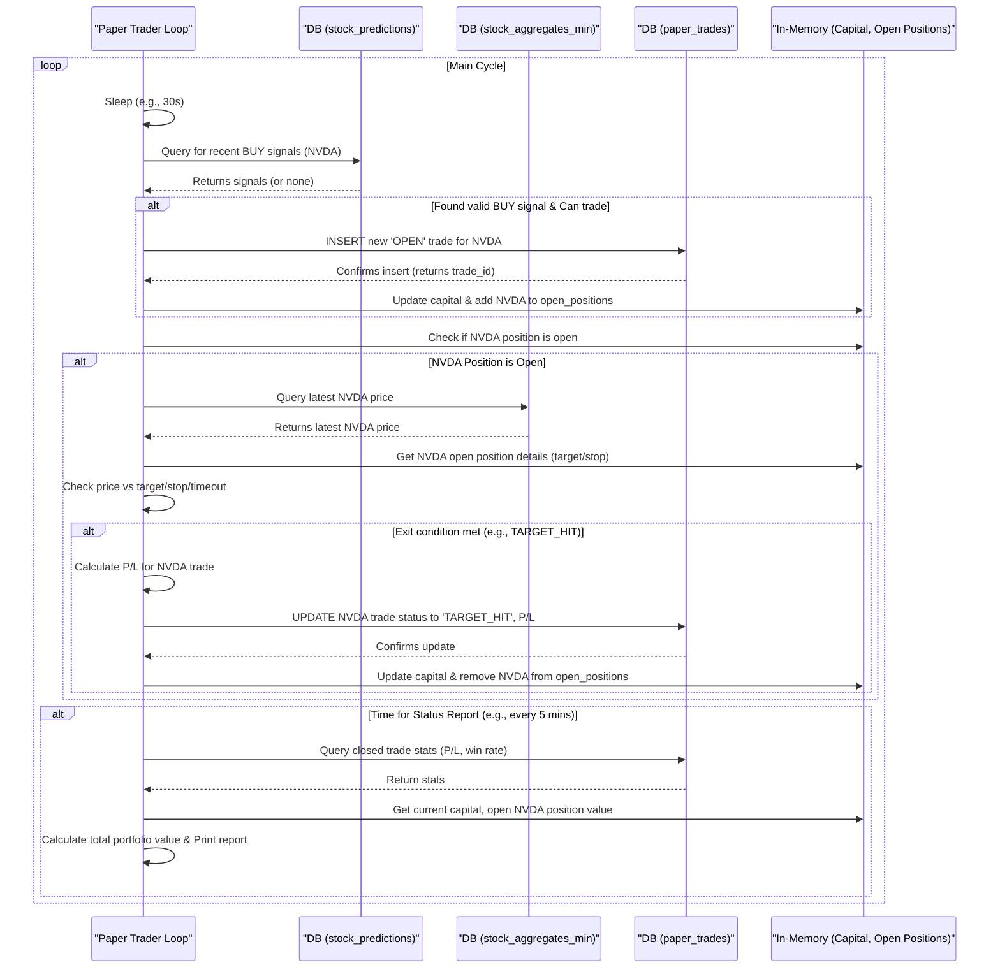

# Chapter 8: Simulated Trading Execution (Paper Trading)

Welcome to the final chapter of our `nvda-daily-prediction` journey! In [Chapter 7: Real-time Prediction Engine (Python)](07_real_time_prediction_engine__python__.md), we saw how our trained machine learning model can continuously generate forecasts (predictions) about potential future NVDA price movements. These predictions are diligently saved to the `stock_predictions` table in our database. That's fascinating, but what if we actually *acted* on those predictions? Would we make or lose money, at least in a hypothetical sense?

That's where our **Simulated Trading Execution**, often called **Paper Trading**, comes in. Think of this chapter as learning about a flight simulator for your trading strategy. The `paper_trading.py` script (found in the `sonnet/` directory) takes the live predictions from our Prediction Engine and pretends to buy and sell NVDA stock based on a set of predefined rules. This allows us to test our entire strategy – from data collection to prediction to basic trading logic – without risking any real money.

## Why Simulate Trading? It's Practice Before the Real Game!

Imagine you've built an amazing robot chef (our prediction model from [Chapter 6: Predictive Model Training & Walk-Forward Validation](06_predictive_model_training___walk_forward_validation_.md)) that can follow complex recipes. Before letting this robot cook for a big, important dinner party, you'd want to test it in a practice kitchen, right? Does it use the ingredients (predictions) correctly? Does it know when the "dish" (trade) is ready to be "served" (closed)? Does it manage its "budget" (fake money) wisely?

Our `paper_trading.py` script does exactly this for our NVDA trading model. Its main job is:
*   To **read the predictions** made by our Prediction Engine.
*   To **simulate making trading decisions** (buy or sell) based on these predictions and some simple rules.
*   To **track these simulated trades** and their hypothetical profit or loss over time.
*   To **record everything** in a database table called `paper_trades`.

This helps us answer the question: "If I had followed these prediction signals with these simple rules, how might my NVDA trading have performed?"

## Key Concepts: The Rules of Our Simulated Game

Let's break down how this "flight simulator" works:

1.  **Paper Trading (Fake Money):** We start with an imaginary pile of cash (e.g., $100,000). When the script "buys" NVDA, it reduces this fake cash and records that it "owns" a certain number of fake shares. When it "sells," it increases the fake cash based on the simulated profit or loss. No real money is ever touched!

2.  **Trading Logic (The Rules of Engagement):** The `paper_trading.py` script needs clear rules to decide when to act:
    *   **Entry Signal:** It constantly checks the `stock_predictions` table (which our Prediction Engine from [Chapter 7: Real-time Prediction Engine (Python)](07_real_time_prediction_engine__python__.md) is filling up). If it sees a recent "BUY" signal for NVDA with high enough confidence (e.g., the model's predicted probability is above 60%), it considers "opening a position" (simulating a buy).
    *   **Position Sizing:** If it decides to buy, how many shares? The script uses a basic rule, like buying a fixed number of shares or risking a small percentage of the fake capital.
    *   **Exit Signals:** Once "holding" fake NVDA shares (an "open position"), it needs rules to "sell" (or "close the position"):
        *   **Profit Target:** Sell if the price hits a pre-defined target gain (e.g., if NVDA's price goes up by $1.00 from where we "bought" it).
        *   **Stop-Loss:** Sell if the price drops to a pre-defined loss limit (e.g., if NVDA's price goes down by $0.50) to prevent huge simulated losses.
        *   **Timeout:** Sell if the position has been open for too long (e.g., 4 hours), no matter the profit or loss.

3.  **Tracking Trades (The Scoreboard):** The simulation needs to keep a careful record:
    *   **Open Positions:** What stocks it's currently "holding" (this is usually kept in the script's memory while it's running).
    *   **Available Capital:** How much fake money is left.
    *   **Trade History:** Every simulated buy and sell – including entry time/price, exit time/price, number of shares, and the profit or loss – is recorded permanently in the `paper_trades` database table. We learned about setting up database tables in [Chapter 3: Time-Series Data Persistence (TimescaleDB & JPA/psycopg2)](03_time_series_data_persistence__timescaledb___jpa_psycopg2__.md).

4.  **Database Interaction (Talking to the Library):** The script is constantly talking to our database:
    *   It **reads** from the `stock_predictions` table to find new BUY signals.
    *   It **reads** from the `stock_aggregates_min` table (where our [Live Market Data Ingestion (Java/WebSocket)](04_live_market_data_ingestion__java_websocket__.md) service stores fresh price data) to get the *latest* NVDA prices. These are needed to check if profit targets or stop-losses for open positions have been hit.
    *   It **writes** details of every opened and closed simulated trade into the `paper_trades` table.

## How To Use It: Running Your Own Trading Simulation

Before you can start your paper trading simulation, make sure of a few things:

1.  **Infrastructure is Running:** Your TimescaleDB database and the Java data collector service must be up and running. You usually start these with `docker-compose up -d` (as shown in [Chapter 1: Dockerized Service Orchestration](01_dockerized_service_orchestration_.md)).
2.  **Prediction Service is Running:** The Python Prediction Engine (e.g., `sonnet/lgbm_prediction_service.py` from [Chapter 7: Real-time Prediction Engine (Python)](07_real_time_prediction_engine__python__.md)) must be running in another terminal. It needs to be actively generating predictions and saving them into the `stock_predictions` table.
3.  **Database Access Ready:** Your `.env` file (discussed in [Chapter 2: Secure Configuration & Secrets Management](02_secure_configuration___secrets_management_.md)) should have the correct database password so the Python script can connect.
4.  **Python Environment Active:** Activate your Python virtual environment (e.g., by running `source venv/bin/activate` in your project's root directory).

Now, to start the paper trading simulation:
1.  Open a **new terminal window**.
2.  Navigate to your project's root directory (e.g., `cd nvda-daily-prediction`).
3.  Activate your Python virtual environment: `source venv/bin/activate`.
4.  Run the paper trading script (the `README.md` might specify `paper_trading_test.py` or a similar name; we'll use `paper_trading.py` as our example from the `sonnet/` directory):

```bash
python sonnet/paper_trading.py
```

**What to Expect:**
The script will start up and print messages to your terminal. It will connect to the database and then enter a loop, periodically checking for new trade signals and managing its simulated positions. You might see output like this (simplified):

```
--- Paper Trading Simulation ---
Connecting to database 'polygondata' on localhost:5433...
Connection successful.
Paper trades table verified/created.

Starting paper trading system...
Trading Ticker: NVDA
Initial capital: $100000.00
Confidence Threshold: 0.60

Received BUY Signal: NVDA @ $485.5000, Conf: 0.7230, Time: 2023-11-15 10:30:00+00:00
Trade 1 logged to DB.
--- PAPER TRADE: OPENED --- | Ticker: NVDA | Shares: 20 | Entry: $485.50 | Cost: $9710.00 | Target: $486.50 | Stop: $485.00 | Cash Left: $90290.00

--- Calculating Portfolio Status ---
... (status messages might appear here periodically) ...

--- PAPER TRADE: CLOSING 1 (NVDA TARGET_HIT) ---
  Trade 1 updated in DB.
  Exit: $486.55 at ... | P/L: $21.00 (0.22%) | Held: 0:10:30
  Current Cash: $90311.00

--- PORTFOLIO STATUS ---
Timestamp:               2023-11-15 10:40:30+00:00
Initial Capital:         $100000.00
Current Cash:            $90311.00
Value of Open Positions: $0.00
Total Portfolio Value:   $90311.00
Performance:             -9.69%
Open Positions Count:    0
-------------------------
Closed Trades Summary:
  Total Closed:          1
  Wins / Losses:         1 / 0
  Win Rate (Closed):     100.00%
  Total P&L (Closed):    +$21.00
==================================================================
```
The script will keep running, checking for signals, managing trades, and printing status updates until you stop it by pressing `Ctrl+C` in the terminal.

## A Peek Inside the Code (Simplified `paper_trading.py`)

Let's look at some very simplified Python code snippets inspired by the `sonnet/paper_trading.py` script to understand its key actions.

**1. Setup and Connecting to the Database:**
The script starts by setting up parameters and connecting to our TimescaleDB.

```python
# Simplified from sonnet/paper_trading.py
import psycopg2
import os
from dotenv import load_dotenv

load_dotenv() # Load DB password from .env
DB_PASS = os.getenv("POLYGON_DB_PASSWORD")
# ... other DB connection details (host, port, dbname, user) ...
TICKER_TO_TRADE = "NVDA"
INITIAL_CAPITAL = 100000.00
available_capital = INITIAL_CAPITAL
open_positions = {} # To keep track of current "held" stocks

# --- Connect to DB ---
conn = psycopg2.connect(host="localhost", port="5433", # ... etc.
                        password=DB_PASS)
conn.autocommit = True # Changes are saved immediately
cursor = conn.cursor()

# --- Create paper_trades table if it doesn't exist ---
cursor.execute("""
CREATE TABLE IF NOT EXISTS paper_trades (
    id SERIAL PRIMARY KEY, entry_time TIMESTAMPTZ, /* ... other columns ... */
    profit_loss NUMERIC(12, 4), trade_status VARCHAR(20) );
""")
print("Paper trades table verified/created.")
```
*Explanation:*
This code loads the database password (thanks to [Chapter 2: Secure Configuration & Secrets Management](02_secure_configuration___secrets_management_.md)), defines our starting fake money, and sets up an empty dictionary `open_positions` to remember what we're "holding." It then connects to the database and makes sure the `paper_trades` table (where we'll log all our simulated trades) exists.

**2. Checking for Buy Signals from `stock_predictions`:**
This function looks for recent "BUY" signals from our Prediction Engine.

```python
# Simplified from 'check_for_signals' in sonnet/paper_trading.py
MIN_CONFIDENCE = 0.60 # Our rule for minimum confidence

def check_for_signals():
    global available_capital, open_positions, cursor
    # Query stock_predictions for recent BUY signals for NVDA
    query = """
    SELECT timestamp, current_price, predicted_probability,
           target_price, stop_loss /* these are from prediction service */
    FROM stock_predictions
    WHERE ticker = %(ticker)s AND trade_signal = true
      AND timestamp > (NOW() AT TIME ZONE 'UTC' - INTERVAL '5 minutes')
    ORDER BY timestamp DESC LIMIT 1;
    """
    cursor.execute(query, {'ticker': TICKER_TO_TRADE})
    signal = cursor.fetchone() # Get the latest signal, if any

    if not signal: return # No fresh signal found

    timestamp, entry_price, confidence, pred_target, pred_stop = signal
    entry_price = float(entry_price); confidence = float(confidence)
    # ... (logic to handle if pred_target/pred_stop are None, and pre-trade checks) ...
    if confidence < MIN_CONFIDENCE or TICKER_TO_TRADE in open_positions:
        return # Skip if confidence too low or already holding NVDA

    # If all checks pass, proceed to simulate_buy(...)
    # simulate_buy(timestamp, entry_price, confidence, pred_target, pred_stop)
```
*Explanation:*
This function queries the `stock_predictions` table (populated by the service from [Chapter 7: Real-time Prediction Engine (Python)](07_real_time_prediction_engine__python__.md)) for the latest BUY signal for NVDA. It checks if the signal's confidence is high enough and if we're not already "holding" NVDA. If everything looks good, it would then call a function to simulate the buy.

**3. Simulating a Buy:**
If a good signal is found, we "buy" fake shares.

```python
# Simplified logic for simulating a buy
# (conceptually part of check_for_signals or a helper function)
MAX_SHARES_PER_TRADE = 20 # Example

def simulate_buy(timestamp, entry_price, confidence, pred_target, pred_stop):
    global available_capital, open_positions, cursor
    shares_to_buy = MAX_SHARES_PER_TRADE # Simple sizing
    position_cost = shares_to_buy * entry_price
    if position_cost > available_capital: return # Can't afford

    available_capital -= position_cost # "Spend" fake money

    # Log to 'paper_trades' table in DB
    sql = """INSERT INTO paper_trades (entry_time, ticker, entry_price,
               shares, trade_status, confidence)
             VALUES (%s, %s, %s, %s, 'OPEN', %s) RETURNING id;"""
    cursor.execute(sql, (timestamp, TICKER_TO_TRADE, entry_price,
                          shares_to_buy, confidence))
    trade_id = cursor.fetchone()[0] # Get ID of this new trade

    # Store in our memory of open positions
    open_positions[TICKER_TO_TRADE] = {
        'trade_id': trade_id, 'entry_price': entry_price,
        'shares': shares_to_buy, 'target_price': pred_target, # Use what prediction gave
        'stop_loss': pred_stop, 'entry_time': timestamp
    }
    print(f"--- PAPER TRADE: OPENED NVDA, Shares: {shares_to_buy}... ---")
```
*Explanation:*
This function calculates how many shares to "buy" (here, a fixed `MAX_SHARES_PER_TRADE`). It reduces `available_capital`, logs the new "OPEN" trade into our `paper_trades` table (see [Chapter 3: Time-Series Data Persistence (TimescaleDB & JPA/psycopg2)](03_time_series_data_persistence__timescaledb___jpa_psycopg2__.md)), and remembers the details of this open position in our `open_positions` dictionary.

**4. Checking Open Positions (Targets/Stops):**
This function checks if any "held" stocks should be "sold."

```python
# Simplified from 'check_open_positions' in sonnet/paper_trading.py
POSITION_TIMEOUT_HOURS = 4 # Max hold time

def check_open_positions():
    global available_capital, open_positions, cursor
    if not open_positions: return # Nothing to check

    # Get latest NVDA price from 'stock_aggregates_min' table
    query = """SELECT agg_close, start_time FROM stock_aggregates_min
               WHERE symbol = %(ticker)s ORDER BY start_time DESC LIMIT 1;"""
    cursor.execute(query, {'ticker': TICKER_TO_TRADE})
    price_data = cursor.fetchone()
    if not price_data: return # No current price data

    current_price, price_timestamp = float(price_data[0]), price_data[1]
    position = open_positions[TICKER_TO_TRADE] # Assuming only NVDA for simplicity
    exit_reason = None
    position_age = datetime.now(timezone.utc) - position['entry_time']

    # Check exit conditions
    if current_price >= position['target_price']: exit_reason = 'TARGET_HIT'
    elif current_price <= position['stop_loss']: exit_reason = 'STOP_LOSS'
    elif position_age > timedelta(hours=POSITION_TIMEOUT_HOURS): exit_reason = 'TIMEOUT'

    if exit_reason:
        # simulate_sell(position, current_price, price_timestamp, exit_reason)
        pass # Placeholder for calling the sell simulation
```
*Explanation:*
If we have an open position in NVDA, this function gets the latest NVDA price from the `stock_aggregates_min` table (where our [Live Market Data Ingestion (Java/WebSocket)](04_live_market_data_ingestion__java_websocket__.md) service saves data). It then checks if this current price has hit our profit target, stop-loss, or if we've held the position for too long (timeout). If an exit condition is met, it would call a function to simulate the sell.

**5. Simulating a Sell:**
When an exit condition is met, we "sell" our fake shares.

```python
# Simplified logic for simulating a sell
# (conceptually part of check_open_positions or a helper function)

def simulate_sell(position, exit_price, exit_timestamp, exit_reason):
    global available_capital, open_positions, cursor
    shares = position['shares']; entry_price = position['entry_price']
    profit_loss = shares * (exit_price - entry_price)
    capital_return = shares * exit_price
    available_capital += capital_return # Get fake money back

    # Update 'paper_trades' table in DB
    sql = """UPDATE paper_trades SET exit_time = %s, exit_price = %s,
               profit_loss = %s, trade_status = %s
             WHERE id = %s AND trade_status = 'OPEN';"""
    cursor.execute(sql, (exit_timestamp, exit_price, profit_loss,
                          exit_reason, position['trade_id']))

    print(f"--- PAPER TRADE: CLOSED NVDA ({exit_reason}). P/L: ${profit_loss:.2f} ---")
    del open_positions[TICKER_TO_TRADE] # Remove from our memory
```
*Explanation:*
This function calculates the profit or loss from the "trade." It updates the trade record in the `paper_trades` table to mark it as closed (e.g., 'TARGET_HIT') and records the exit price and profit/loss. It adds the "proceeds" back to `available_capital` and removes the position from our `open_positions` memory.

## Under the Hood: The Simulation Cycle

The `paper_trading.py` script runs in a continuous loop, performing these main actions repeatedly:

1.  **Wait:** Pauses for a short time (e.g., 30 seconds or 1 minute).
2.  **Check for New BUY Signals:** It queries the `stock_predictions` table. If a good "BUY" signal for NVDA is found (high confidence, not already holding), it simulates opening a new position. This involves:
    *   Logging the new trade with status 'OPEN' to the `paper_trades` table.
    *   Updating its in-memory `available_capital` and `open_positions`.
3.  **Check Open Positions:** If it's "holding" NVDA:
    *   It fetches the latest NVDA price from `stock_aggregates_min`.
    *   It checks this price against the position's profit target and stop-loss. It also checks for a timeout.
    *   If an exit rule is triggered, it simulates closing the position. This involves:
        *   Updating the trade in `paper_trades` with exit details and profit/loss.
        *   Updating `available_capital` and removing the position from `open_positions`.
4.  **Report Status (Periodically):** Every few minutes, it calculates the total value of the simulated portfolio (cash + value of any open positions based on current prices) and prints a summary, often including statistics from the `paper_trades` table like win rate and total P&L.
5.  **Repeat:** Goes back to step 1 to wait for the next cycle.

Here's a simplified diagram illustrating this cycle:



This continuous loop allows our `paper_trading.py` script to react to new prediction signals from the Prediction Engine and manage its simulated NVDA portfolio based on incoming price data over time.

## Conclusion

Congratulations! You've made it to the end of our `nvda-daily-prediction` tutorial. In this final chapter, you learned about **Simulated Trading Execution (Paper Trading)**. You saw how the `paper_trading.py` script can:
*   Read predictions generated by our [Real-time Prediction Engine (Python)](07_real_time_prediction_engine__python__.md).
*   Apply simple trading rules (entry confidence, profit targets, stop-losses, timeouts).
*   Simulate buying and selling NVDA using fake money.
*   Track these simulated trades in the `paper_trades` database table (setup in [Chapter 3: Time-Series Data Persistence (TimescaleDB & JPA/psycopg2)](03_time_series_data_persistence__timescaledb___jpa_psycopg2__.md)).
*   Monitor open positions using live prices from the `stock_aggregates_min` table (populated by our service from [Chapter 4: Live Market Data Ingestion (Java/WebSocket)](04_live_market_data_ingestion__java_websocket__.md)).

This paper trading simulation acts as a crucial testing ground, giving you valuable insights into how your entire trading strategy might perform from end-to-end *before* ever thinking about risking real money. Remember, though, that simulation results, no matter how good, do **not** guarantee future real-world performance. Real trading involves factors like slippage (price changes between when you decide to trade and when your trade executes), commissions/fees, and the emotional pressures of dealing with actual money, none of which are fully captured in a simple simulation.

You now have a foundational understanding of all the major components of the `nvda-daily-prediction` project, from setting up the infrastructure and managing configurations, to collecting live market data, engineering features from it, training a predictive model, generating real-time predictions, and finally, simulating trades based on those predictions.

For next steps, you can refer back to the main `README.md` file in the project for detailed instructions on running the entire system, how to visualize your data and results (perhaps using Grafana, as hinted in the `README.md`), and for ideas on potential future improvements or experiments you could try.

Happy coding and happy learning!

---

Generated by [AI Codebase Knowledge Builder](https://github.com/The-Pocket/Tutorial-Codebase-Knowledge)