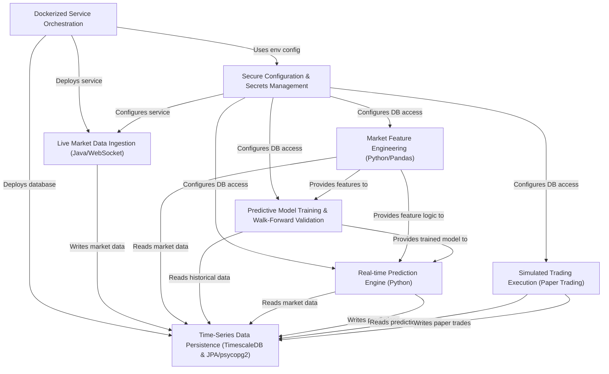

# Tutorial: nvda-daily-prediction

This project, `nvda-daily-prediction`, is designed to **predict daily stock price movements** for NVIDIA (NVDA).
It involves several key stages: *ingesting live market data* from Polygon.io, *storing it in a TimescaleDB database*,
*engineering relevant market features* using Python/Pandas, *training a machine learning model* (e.g., LightGBM or XGBoost)
with walk-forward validation, making *real-time predictions* with the trained model, and then *simulating trading strategies*
(paper trading) based on these predictions. The entire system, including the database and data ingestion service,
is **orchestrated using Docker Compose** for easy deployment and consistent operation.

**Source Repository:** [https://github.com/solfamila/polygon-lgbm-service/tree/feature/nvda-daily-prediction](https://github.com/solfamila/polygon-lgbm-service/tree/feature/nvda-daily-prediction)

## Chapters

1. [Dockerized Service Orchestration
](01_dockerized_service_orchestration_.md)
2. [Secure Configuration & Secrets Management
](02_secure_configuration___secrets_management_.md)
3. [Time-Series Data Persistence (TimescaleDB & JPA/psycopg2)
](03_time_series_data_persistence__timescaledb___jpa_psycopg2__.md)
4. [Live Market Data Ingestion (Java/WebSocket)
](04_live_market_data_ingestion__java_websocket__.md)
5. [Market Feature Engineering (Python/Pandas)
](05_market_feature_engineering__python_pandas__.md)
6. [Predictive Model Training & Walk-Forward Validation
](06_predictive_model_training___walk_forward_validation_.md)
7. [Real-time Prediction Engine (Python)
](07_real_time_prediction_engine__python__.md)
8. [Simulated Trading Execution (Paper Trading)
](08_simulated_trading_execution__paper_trading__.md)

---

Generated by [AI Codebase Knowledge Builder](https://github.com/The-Pocket/Tutorial-Codebase-Knowledge)