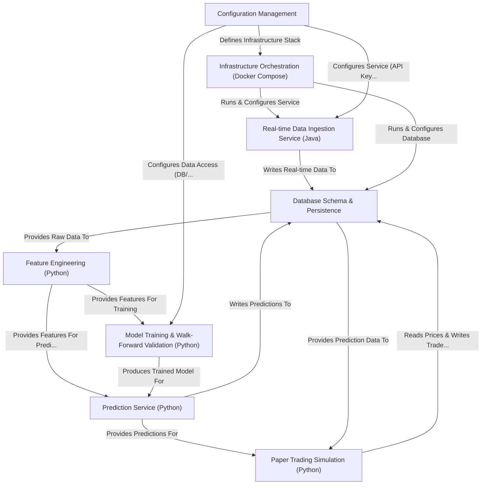

# Tutorial: polygon-lgbm-service

This project is a system for **algorithmic trading experimentation** using stock market data.
It starts by *ingesting real-time* stock data from Polygon.io using a Java service and storing it in a **TimescaleDB database**.
Python scripts then use this historical data to *engineer features* (informative signals) and train **machine learning models** (like LightGBM) with walk-forward validation to predict future price movements.
Another Python service runs continuously, using the trained model to make *live predictions* based on the latest data, saving these predictions back to the database.
Finally, a separate Python script simulates **paper trading**, making hypothetical buy/sell decisions based on the model's predictions and tracking the simulated profit or loss.
The entire system (database, Java service, visualization) is managed using **Docker Compose**, and configuration (like API keys) is handled through `.env` and property files.

**Source Repository:** [https://github.com/solfamila/polygon-lgbm-service](https://github.com/solfamila/polygon-lgbm-service)

## Chapters

1. [Configuration Management
](01_configuration_management_.md)
2. [Infrastructure Orchestration (Docker Compose)
](02_infrastructure_orchestration__docker_compose__.md)
3. [Database Schema & Persistence
](03_database_schema___persistence_.md)
4. [Real-time Data Ingestion Service (Java)
](04_real_time_data_ingestion_service__java__.md)
5. [Feature Engineering (Python)
](05_feature_engineering__python__.md)
6. [Model Training & Walk-Forward Validation (Python)
](06_model_training___walk_forward_validation__python__.md)
7. [Prediction Service (Python)
](07_prediction_service__python__.md)
8. [Paper Trading Simulation (Python)
](08_paper_trading_simulation__python__.md)

---

Generated by [AI Codebase Knowledge Builder](https://github.com/The-Pocket/Tutorial-Codebase-Knowledge)